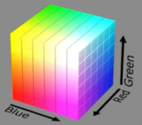
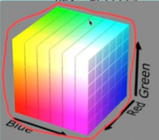
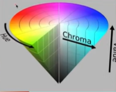

# CSS面试题

在学习css的过程中，一定要弄明白两个问题：css属值的计算过程和视觉格式化模型
1. css属性值得计算过程(`所有得css属性从都没有值到都有值的过程`)通过以下四个步骤来确定最终得css属性值
   1. `确定声明值`
         声明值得来源有两个地方： `作者样式表和浏览器默认样式表`
         在这一步得目的是浏览器找出没有冲突的属性（有冲突的属性在这一步先不管）同时会把相对单位全部变成绝对单位
   2. `层叠`
         在这一步针对上述有冲突的属性进行比较，通过三个标准进行比较（1. 比较重要性 2. 比较特殊性 3. 比较源次序）
         <br />
          `重要性从高到低进行比较`<br />
              - 作者样式表中带有!important<br />
              - 浏览器默认样式表中带有!important<br />
              - 作者样式<br />
              - 默认样式<br />
           `比较特殊性`： 也就是平时所说的权重`四个数字：第一个是内联样式；第二个是id；第三个是属性选择器和类选择器的数量； 第四个是元素，伪元素等选择器`
           `比较源次序`： 源码中靠后的覆盖靠前的
   3. `继承`： 对仍然没有值的属性，若可以继承则使用继承，满足属性继承的属性在本文中的下方展示
   4. `使用默认值`
2. 视觉格式化模型
css中常说的盒模型其实只是规定了单个盒子的布局
页面中肯定不止生成一个盒子，`定义多个盒子的排列规则就是视觉格式化模型(布局规则)`
大体上将页面上的布局排列分为三种：
- 常规流
- 浮动
- 定位


## 1. css的盒子模型？
盒子模型有两种： 标准盒模型和怪异和模型
- 在标准盒模型中，块盒的总宽度（margin+padding+border+content）一定要等于其包含块的宽度
- 怪异盒子模型中，也就是说：元素最终的尺寸等于定义的宽度+margin， 比如定义宽高是100*100的那么最终呈现的尺寸也是100*100的，如果有内边距和边框的话，会导致内容本身的宽高进行挤压

## 2. CSS中有哪些属性可以继承？
1. 字体系列：font、font-family、font-weight、font-size、font-style
2. 文本系列属性： 
     - 内联元素：color、line-height、word-spacing、letter-spacing、text-transform
     - 块级元素：text-indent、text-align
3. 元素可见性：visibility
4. 表格布局属性：caption-side、border-collapse、border-spacing、empty-cells、table-layout
5. 列表布局属性：list-style


## 3. css中可以进行复合的属性？ 以及复合属性内部的顺序是什么？
1. font： font-style、font-weight、font-size|line-height font-family
2. background: background-color、background-image、background-repea、background-position/background-size、background-attachment;
3. transform: 具体最终的形状和书写的顺序有关，按照从后往前的执行顺序 rotate|translate|scale|skew
4. transition
5. animation
6. margin|padding top-right-bottom-left
7. border: border-width、border-style、border-color
## 4. Css的哪些属性可以导致元素会脱离文档流？
定位，浮动
## 5. css中的几种定位？
## 6. 如何清除浮动？
1. 触发BFC
2. clear：left|right|both（可以作用在父元素的伪元素内）
````css
.container::after {
  content: '';
  display: block;
  clear: both;
}
````
## 7. 对BFC(Block Formatting Context)的理解？
`视觉格式化模型包括块级格式化上下文，块级格式化上下文介绍了规定常规流块盒的布局规则`


它是一块独立的渲染区域，在这块区域内，规定了常规流块盒的布局


BFC的渲染规则：
- 常规流块盒在水平方向上，必须撑满包含块（margin +　padding + border + content = 包含块的宽度）
- 常规流块盒在垂直方向上，依次摆放
- 常规流块盒若外边距无缝相邻，则进行外边距的合并
- 常规流块盒的自动高度和摆放位置，都无视浮动元素和定位元素


总结：规则：`垂直排列+横向撑满+外边距合并+不计算浮动元素`


这些规则都是在一个区域中生效的，那么这个区域就是BFC创建的区域（块级格式化上下文）

块级格式化上下文产生的条件（如何创建BFC）：
1. 这个区域由某个HTML元素创建(`常见`)，以下元素会在其内部创建BFC:
    - 根元素：意味着body元素创建的BFC，覆盖整个网页所有的内容
    - 浮动元素和绝对定位元素
    - overflow不为visible的块盒（默认值为visible）
    - display的值为inline-block、table-cell、flex、inline-flex、table-caption

BFC的适用场景：
1. 防止因为浮动导致所在块高度坍塌（清除浮动）
2. 避免外边距折叠

扩展（格式化上下文还包含以下）：
- BFC（Block Formatting context）：块级格式化上下文
- FFC (Flex Formatting context) ： 自适应格式化上下文
- IFC (Inline Formatting context)：内联格式化上下文
- GFC (Grid Formatting context)： 网格布局格式化上下文


## 8. 对包含块（containing-block）的理解

每个盒子都有它的包含块，它规定了在盒子内的排列区域
`绝大多数盒子的包含块为其父盒子的内容盒`
还有少量情况：

## 09. 常规流块盒
### 1.每个盒子的总宽度必须刚好等于其包含块的宽度
    - 宽度的默认为auto，即自动盛满整个包含块
    - margin的值也可以为auto，默认值为0
    - auto：将剩余空间全部吸收掉
    - 如果当width和margin的值都为auto，由于width的吸收能力强于margin，会优先执行width
    - 若内容宽度，border、padding、margin计算后，仍然有剩余空间，
        该剩余空间会被margin-right全部吸收掉，目的是为了保证块盒的总宽度刚好等于其包含块的宽度
    - 在常规流中，块盒在其包含块中水平居中的方式：可以定宽，左右margin设置为auto

### 2. 垂直方向的auto
    - height：auto；适应内容的高度
    - margin：auto；表示0

不只是常规流块盒，其他的盒子绝大多数情况下垂直方向的margin设置为auto，也是0

### 3. 百分比取值
padding、margin、宽可以取值为百分比

`所有的百分比取值都是相对包含块的宽度`

高度的百分比：
    - 包含块的高度取决于子元素的高度（包含块未设置高度、包含块的高度由内容撑满），设置百分比无效
    - 包含块的高度不取决于子元素的高度，百分比取值相对于父元素的高度

### 4. 外边距合并
`两个常规流块盒，`上下外边距相邻`，会进行合并`
为什么？
原因来源于印刷学，来源于印刷学的还有一个乱数假文（Lorem）

合并规则：
- 两个外边距取最大值

`记住：外边距合并并不是只有相邻兄弟元素，才会合并，父子元素只要外边距相邻，也会合并`
如何解决外边距合并？
- 只要两个块盒的外边距不相邻，就不会合并，中间只要相隔任何东西都不会合并


## 10. 浮动
视觉格式化模型， 大体上将页面中的盒子排列分为以下三种方式：
- 常规流
- 浮动
- 定位


### 应用场景
在css3出来之前，浮动的用法特别多，比如文字环绕（图片在左，文字进行环绕）、横向排列
在css3出来之后，使用浮动的更多做法是实现很多酷炫的效果

1. 文字环绕

2. 横向排列
css3之后，实现横向排列的方式有很多种：弹性盒、网格布局等等
css3之前，使用浮动来实现横向排列是比较主流的方案（兼容性最好的一种方案），当然也可以使用行块盒（除了内容之间的间隙，还有很多别的问题）

### 浮动的基本特点
实现浮动的方式：修改float（浮动）属性，值为left|right|none
- left：左浮动，在整个包含块内向上向左排列（向上的优先级大于向左）
- right：有浮动，在整个包含块内向上向右排列（向上的优先级大于向右）
- none：默认值，不使用浮动，就是常规流块盒的布局方案


特点：
1. 当一个元素浮动后，元素必定为块盒（display属性为block）
2. 浮动元素的包含块，和常规流一样，包含块为父元素的内容盒

### 盒子尺寸
1. 宽度为auto时， 自适应内容宽度，当没有内容的时候，宽度为0，和常规流不一样，常规流auto为撑满
2. 高度为auto时，和常规流一样，都是适应内容的高度
3. margin为auto时，为0，不和常规流一样（自动吸收剩余空间）
4. 边框，内边距的百分比设置和常规流一样的（相对于包含块的宽度），高度的百分比设置也和常规流一致。


### 排列规则
1. 左浮动的盒子靠上靠左排列，右浮动的盒子靠上靠右排列
2. 浮动盒子在包含块中排列的时候，如果有常规流盒子，会自动避开
3. 常规流块盒在包含快中排列的时候，无视浮动盒
4. 行盒在排列的时候，会避开浮动盒（常用来实现文字环绕）
> 如果文字没有在行盒中，浏览器会自动生成一个行盒来包裹文字，这叫做匿名行盒
> 在用来实现文字环绕的时候，如果想要文字离图片远一点（需要设置图片的margin属性，不能设置内容的margin，因为图片是在内容的包含块里面）


### 高度坍塌
高度坍塌的根源：常规流盒子的自动高度来源于内容的高度，在计算时不会考虑浮动盒子


如何解决？使用到css中的一个clear属性
> - clear:left;清除左浮动，作用在该属性上的元素必须在所有左浮动元素的下方，只有在最下方的时候，`常规流盒子在进行布局的时候会忽视浮动`
> - clear:right;清除右浮动，作用在该属性上的元素必须在所有右浮动元素的下方，只有在最下方的时候，`常规流盒子在进行布局的时候会忽视浮动`
> - clear:both;清除左浮动，作用在该属性上的元素必须在所有浮动元素的下方，只有在最下方的时候，`常规流盒子在进行布局的时候会忽视浮动`


````html
<!-- 高度坍塌现象 -->
<!doctype html>
<html lang="en">
  <head>
    <meta charset="UTF-8" />
    <link rel="icon" type="image/svg+xml" href="/vite.svg" />
    <meta name="viewport" content="width=device-width, initial-scale=1.0" />
    <style>
      .container {
        background-color: lightblue;
        padding:30px;
      }      
      .item {
        width:100px;
        height: 100px;
        background-color: red;
        float:left;
      }
    </style>
  </head>
  <body>
    <div class="container">
       <div class="item"></div>
       <div class="item"></div>
       <div class="item"></div>
       <div class="item"></div>
       <div class="item"></div>
       <div class="item"></div>
       <div class="item"></div>
       <div class="item"></div>
       <div class="item"></div>
       <div class="item"></div>
       <div class="item"></div>
    </div>
  </body>
</html>

````

````html
<!-- 解决方式一：在最下方添加元素设置clear：both|left|right -->
<!doctype html>
<html lang="en">
  <head>
    <meta charset="UTF-8" />
    <link rel="icon" type="image/svg+xml" href="/vite.svg" />
    <meta name="viewport" content="width=device-width, initial-scale=1.0" />
    <style>
      .container {
        background-color: lightblue;
        padding:30px;
      }      
      .item {
        width:100px;
        height: 100px;
        background-color: red;
        float:left;
      }
      .clearfix {
        clear:both
      }
    </style>
  </head>
  <body>
    <div class="container">
       <div class="item"></div>
       <div class="item"></div>
       <div class="item"></div>
       <div class="item"></div>
       <div class="item"></div>
       <div class="item"></div>
       <div class="item"></div>
       <div class="item"></div>
       <div class="item"></div>
       <div class="item"></div>
       <div class="item"></div>
       <div class="clearfix"></div>
    </div>
  </body>
</html>
````

````html
<!-- 解决方式一：在伪元素设置clear：both|left|right -->
<!doctype html>
<html lang="en">
  <head>
    <meta charset="UTF-8" />
    <link rel="icon" type="image/svg+xml" href="/vite.svg" />
    <meta name="viewport" content="width=device-width, initial-scale=1.0" />
    <style>
      .container {
        background-color: lightblue;
        padding:30px;
      }      
      .item {
        width:100px;
        height: 100px;
        background-color: red;
        float:left;
      }
      .clearfix::after {
        content: "";
        display: block;
        clear:both
      }
    </style>
  </head>
  <body>
    <div class="container clearfix">
       <div class="item"></div>
       <div class="item"></div>
       <div class="item"></div>
       <div class="item"></div>
       <div class="item"></div>
       <div class="item"></div>
       <div class="item"></div>
       <div class="item"></div>
       <div class="item"></div>
       <div class="item"></div>
       <div class="item"></div>
    </div>
  </body>
</html>
````
## 11. 定位
视觉格式化模型，通常会将页面上的盒子按照以下的方式进行排列：
- 常规流
- 浮动
- 定位


定位： 手动控制元素在包含块中的精准位置，通过position属性进行设置

### position属性
static|relative|absolute|fixed
- static:默认值，静态定位（不定位）
- relative：相对定位
- absolute: 绝对定位
- fixed： 固定定位

只要一个元素的取值不是statis，就认为这个元素是定位元素

### 特点
- 定位元素会脱离文档流（和浮动元素一样），但是相对定位除外
> 一个脱离了文档流的元素特点：
> 1.  文档流元素进行排放的时候，会忽略了脱离文档流的元素
> 2.  文档流的元素在计算自动高度的时候，会忽略脱离了文档流的元素

### 相对定位
不会导致元素脱离文档流，只是让元素在原来的位置上进行偏移，如果该盒已经使用浮动，脱离了文档流，那么他在相对定位下还是脱离了文档流（因为浮动）
可以通过以下四个属性进行偏移：
- left：
- right：
- top：
- bottom：

盒子的偏移量不会对其他盒子造成影响

### 绝对定位
1. 宽高为auto时，适应内容
2. 包含块变化：找祖先元素中的第一个定位元素，该元素的填充盒为其包含块，如果找不到，则它的包含块为整个网页（初始化包含块）


### 固定定位

其他情况和绝对定位一致

包含块不同：固定为视口（浏览器的可视窗口）

### 定位下的居中
某个方向的居中：
1. 定宽高
2. 将左右（上下）距离设置都为0
3. 将左右（上下）margin设置为auto

绝对定位和固定定位中，margin为auto，会自动吸收剩余空间，和常规流一样

### 多个定位元素重叠时
堆叠上下文
设置z-index，通常情况下，值越大，离用户越近
只有定位元素设置z-index才有效

z-index可以为负数，如果遇到常规流元素和浮动元素，那么会被覆盖

### 补充
绝对定位元素和固定定位元素一定是块盒
绝对定位元素一定不是浮动元素，浮动元素会被强制修改为none
没有外边距合并


## 12.必须要知道的伪类选择器
> - a:first-clild: `选中第一个a元素，同时这个a元素还必须要是第一个子元素`（从第一个子元素开始数）,，如果前面有别的元素，那么不生效
> - a:first-of-type：`选中第一个a元素，可以不是第一个子元素`
> - a:last-child：`选中最后一个a元素，同时这个a元素还必须是最后一个子元素`（从第一个子元素开始数），如果后面有别的元素，那么也不生效
> - a:last-of-type：`选中最后一个a元素，可以不是最后一个元素`
> - a:nth-child(n)：`选择第几个a元素，必须是第几个子元素（从第一个子元素开始数`），并非是第几个a元素,n可以是数字，也可以是变量（odd表示奇数。even表示偶数）
> - a:nth-of-type(n): `选中指定子元素中第几个某类型的元素，只看a元素，别的元素看都不看`


````html
<!-- first-child -->
<!doctype html>
<html lang="en">
  <head>
    <meta charset="UTF-8" />
    <link rel="icon" type="image/svg+xml" href="/vite.svg" />
    <meta name="viewport" content="width=device-width, initial-scale=1.0" />
    <style>
      div.item:first-child{
        color:red;
      }
    </style>
  </head>
  <body>
    <nav class="container">
       <div class="item">lorem1</div> <!--red-->
       <div class="item">lorem1</div>
       <div class="item">lorem1</div>
       <div class="item">lorem1</div>
       <div class="item">lorem1</div>
       <div class="item">lorem1</div>
       <div class="item">lorem1</div>
       <div class="item">lorem1</div>
       <div class="item">lorem1</div>
       <div class="item">lorem1</div>
       <div class="item">lorem1</div>
    </nav>
  </body>
</html>
````


````html
<!-- first-child -->
<!doctype html>
<html lang="en">
  <head>
    <meta charset="UTF-8" />
    <link rel="icon" type="image/svg+xml" href="/vite.svg" />
    <meta name="viewport" content="width=device-width, initial-scale=1.0" />
    <style>
      div.item:first-child{
        color:red; /* 都不生效，因为前面有子元素，第一个子元素是p不是div */ 
      }
    </style>
  </head>
  <body>
    <nav class="container">
        <p>kdkls</p>
       <div class="item">lorem1</div>  
       <div class="item">lorem1</div>
       <div class="item">lorem1</div>
       <div class="item">lorem1</div>
       <div class="item">lorem1</div>
       <div class="item">lorem1</div>
       <div class="item">lorem1</div>
       <div class="item">lorem1</div>
       <div class="item">lorem1</div>
       <div class="item">lorem1</div>
       <div class="item">lorem1</div>
    </nav>
  </body>
</html>
````
````html
<!-- first-of-type -->
<!doctype html>
<html lang="en">
  <head>
    <meta charset="UTF-8" />
    <link rel="icon" type="image/svg+xml" href="/vite.svg" />
    <meta name="viewport" content="width=device-width, initial-scale=1.0" />
    <style>
      div.item:first-of-type{
        color:red;
      }
    </style>
  </head>
  <body>
    <nav class="container">
      <p>2123132123132123</p>
       <div class="item">lorem1</div> <!--red-->
       <div class="item">lorem1</div>
       <div class="item">lorem1</div>
       <div class="item">lorem1</div>
       <div class="item">lorem1</div>
       <div class="item">lorem1</div>
       <div class="item">lorem1</div>
       <div class="item">lorem1</div>
       <div class="item">lorem1</div>
       <div class="item">lorem1</div>
       <div class="item">lorem1</div>
    </nav>
  </body>
</html>
````
````html
<!-- first-of-type -->
<!doctype html>
<html lang="en">
  <head>
    <meta charset="UTF-8" />
    <link rel="icon" type="image/svg+xml" href="/vite.svg" />
    <meta name="viewport" content="width=device-width, initial-scale=1.0" />
    <style>
      div.item:first-of-type{
        color:red;
      }
    </style>
  </head>
  <body>
    <nav class="container">
       <div class="item">lorem1</div> <!--red-->
       <div class="item">lorem1</div>
       <div class="item">lorem1</div>
       <div class="item">lorem1</div>
       <div class="item">lorem1</div>
       <div class="item">lorem1</div>
       <div class="item">lorem1</div>
       <div class="item">lorem1</div>
       <div class="item">lorem1</div>
       <div class="item">lorem1</div>
       <div class="item">lorem1</div>
    </nav>
  </body>
</html>
````
````html
<!-- nth-child(n) -->
<!doctype html>
<html lang="en">
  <head>
    <meta charset="UTF-8" />
    <link rel="icon" type="image/svg+xml" href="/vite.svg" />
    <meta name="viewport" content="width=device-width, initial-scale=1.0" />
    <style>
    /* 指定第几个div元素 */
      div.item:nth-child(n){
        color:red;
      }
    </style>
  </head>
  <body>
    <nav class="container">
       <div class="item">lorem1</div> <!--red-->
       <div class="item">lorem1</div>
       <div class="item">lorem1</div><!--red-->
       <div class="item">lorem1</div>
       <div class="item">lorem1</div><!--red-->
       <div class="item">lorem1</div>
       <div class="item">lorem1</div><!--red-->
       <div class="item">lorem1</div>
       <div class="item">lorem1</div><!--red-->
       <div class="item">lorem1</div>
       <div class="item">lorem1</div><!--red-->
    </nav>
  </body>
</html>
````
````html
<!-- nth-child -->
<!doctype html>
<html lang="en">
  <head>
    <meta charset="UTF-8" />
    <link rel="icon" type="image/svg+xml" href="/vite.svg" />
    <meta name="viewport" content="width=device-width, initial-scale=1.0" />
    <style>
      div.item:nth-child(n){
        color:red;
      }
    </style>
  </head>
  <body>
    <nav class="container">
      <p>1214523123123</p>
       <div class="item">lorem1</div> 
       <div class="item">lorem1</div><!--red-->
       <div class="item">lorem1</div>
       <div class="item">lorem1</div><!--red-->
       <div class="item">lorem1</div>
       <div class="item">lorem1</div><!--red-->
       <div class="item">lorem1</div>
       <div class="item">lorem1</div><!--red-->
       <div class="item">lorem1</div>
       <div class="item">lorem1</div><!--red-->
       <div class="item">lorem1</div>
    </nav>
  </body>
</html>
````

````html
<!-- nth-of-type(n) -->
<!doctype html>
<html lang="en">
  <head>
    <meta charset="UTF-8" />
    <link rel="icon" type="image/svg+xml" href="/vite.svg" />
    <meta name="viewport" content="width=device-width, initial-scale=1.0" />
    <style>
    /* 指定第几个div元素,只看a元素 */
      div.item:nth-of-type(n){
        color:red;
      }
    </style>
  </head>
  <body>
    <nav class="container">
      <p>ks123132123</p>
       <div class="item">lorem1</div> <!--red-->
       <div class="item">lorem1</div>
       <div class="item">lorem1</div><!--red-->
       <div class="item">lorem1</div>
        <p>ks123132123</p>
       <div class="item">lorem1</div><!--red-->
       <div class="item">lorem1</div>
       <div class="item">lorem1</div><!--red-->
       <div class="item">lorem1</div>
       <div class="item">lorem1</div><!--red-->
        <p>ks123132123</p>
       <div class="item">lorem1</div>
       <div class="item">lorem1</div><!--red-->
    </nav>
  </body>
</html>
````

## 13. 透明度的设置方式
1. opacity： 设置的是整个元素的透明度，值为0-1
2. 在颜色位置设置alpha通道（rgba）（常用遮盖层）

## 14. 盒子隐藏的设置方式
1. display：none；不生成盒子，影响原先盒子的排版布局
2. visibility：hidden；生成盒子，不影响原来盒子的排版布局

## 15. 图片的表达方式有两种，怎样选择使用哪种方案？
img是html层面的概念
背景图是css的概念
根据应用场景来区分: 
- 如果图片是网页的内容，必须使用img图片；
- 如果图片只是起到一个美化的作用，必须要使用背景图

## 16. 色彩空间
目前用来表示颜色的方法：
- rgb
- hex
- hsv
- hsb

rgb和hex被称为三原色表示法，他其实是有一个坐标系，红绿蓝，但是这种表示色彩的方式对于计算机来说，比较适合计算机，但是对于人类来说，并不是很友好

比如说，我需要一个暗紫色（在紫色上面把光线调暗）但是这种对于计算机比较好理解的三原色表示法来说，人类不好表示这个颜色

所以在设计领域呢，经常会使用另外一种表示法：hsv/hsb，用这种颜色表示法，就更加符合人类的直观印象

那么这种颜色表示法和三原色表示法有什么关系呢，三原色表示法的表示形式是一个正方体，
 

hsv的表示方法，就是将这一块色彩空间，按照上面的边边，绕成一个圈，会得到一个平面，然后将这个平面绕成一个环


`在这个锥形的面往下就是在某一个点不断的加黑色`，这个面其实就是色相环，也即是hue

一般在页面上做的调色盘，其实就是这个色相环，也就是这个锥形的顶面

hsv属性值的解读：
- 第一个参数其实就是这个色相环的角度，从0-360
- 第二个值表示纯度，这个值越高，表示颜色越纯，越低的就像当时加水稀释了
- 第三个值表示value，值越大加的黑色越多，值越小加的黑色越少