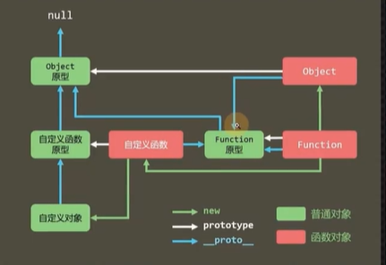
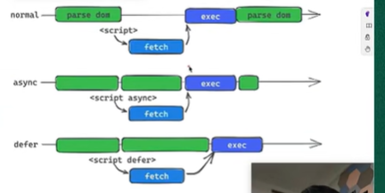
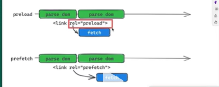

# js面试题
## 01.小数运算不精确的根源
这并不算是js的缺陷，其实是早期语言(遵循IEEE754规范的语言)都有的问题，因为在处理小数的时候，计算机会遇到一些难题，我们会想当然的认为，`小数运算就小数运算嘛，不精确就不精确嘛，为什么有的精确有的不精确？`

计算机在进行数字运算的时候，是需要转成二进制运算的，一转二进制就要出问题。 


我们回想当然的认为， 小数转二进制和整数转二进制是一样的，比如说
````js
3 -> 11
3.3 -> 11.11
// 其实不是这样的，如果是这样的话，是要出问题的
// 当3.3 + 3.3 = 6.6， 但二进制的计算过程中：11.11+11.11 = 1111.10 转成十进制变成了7.1
````

如果按照这样的运算规则的话，为了保证二进制的精确运算，那么计算机就不得不针对小数运算搞一套独有的规则，这些CPU的厂家肯定不会这样干的，太消耗cpu的性能了
，所以他期望的运算规则是整数和小数是一样的， 那么计算机就要对于二进制的转换规则做文章了，选择了下面的计算规则
````js
十进制
314 = 3 * 102 + 1 * 101 + 4 * 100 （2，1，0是n次方） 
3.14 = 3 * 100 + 1 * 10-1 + 4 * 10-2

二进制
101 = 1 * 102 + 0 * 101 + 1*100
1.01 = 1 * 100 + 0 * 10-1 + 1 * 10-2 = 1.625
````

只有按照这样的转换规则(和十进制的展开逻辑是一样的)，只有使用这样的展开逻辑，他们的运算规则加减乘除才能一直保持一致，这样的话其实有个特点可以发现
`只有十进制为5结尾的数字，才能转换成有限位数的二进制数,如果十进制数字不是以5结尾的数字，那即便转成二进制也是无限位数的二进制数，计算机不会允许这样的情况出现的，也没办法存储，所以，计算机会对这些无限位数的小数进行截取，如果以0截取，那么会比原来的值要小，反之更大，这也是为什么小数不精确的根源所在`


## 02.js计时器是否精确？ 为什么？
肯定是不精确的
至于为什么要从下面四个方面解释
- 硬件
- 系统
- 标准
- 事件循环

> 计算机硬件没有原子钟，无法做到精准计时

> 操作系统的计时函数本身就存在偏差，由于js的计时函数调用的时候操作系统的接口，也就携带了这些偏差

> 按照W3C的标准，浏览器实现计时器时候，如果嵌套层级大于等于了五层，则会带有4毫秒的最小间隔

> 受事件循环的影响，计时器的回调函数只会在主线程空闲的时候运行，因此又带来了偏差


## 03.js的数据类型有哪些？
> 基本数据类型：null、undefined、string、number、boolean，symbol、bigint

> 引用数据类型：object

## 04.原型的作用是什么？

> 之所以存在原型，是因为js要实现面向对象，而在es6之前，实现面向对象的方式就是通过原型，一个能支持面向对象的语言必须要做到一点：能判定一个实例的类型。在js中，通过原型就能知晓某个对象属于哪个类型，换句话说，`原型的存在就是为了避免类型的丢失`。
 

> 实现面向对象只有两种方式：类型元数据（传统后端语言：java， c#）、原型

> 不管是什么方式实现的面向对象：`都是为了保证对象的类型可溯()`


## 05.GET和Post的区别？
> 1. 协议层面(HTTP)： 语义区别
>      在http协议里面，get和post只是请求报文中的第一个单词，只是起到一个语义的作用 
> 2. 应用层面：GET请求体为空
> 3. 浏览器层面：1.2.3.4.5.6.7.8.9。。。


## 06.Promis解决了什么问题？ 
> Promise最重要的就是`统一js中的异步实现方案`

> 异步是js中常见的一种场景，统一实现方案，不仅可以有效降低心智负担、更重要的是可以让不同的异步场景进行相互联动。

> Promise也无法消除回调，他只不过是通过链式调用的方式让回调变得进行可控

## 07.**null和undefine的区别**


## 08.Proxy和Object.defineProperty的区别

八股文：
1. Proxy是对整个对象的代理，而Object.defineProperty只能代理某个属性。
2. 对象上新增属性，Proxy可以监听到，Object.defineProperty不能。
3. 数组新增修改，Proxy可以监听到，Object.defineProperty不能。
4. 若对象内部属性要全部递归代理，Proxy可以只在调用的时候递归，而Object.definePropery需要一次完成所有递归，性能比Proxy差。
5. Proxy不兼容IE，Object.defineProperty不兼容IE8及以下
6. Proxy使用上比Object.defineProperty方便多。


延申：  
> Proxy是可以做到拦截和重定义对象的基本操作
> [proxy官方文档](https://developer.mozilla.org/en-US/docs/Web/JavaScript/Reference/Global_Objects/Proxy)
> Proxy和Object.defineProperty最大的区别在于proxy可以拦截所有的基本操作，而Object.defineProperty只是基本操作中的其中一个
> 实际上当开发人员写的对对象的操作，包括增删改查在内部都会转成一个函数，这个函数就是对象的基本操作，对于`对象有哪些基本操作在ECMA262官方文档中`写的有
> 基本操作共有十一种，如果该对象是函数，会多出来两种（[[call]] | [[constructor]]）;调用方法用的是[[call]],使用new实例化的时候会被转调用[[constructor]]

````js
const obj = {
  name: 'jiuci'
}

obj.name 
obj["name"] //点操作和中括号操作都会被转成`[[GET]]`(基本操作)

obj.name = 'qianduanjiuci'; //会被转成[[SET]]

delete obj.name; //会被转成[[DELETE]]

for(let key in obj) { // 会被转成[[OwnPropertyKeys]]
  console.log(key)
}
````


在Proxy中，对象的每一个基本操作都对应着proxy中的陷阱函数

陷阱函数：通过一个代理，去读属性的时候，他应该运行的是内部的[[Get]]方法，转而掉入到proxy中的get方法中运行去了，没有去运行他内部的基本操作，这就是陷阱

`总结：Proxy拦截的是所有的基本操作，而Object.defineProperty什么都不拦截，他只是众多基本操作中的其中一个。`


## 09.什么是Promise 
说起Promise从以下两方面来说：
- PromiseA+规范

PromiseA+规范是在2015年之前出来的一套社区方案，但是很多第三方库都接纳了这种方案，该规范中说明了`什么是Promise?`:`一个对象中带有then方法，那这个对象就是Promise`
但是当ES6出来之后，新出了一个构造函数Promise，当使用new Promise的时候，生成的这个对象就是Promise并且这个Promise满足这个A+规范

PromiseA+规范写了什么？
- `通篇都在告诉你：then方法应该实现什么样的功能，他接收什么样的参数，它里面应该怎么处理，以及他应该返回什么？`
- PromiseA+规范中有这么一个说法，只要你是一个Promise，你就可以互操作

比如：`Jquery中的$.ajax(), 他的返回值就是一个promise，只不过这个promise并不是通过构造函数new出来的，他其实是手写了一套符合PromiseA+规范的Promise`

`Promise下的catch方法，finally方法，包括他的all方法、race方法，这些其实都不是PromiseA+规范里面的，都是ES6中新加的`


> `当有一个符合PromiseA+规范的then方法的对象，那么这个对象就是一个Promise，而ES6出现之后，它带来了一个构造函数，可以创建一个满足PromiseA+规范的Promise对象`


## 10. 值和引用的考察
对值和引用的考察，在面试中的常见的表现形式是进行数据传递
不管是什么数据传递，在复杂的题都根据一个原则来进行做

> - 原始数据类型得数据的存储是在栈区，直接存储值
> - 引用数据类型的数据的存储在栈区存储的只是该数据在堆区的地址

`做这种题的时候一定要进行画图或者文字展示说明`
大厂面试题：
````js
var foo = {
  n: 0,
  k: {
    n: 0
  }
};
var bar  = foo.k;
bar.n++;
bar = {
  n:10;
}
bar = foo;
bar.n++;
bar = foo.n;
bar++
console.log(foo.n, foo.k.n); // 1,1
````


````js
下面的代码输出什么？京东

var foo = {
  n: 1,
}
var arr = [foo];
function method1(arr) {
  var bar = arr[0];
  arr.push(bar);
  bar.n++;
  arr = [bar];
  arr.push(bar)
  arr[1].n++
}
function method2(foo) {
  foo.n++
}
function method3(n) {
  n++;
}

method1(arr)
method2(foo)
method3(foo.n)
console.log(foo.n, arr.length); // 4, 2
````


## 11. 作用域
1. js有两种作用域：全局作用域和函数作用域
    - 内部作用域能访问外部，反之不行。访问时从内向外依次查找。
    - 如果在内部作用域中能访问外部作用域，则会产生闭包。
    - 内部作用域能访问外部，取决于`函数定义的位置，和调用无关`。
2. 作用域内调用的变量、函数声明会提升到作用域顶部。    

面试题
````js
var a = 1;
function m() {
  a++;
}

function m2() {
  var a = 3;
  m();
  console.log(a) //3
}

m2();
console.log(a); //2
````

## 12.全局变量
无论是浏览器环境还是node环境，都会提供一个全局对象
- 浏览器环境：window
- node环境： global


全局对象有以下几个特点：
- 全局对象的属性可以直接访问
- 给未声明的变量赋值，实际上就是全局对象上的变量赋值
> 永远别这么干
````js
b=10;//等效于window.b=10;
````
- 所有的全局变量、全局函数都会附加到全局对象
> 这称之为全局污染，也称为全局暴露，或简称污染、暴露
> 如果要避免全局污染，需要使用立即执行函数改变其作用域
> 立即执行函数又被称为IIFE， 它的全称是Immediately invoked Function Express
> IIFE通常用于强行改变作用域


````js
// 污染还是和暴露有点区别的，污染是对不需要的东西，仍然在全局中，这算是污染，暴露是把需要的东西，还能交给别人使用
// 全局污染的函数
var a = 1；
var b = 2;
var c = function () {
  console.log("function c")
}
// 有的人会说，不是要强行修改作用域吗，我来个普通函数，调用不是也可以吗
function fn() {
  var a = 1；
  var b = 2;
  var c = function () {
    console.log("function c")
  }
}

fn(); // 这样不是也避免了变量全局的污染吗，其实不是的，在这里声明了一个fn函数，本身这个fn函数也是污染的，同时复杂度也提高了，这样并不好
// 目前来看，abc都在全局，我们有时候希望变量a不污染全局，但仍然需要是全局函数，可以使用IIFE来解决问题
(
  function(){
      var a = 1；
      var b = 2;
      var c = function () {
        console.log("function c")
      }
  }
)();
// 使用立即执行函数，就可以避免全局污染，如果我们想要暴露一些变量，供外面使用，可以将需要暴露出去得变量进行返回
var IIFE = (
  function(){
      var a = 1；
      var b = 2;
      var c = function () {
        console.log("function c")
      }
      return {
        a,
        c
      }
  }
)();

//在此时a、c就暴露到了全局，但是需要使用IIFE来进行访问，这样就合理得避免了全局污染
````

## 13. ES6新变化

### 1. let和const
ES6建议不再使用var定义变量，而是使用let定义变量、const定义常量

**对于开发得影响：均使用const，实在需要修改变量，再改为let**

无论是let还是const，他们均解决了长久以来变量定义得问题，使用它们定义变量，具有以下特点：
- 全局定义得变量不会再作为属性添加到全局对象中
- 再定义变量前使用它会报错（实际上还是有变量提升，只是因为存在暂时性死区，提前使用会报错）
- 不可重复定义同名变量
- 使用const定义常量时，必须完成初始化
- 变量具有块级作用域，在代码块之外不可使用

注意：再for循环中使用let定义变量，变量所在得作用域是一个循环体，因此不能再循环之外使用，另外，for循环会对该变量进行特殊处理，让每次循环使用得都是一个独立得循环变量，这还可以用来解决js长久以来得问题

## 14. 属性描述符
在vue2的源码中，也大量运用了属性描述符的知识
属性描述符：它表达了一个属性相关的信息（元数据）

属性分为两种：
1. 数据属性
2. 存取器属性（当赋值的时候，会自动执行一个函数，当修改的时候，也会指定执行一个函数）

设置对象的一个存取器属性，要通过`Object.defineProperty(obj,prop,propertyDescriptor)`
vue实现的双向数据绑定就是通过这个方法来实现的，可以对对象的属性进行操作的时候拦截

属性描述符的可取值：value | get | set | writeable　| 
没有设置value值得时候，默认为undefined
`注意: 当这个属性是存取器属性得时候，如果设置了get | set，那就不能设置value了`


应用场景(可太多了，但凡对参数有限制的函数，可以使用这个存取器，存取器最大的特点就是当存取的时候，可以加入更多的限制)


获得其他的属性描述符：
> Object.getOwnPropertyDescript: 获取某个对象的某个属性的描述符对象

## 15. this指向的问题？
> 全局this指向取决于全局的环境，比如在浏览器中this指向为window，但当在nodejs中的this指向为空对象{}

> 函数里面的this指向，通过调用的方式不同，this的指向也就不同（`函数内部的this一定取决于是如何调用的`）

> this指向和执行上下文有着紧密的关系，在创建执行上下文的时候，除了会设置AO，VO还会确定this的指向

| 调用方式      | 示例 |  this指向 |
| ----------- | ----------- |  ----------- |
| 直接调用     | method()       |  全局对象      |
| 构造函数   | new Method()        |  实例        |
| 通过对象调用   | obj.method()        |  obj        |
| apply、call、bind   | method.call(ctx)        |  第一个参数        |

> 箭头函数没有资格出现在这个表格里面，因为他就没有this，同样arguments也没有，能在里面使用this，能在里面arguments完全是基于闭包，基于词法作用域

## 16. 作用域和闭包？
### 作用域和作用域链
> 作用域其实就是变量和函数的访问范围

> 从程序上来说：作用域分为全局作用域、函数作用域、块作用域
> 从编译原理上来说：作用域分为静态作用域（词法作用域）和动态作用域

> 作用域链： 其实就是访问变量和函数的一种向上查找的规则，在当前作用域如果找不到声明的变量或者函数，会从父级作用域中进行查找，一直向上查找到全局作用域

### 垃圾回收
一直以来，对于垃圾，都没有明确的定义，不过形成的统一共识是垃圾是指哪些不再需要的内存。

是不是垃圾是由开发人员说的算的，浏览器也不知道那些是我们需要的，那些是我们不需要的，

那么垃圾回收机制他是怎么来回收的呢？难道他知道那些是我们需要的吗，那些是我们不需要的吗，

不，他也不知道，他虽然不知道那些是我们需要的，但是他知道哪些是我们一定不需要的（`访问不到的内存空间： 无法从触达的内存空间`）

但是还有一些仍然可以触达到的内存空间，但这些也是我们不需要的，但是这些内存没有被回收掉，这些就是内存泄漏

至于垃圾回收机制怎么判断这些无法触达的内存空间，这就是具体的实现细节了（比如常听到的`引用计数法：虽然效率高，但也有一些弊端`）

js实现判断是否为无法触达的内存空间的方式为`标记清除法`,在标记清除里面，还有很多实现细节（`新生代/旧生代、星历图等等`）


但是垃圾回收机制也不是很智能的，有些内存是无法触及到的，但是也回收不了（游离的dom节点、闭包）
### 内存泄露
垃圾回收机制会针对哪些仍热可以触达的内存空间，进行保留下来，这就是内存泄漏
### 闭包
`聊闭包的话题，一定要弄明白垃圾回收和内存泄漏`

闭包和内存泄漏有直接的关系吗，其实没有直接的关系，只是闭包会让我们对内存泄漏放松警惕（认为一个函数，漏了就漏了，他能占用多少内存空间啊）

> **闭包和其他的内存泄漏没有本质的区别：**
> 1. 持有了不在需要的函数引用，并没有将函数置空，会导致函数关联的词法环境无法被销毁，从而导致内存泄漏
> 2. 当多个函数共享词法环境的时候，会导致词法环境膨胀，从而会出现无法触达也无法回收的


````html
<button>1</button>
  <script>
    // 闭包现象
    function createIncrease() {
      const doms = new Array(10000).fill(0).map((_,i) => {
        const dom = document.createElement('div');
        dom.innerHTML = i;
        return dom;
      })
      function increase() {
        doms.forEach((dom) => {
            dom.innerHTML = Number(dom.innerHTML) + 1;
         })
      }
      return increase
    }
    const increase = createIncrease()
    const btn = document.querySelector("button")
    btn.addEventListener("click", increase)
  </script>
````                                                                         


## 17. 普通函数和箭头函数的区别？


1. 函数在调用的时候，都会创建一个执行上下文，在执行上下文中会有一个this，但是箭头函数没有
2. 箭头函数没有argument
3. 箭头函数不能作为构造函数


## 18. 柯里化函数？
> 将一个接收多个参数的函数转化成接受单个参数的函数


## 19. 防抖和节流？
> 防抖和节流都是为了针对于高频的进行耗时的操作的一种优化方案

### 防抖
原理：
> 事件一定在被触发了n秒后才会执行，如果指定时间内再次触发该耗时操作，则会以新的触发事件为准，重新等待n秒之后在执行
实现思路：
> 每次触发事件时候，都取消上一次的延迟调用方法

使用防抖的条件：
- 高频
- 耗时
- 只在最后一次生效
````js
    function debance(fn, delay = 500) {
      let timeId;
      return function (...args) {
        clearTimeout(timeId);
        timeId = setTimeout(() => {
          fn.apply(this,args)
        }, delay);
      }
    }
````
防抖和节流原理不同：
- 防抖是在一段时间内高频的执行耗时操作时，如果在这段时间内再次触发，重新计时，直到在这段时间内没有触发耗时操作
- 节流是在触发的第一时间执行，但是在指定时间内，再次出发，不生效

防抖应用场景：
- 窗体改变事件
- 鼠标输入事件
- 等符合防抖三个条件的情况


### 节流
原理：
> 即使持续触发事件，每个一段时间，事件都只会被触发一次
实现思路：
> 每次触发事件都判断当前是否有等待执行的函数，有两种主流的实现方式：通过时间戳和设置定时器
````js
// 使用设置定时器设置节流
      function throttle(fn,delay = 500) {
        let timeId;
        return function (...args) {
          if(timeId) clearTimeout(timeId);
             timeId = setTimeout(() => {
               fn.apply(this,args)
                timeId = null;
            }, delay);
        }
      }
      const fn = function () {
        console.log('skjdskf');
      }
      const handler = throttle(fn)
       // 函数节流：每个一段时间内执行一次，这个只会在第一次执行，然后再规定时间内，仍然被触发的话，不作数
       window.onscroll = handler
````

````js
// 使用时间戳设置节流
      function throttle(fn, delay = 500) {
        let time = Date.now();
        return function (...args){
          let now = Date.now()
          if(now - time <= delay) return
          fn.apply(fn,args)
          time = now;
        }
      }
````
## 20. 在浏览器中输入url按下，发生了什么？
主要分为三步：
> 1. IP地址的寻址
> 2. 请求数据
> 3. 页面展示


### IP地址的寻址
1. 首先会在浏览器的缓存里面去查找有没有这个域名的IP地址
2. 到host文件里面去查找有没有这个域名的IP地址
3. 到路由器的缓存里面去查找有没有这个域名的IP地址
4. 到DNS服务器去查找，如果没有就到更高一级的DNS服务器去查找，直到直到IP地址

### 请求数据
1. 首先呢，会去向这个IP地址发起连接的请求，进行TCP的三次握手
2. 连接建立成功之后呢，服务器就会发送响应的数据
3. 断开TCP连接的四次挥手

### 页面展现
这一块的内容，就相当于是浏览器的渲染原理：
请看浏览器渲染原理内容
## 21. typeof和instanceof的区别？
> 原理：typeof，是通过获取二进制前三位存储的类型信息，而instanceof是通过原型链，通过判断构造函数的原型是否在该对象的原型链上

> 返回类型：typeof返回值字符串，instance返回值是布尔

> 返回类型：string、number、boolean、undefine、symbol、binint、function、object

> 关于null，typeof null等于object，而 null instanceof Object为false


## 22. call和apply以及bind的区别？

> 实际上call与apply的功能是相同的，只是两者的传参方式不一样，而bind传参方式与call相同，但它不会立即执行，而是返回这个改变了this指向的函数。

## 23. new操作符具体干了什么？
1. 创建一个空对象
2. 改变该对象的隐形原型的指向
3. 改变构造函数this的指向
4. 判断构造函数有无返回对象

````js
function Fn(name) {
  this.name = name
}

// 如果构造函数存在返回值，返回类型为原始数据类型，则忽略返回值，如果返回的是引用数据类型，则忽略new关键字

function _new(fn, ...args) {
  const obj = {} // 创建新对象
  Object.setPrototypeof(obj,fn.prototype) // 修改新对象的隐式原型为构造函数的原型
  const f = fn.apply(obj,args) // 把构造函数的this修改为新对象
  return (typeof f === 'function' || typeof f === 'object') ? f : obj // 判断构造函数有无返回对象
}
````
## 24. 鼠标事件下的位置信息？


- pageX|Y：鼠标到页面左|上边缘的距离
- clientX|Y： 鼠标到视口左|上边缘的距离
- offsetX|Y：事件源到事件源左边缘|上边缘的距离（如何理解，比如div>button, 给div注册的点击事件，但是点击的是button e.offsetX表示在鼠标点击的位置到button边缘的距离）
- movementX|Y: 这一次鼠标点击的位置，相对于上一次点击的位置的x|Y的偏移量


## 25. 说一下原型和原型链？
### 原型
所有的函数都有一个属性：prototype，称之为函数原型
默认情况下：prototype是一个普通的object对象
默认情况下，prototype中有一个属性constructor，他也是一个对象，他指向构造函数本身

### 隐式原型
所有的对象都有一个属性：`__proto__`，称之为隐式原型
默认情况下，隐式原型指向创建该对象的构造函数的原型




对象是一定通过构造函数创建的
object顶级对象也是通过Function常见的
既然顶级对象都是Function创建的，那么Function的隐式原型指向谁呢？
他是个特殊：Function是直接存储在内存里面的，它的隐式原型指向自己也就是说`Function.__proto__=Function.prototype`

### 原型链 
当访问实例上的成员的时候
- 先去查找自身上是否有该成员，如果没有
- 然后会从它的隐式原型上没有找，如果还没有
- 继续向上查找，直到找到Object

这样形成的一个链式结构就是原型链

## 26. js延迟加载的方式
js的延迟加载是指等到页面加载完成之后再去加载js文件，js延迟加载有助于提高页面加载速度。
常见的延迟加载的方式：
- defer
- async

## 27. Reflect
`Reflect是用来调用对象的基本方法（内部方法）`

基本方法（内部方法）： 无论对对象如何进行操作，都逃不过对象的基本方法，最终调用的也都是对象的基本方法
[ecma-262](https://ecma-international.org/publications-and-standards/standards/ecma-262/)
对象的基本方法共有十一中，如果是个函数，在多加两种，无论怎么操作，怎么玩，都逃不过这些基本方法
`现在Reflect出来了，可以直接利用这个反射调用对象的基本方法，这在以前是不可能完成的`

### 问题？既然可以使用间接的调用内部方法，为什么还要直接调用，直接调用什么好处？
当使用.语法来完成对象的获取或者是赋值的时候，实际上它会经过一系列的规则和步骤（`这些额外的操作取决于你写的代码是什么`），只是这些操作中有一步是调用基本方法，如果不想有一些额外的操作，就必须调用基本方法，

````js
// 举个例子
var obj = {
  a: 1, 
  b: 2,
  get c() {
    return this.a + this.b;
  }
}

// 使用.语法进行操作
obj.c //答案为4， 在调用这个方法的时候，其实在[[get]]内部方法中有一个参数是需要确定this的，所以使用.语法进行获取的时候，在他进行一系列的操作的时候有一步是确定this
// 当有个需求，当获取c值的时候，我想手动的修改this的指向，在这样的操作中，是做不到的，但是使用Reflect反射就可以完成

Reflect.get(obj, 'c', {a:3, b:4}) // 7
````
在原始语法层面，他会绕一圈，不直接，使用reflect可以更直接

比如在封装一些代理对象的时候，这个反射就特别有用，代理拦截的也都是基本操作


## 28. 检测数据类型的几种方式
- typeof，检测出来该数据的基本类型（共有八种：undefind string number boolean symbol bigint object function）
- instanceof: 用于检测对象是是属于哪个构造函数。 原理：使用isPrototypeof，检测构造函数的原型是否在该对象上原型链上
- Object.prototype.toString.call(): 用于精准检测类型， 不仅可以作用到原始数据类型，还可以检测对象的类型


## 29. 如何理解异步？

> JS是一门单线程的语言，这是因为它运行在浏览器的渲染主线程中，而渲染主线程只有一个，而渲染主线程承担着诸多的工作，渲染页面、执行js都在其中运行。

> 如果使用同步的方式，则极有可能会导致主线程产生阻塞，从而导致消息队列中的很多其他任务无法得到执行，这样以来，一方面会导致繁忙的主线程白白的消耗时间，另一方面导致页面无法计时得到更新，给用户造成卡死的现象。

> 所以浏览器使用异步的方式来避免，具体做法是当某些任务发生时，比如计时器、网络、事件监听，主线程将任务交给其他线程去处理，自身立即结束任务的执行，转而执行后续代码，当其他任务完成时，将事先传递的回调函数包装成任务，加入到消息队列的末尾排队，等待主线程调度执行。

> 在这种异步模式下，浏览器永不阻塞，从而最大限度的保证了单线程的流畅运行


## 30. 说一下js的事件循环
> 事件循环又被称为消息循环，是浏览器渲染主线程的工作方式

> 在Chrome源码中，它开启一个不会结束的for循环，每次循环将消息队列中取出第一个任务执行，而其他线程只需要在合适的时候将任务加入到消息队列的末尾即可

> 过去会把消息队列简单的分为宏队列和微队列，这种说法目前已无法满足复杂的浏览器环境，取而代之的是一种更为灵活多变的处理方式

> 根据W3C官方的解释，每个任务都有不同的类型，同类型的任务必须在同一个队列，不同类型的任务可以从属于不同的队列，不同的任务队列有着不同的优先级，再一次事件循环中，由浏览器自行决定取哪一个任务队列中的任务。但浏览器必须要有一个微队列，微队列的任务一定具有最高的优先级，必须优先调度执行。


## 31. js实现继承的方式有哪些？以及他的优缺点？
### 1. 原型链继承
> 原理：通过将子类的构造函数原型指向父类的实例
> 缺点：
> 所有子类的实例会共享父类引用属性
````js
    function Parent() {
      this.name = 'parent'
    }
    Parent.prototype.sayHello = function() {
      console.log(`hello , I'm ${this.name}`);
    }

    function Child() {

    }

    // 通过原型链设置继承-原理：将子类的函数原型指向父类的实例
    Child.prototype = new Parent()
    console.log(new Child().eat());
   console.log(new Child().name); // 缺点，共享父类中的属性
````
### 2. 构造函数继承
> 原理：在子类的构造函数中调用父类的构造函数
> 缺点：这样可以避免原型链继承中的属性共享的问题，但父类的方法不会被继承到子类原型中
````js
    function Parent() {
      this.name = 'parent'
      this.age = '54'
    }
    Parent.prototype.sayHello = function() {
      console.log(`hello , I'm ${this.name}`);
    }
    function Child() {
      Parent.call(this)
      this.name = "child"
    }
    new Child().sayHello(); //并没有将父类的方法继承到子类的原型上
    console.log(new Child().age);
````
### 3. 组合式继承
> 原理：通过使用原型链继承的方式来继承方法，通过使用构造函数继承的方式来继承属性
> 缺点：会两次调用父类构造函数，造成性能浪费
````js
    function Parent() {
      this.name = 'parent'
      this.info = {
        a:1
      }
    }
    Parent.prototype.sayHello = function() {
      console.log(`hello, I'm ${this.name}`);
    }

    function Child() {
      this.name = "child"
    }

    // 通过原型链设置继承-原理：将子类的函数原型指向父类的实例
    Child.prototype = new Parent()
    const child = new Child()
    const parent = new Parent()
    console.log(child.sayHello());
    console.log(child.info); 
    parent.info.a = 2
    console.log(child.info);
    // 可见：父类实例的info属性是独立的,没有和子类实例的引用的是同一块地址
````
### 4. 原型式继承
> 原理：通过借助一个已经存在的模板来创建新对象，新对象可以继承模板中的属性和方法
> 缺点：对于引用属性仍然是浅拷贝，修改新对象的属性，同样也会修改模板中的数据

````js
    const parent = {
      name: 'Parent',
      info: {
        age: 54
      },
      sayHello: function() {
        console.log(`hello I'm ${this.name}`);
      }
    }

    const child = Object.create(parent);
    child.name = 'Child';
    child.info.age = 55 //浅拷贝
    console.log(parent.info);
    child.sayHello()
````
### 5. 寄生式继承
> 原理：利用一个函数来完成继承，当然也需要一个模板，但是在函数中进行继承的时候，会添加一些额外的属性和方法
> 缺点：还是逃脱不了对引用类型的属性的时候，回去修改模板中的数据
````js
    const parent = {
      name: 'Parent',
      info: {
        age: 54
      },
      sayHello: function() {
        console.log(`hello I'm ${this.name}`);
      }
    }
    function
    const child = Object.create(parent);
    child.name = 'Child';
    child.info.age = 55 //浅拷贝
    console.log(parent.info);
    child.sayHello()
````
### 6. 组合寄生继承
> 原理：我们将组合继承和寄生式继承结合起来，得出了寄生组合式的继承，这也是所有继承方式里面相对最优的继承方式
````js
  function Parent() {
    this.name = 'parent';
    this.play = [1, 2, 3];
  }
  Parent.prototype.getName = function () {
    return this.name;
  }
  function Child() {
    Parent.call(this);
    this.friends = 'child';
  }
​
  function clone (parent, child) {
    // 这里改用 Object.create 就可以减少组合继承中多进行一次构造的过程
    child.prototype = Object.create(parent.prototype);
    child.prototype.constructor = child;
  }
​
  clone(Parent, Child);
  Child.prototype.getFriends = function () {
    return this.friends;
  }
​
  let person6= new Child();
  console.log(perso);
  console.log(person.getName());
  console.log(person.getFriends());
​
// 它可以解决组合继承 父类被调用两次和在不同层级属性重复的问题。
````
### 7. extends
>  extends  
 

## 32. 深拷贝和浅拷贝？
> js在存储变量的时候，变量都是存储在栈内存中，如果该变量的值类型是原始数据类型，那么该值也是存储在栈中，但如果是引用数据类型的话，会在堆中开辟一个新的内存空间，栈中的变量指向这块地址

> 常说的深浅拷贝其实就是在说的js在拷贝引用数据类型的模式

> 浅拷贝：新对象的属性和源对象的属性指向同一块内存空间
> 深拷贝：新对象的属性和源对象的属性不会共用同一块内存空间

## 33. defer和async以及link下的preload和prefetch区别？
这四种都是资源提示符
只是defer和async作用在script元素上
preload和prefetch是作用到link元素上
### defer和async

当如果不给js文件添加资源提示符的时候，当浏览器解析到script标签的时候，他会去等待js的下载，等到下载完成之后，执行js，然后才会去解析后续的dom元素
在浏览器进行等待的过程中就造成了线程阻塞，极大浪费了浏览器的性能
所以为了解决阻塞的问题，浏览器推出了资源提示符的说法，采用了异步的方式解决这问题

> async的原理：当浏览器遇到script标签带着async属性的时候，会立马通知网络线程进行下载js，而主线程转而继续解析后续的dom，等到网络线程下载完之后，主线程才会去执行js，这样会有一个问题，每次加载页面的时候，会导致js文件的执行时机不可控，这跟网络的快慢有关，也跟浏览器解析dom的快慢有关


> defer原理： 浏览器也会通知网络线程去下载js，但是和async不同的是，js文件执行的时机，带有defer资源提示符的js文件，会等到全部的dom解析完成之后才回去执行js

### preload和prefetch
和defer和async一样都是为了保证主线程不阻塞，同样是异步的解决方案

二者细微的区别是优先级的区别
> preload：优先级比较高，如果这时候网络线程中还有别的任务需要下载，那么你先等等，先让这个proload的资源先下载， 通常都是用在本页需要的资源上面添加
> prefetch：优先级比较低，只有当网络线程空闲的时候才会去下载，一般在单页面应用程序中下载其他页面中的资源

## 34. localStorage、sessionStorage、cookie的区别？
>存放数据大小来说： cookie通常在4kb左右，而localstorage和sessionStorage通常在5MB左右

> 数据的生命周期： 一般由服务器生成，可设置过期时间，如果在浏览器中生成cookie，默认关闭浏览器cookie清除， 而sessionStoage的生命周期为当前会话，标签页关闭的时候即清除数据localStorage除非被手动清除，否则永久生效

> 与服务端通信：请求头中自动携带cookie，发送服务器，服务器进行验证身份，但是如果cookie保存的数量过多，会导致网络请求变慢，带来性能问题，而localStorage和SessionStorage只存在于客户端
## 35. 事件流、事件委托、事件冒泡、事件捕获
> 事件流：事件在发生时，会在目标节点和根节点之间按照特定的顺序进行传播，那传播所经过路径上的所有节点都会接收到这个事件，这个过程就叫做事件流，也就是在页面中接受事件的顺序。

> 事件流分为两种事件流模型，冒泡流和捕获流

冒泡流和捕获流的顺序是相反的。

冒泡流就是从目标节点到根节点的传播顺序。目标节点最先接收事件，文档节点最后接受事件。
+.
事件委托就是根据事件冒泡的特性，使用事件委托可以提高用户的性能，比如监听多个子节点的事件，可以通过利用事件委托
## 36. 描述一下浏览器缓存、服务器缓存、cdn缓存
### 浏览器缓存：

## 37. 如何进行数组扁平化
1. 递归
2. reduce
3. 扩展运算符
4. flat
## 38. sort的实现原理
> 这是js中的一种排序方法，对数组进行排序，默认情况下根据字符串的Unicode码点进行排序

> 实现原理： 在Chrome源码中，之前对于该sort方法只提供了插排和快排的两种方式，当数组数量小于10的时候，进行的是插排，数组数量大于10的时候，会选用快排，目前采用的是冒泡排序
## 39. es5中新出的数组遍历方法，以及他们之间的一个区别
arr.foreach
arr.map
arr.filter
arr.fill
arr.some
arr.any
arr.every
arr.reduce

分类：返回值类型
返回一个新数组：arr.map、arr.filter
返回布尔：arr.some、arr.every 不改变原数组
无返回值：arr.foreach

## 40. js模式的分类以及区别？标准模式、严格模式
## 41. 如何将伪数组转换成数组
Array.form(arguments)
Object.prototype.slice.call(arguments)
## 42. 什么是生成器（Genreator）
Generator是ES6中引入的一个函数，它是js实现异步编程的方案之一，它可以通过yield关键字来暂停函数的执行，并在下一次调用的时候从暂停的位置开始，Generator函数返回一个迭代器对象，用`function* generator(){}`表示，可以用于异步编程中
## 43. 什么是迭代器（Interator）
Interator是ES6中引入的一种新的遍历机制，他可以用来遍历任何数据结构，Interator是一个方法，他提供了next方法，每次调用next方法，都会返回一个包含两个属性的对象：{value，done}，value表示当前遍历的值，done是一个布尔，用来表示遍历是否结束，forof内部使用的原理就是迭代器

根据W3C中的可迭代协议：要成为可迭代对象，必须要实现@@Interator方法，这意味着对象（或者它原型链上的某个对象）必须有一个键为 @@iterator 的属性，可通过常量 Symbol.iterator 访问该属性

内部可迭代对象有：String，Array， TypeArray，Map，Set


一些表达式期望可迭代对象：数组的解构、forof循环、扩展运算符...，
````js
const obj = {
  a:1,
  b:2,
  [Symbol.iterator]() {

  }
}
````
