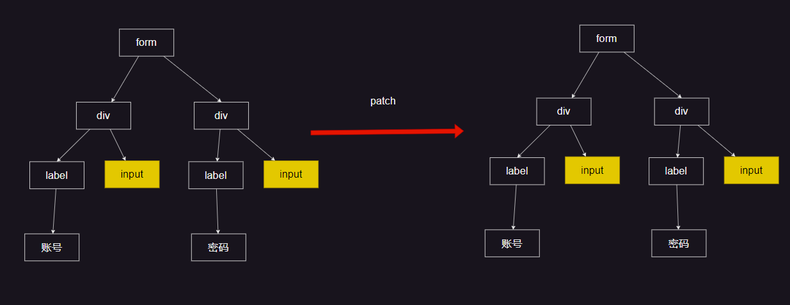
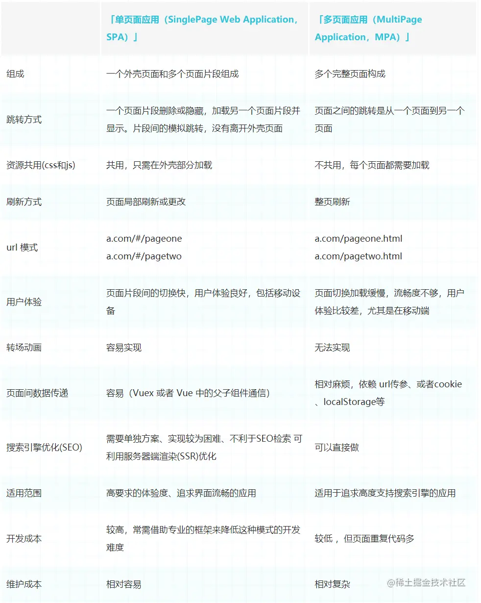

#  vue面试题

## 01.什么是Vue的响应式？

`vue数据响应式设计的初衷是为了实现数据和函数的联动`，当数据发生变化后，该数据的联动函数将会自动运行。

具体在vue的开发中，数据和组件的render函数关联在一起，从而实现了数据变化自动运行render，在感官上就看到了组件的重新渲染。

除了vue自动关联的render函数，其他还有很多适用到vue响应式的场景，比如computed、watch等等，不能仅吧vue的数据响应式想象成和render的关联 


## 02.Vue2和Vue3响应式的区别？
vue2的响应式：


## 03. 阐述响应式的流程

### 1. vue2


vue2：

首先会把我们的数据先变成一个getter和setter，这是通过Object.defineProperty去做的，遍历对象的每一个属性，变成一个getter和setter，那么这样子之后，读取属性的时候就会调用getter函数，修改属性的时候，就回去调用setter函数，这就是一个响应式数据。那么他是如何去把响应式数据和render函数进行挂钩的呢？当运行render函数的时候，里面会用到一些数据，出去触发getter函数，在getter函数内部会去记录当前有一个函数render，他用到了我的这个属性（依赖收集），进行依赖收集的这个东西是watcher（利用了发布订阅模式），它会观察，将来有一天对这个收集过的响应式数据进行修改的时候，这个时候， 他就会去运行setter函数，然后会去通知watcher（这个步骤叫做notify：派发更新），这时候watcher会发现以前是运行render函数收集的依赖，那么他就会重新去触发render函数的执行，render函数重新执行，就又会生成虚拟dom树

> render函数在用到响应式数据的时候，他会进行收集依赖，当我们数据发生变化的时候，他会通知watcher，watcher会重新运行这个render函数


**响应式数据的最终目标：是当对象本身或者对象属性发生变化时，将会运行一些函数，最常见的就是render函数，在具体是线上，vue用到了几个核心部件：**

1. Observer
2. Dep
3. Watcher
4. Schedule

#### 1. Observer

Observer要实现的目标很简单，就是把一个普通的js对象转化成响应式的对象

为了实现这一点，Observer会把对象的每一个属性通过Object.defineproperty转化成带有getter和setter的属性，这样一来，当访问和设置属性时，vue就有机会做一些别的事情


Observer是vue内部的构造器，我们可以通过vue提供的静态方法Vue.observable(object)间接使用该功能。

在组件生命周期中，这件事发生在beforecreate之后，create之前。

具体实现上，他会用递归遍历对象的所有属性，以完成深度的属性转换。

由于遍历只能遍历到对象的当前属性，因此无法监控到将来动态增加或者删除的属性，因此vue提供了$set和$delete两个实例方法，让开发者通过这两个实例方法对已有响应式的对象添加或者删除属性。

对于数组，vue会更改它的隐式原型，之所以要这样做，是因为vue需要监听那些可能改变数组内容的方法


总之，Observer的目标，就是要让一个对象，他属性的读取，赋值，内部数组的变化，都要能够被vue感知到。


#### 2. Dep

在Observer中有两个问题没有解决，就是读取属性时要做什么事，而属性变化时候，要做什么事，这个问题要靠dep来解决，Dep的含义是Dependency，表示依赖的意思。

Vue会为响应式对象中的每个属性、对象本身、数组本身创建一个dep实例，每个dep实例都有能力去做以下两件事：

- 记录依赖：是谁在用我
- 派发更新：我变了，我要通知到那些用到我的人

当读取响应式数据的某个属性的时候，他会进行依赖收集，有人用到了我

当改变某个属性的时候，他会派发更新：那些用到我的人，听好了，我变了， 你也要去做相应的事，改变数据


#### 3. Watcher

这里又出现一个问题，在getter中进行依赖收集的时候，他是怎么知道是谁在调用我？


要解决这个问题，需要依赖另一个东西：watcher

当某个函数执行的过程中，用到了响应式数据，响应式数据就是无法知道是哪个函数在用自己的。

因此，vue通过一种巧妙的办法来解决这个问题

我们不要直接更新函数，而是把函数交给一个叫做watcher的东西来执行，watcher就是一个对象，每个这样的函数执行时候，都会创建一个watcher，通过watcher去执行。

watcher会设置一个全局变量，让全局变量记录当前负责执行的watcher等于自己，然后再去执行函数，在函数的执行过程中，如果发生了依赖记录(dep.depend())， 那么dep就会把这个全局变量记录下来，表示：有一个watcher用到了我这个属性

````js
// watch 内部
currentWatcher = this；// 表示当前是这个watcher用到了我，接下来使用dep.depend()进行依赖收集的时候看，就知道是谁在调用这个响应式数据了
执行render函数中，使用obj.a 的时候，会在getter内部去调用dep.depend()完成依赖收集
````


当dep进行派发更新的时候，他会通知之前记录的所有watcher：我变了


每一个vue组件实例，都至少对应一个watcher，该watcher中对应了该组件的render函数。

watcher首先会把render函数进行一次依赖收集，于是那些在render该函数中用到的响应式数据都会记录这个watcher


当数据发生变化时，dep就会通知该watcher，而watcher将重新运行render函数，从而让界面重新渲染同时重新记录当前的依赖。


`在vue2中，依赖收集的watcher是收集到dep.target上`


#### 4. Schedule(调度器)
[alt text](image-15.png)

现在就剩下最后一个问题，就是Dep通知到watcher之后，如果watcher执行重运行对应的函数，就有可能导致该函数频繁运行，从而导致效率低下 


试想：如果交给一个watcher的函数，它里面用到属性a、b、c、d，那么a、b、c、d属性都会记录依赖，于是下面的代码就会触发四次更新：

````js
state.a = 'new data'
state.b = 'new data'
state.c = 'new data'
state.d = 'new data'
````

这样显然是不合适的，因此watcher会受到派发更新的通知后，实际上并不会直接运行对应的函数，而是把自己交给一个叫做调度器的东西

调度器维护一个执行队列，该队列每一个watcher只会存在一次，队列中的watcher不是立即执行，他会通过一个nextTick的工具方法，把这些需要执行的watcher放到事件循环的微队列中，nexttick的具体方法是通过promise完成的

> nextTick通过this.$nextTick暴露给开发者
>
> nextTick的具体处理方式：https://v2.cn.vuejs.org/v2/guide/reactivity.html#%E5%BC%82%E6%AD%A5%E6%9B%B4%E6%96%B0%E9%98%9F%E5%88%97


也就是说，当响应式数据发生变化时，render函数的执行是异步的，并且在微队列中


#### 5.  总体流程


 


> 首先原始对象，会交给Observer，会变成一个响应式对象，会有getter和setter，突然在某个时刻，render函数要执行，他并不是立即执行，它是交给watcher来执行，watcher会创建一个全局变量，再执行render函数，在执行的过程中，会用到这个响应式对象中的属性，于是响应式对象的属性，会被收集进来（记录这个属性，用到了这个watcher，另外一个属性也用到了watcher，还有一些对象也用到了这个watcher）。当响应式数据发生改变的时候，会做派发更新，之前已经记录到了这个数据有一个watcher用到了我，通知这个watcher做出一些相应的操作（比如重新执行原来的函数啊），watcher不是立即执行这个函数，不然的话，很有可能会重复执行很多遍，他是把自己交给一个调度器，这个调度器的作用就是把这个watcher添加到队列，同时会把队列的执行过程交给nextTick，进行异步执行，每当数据发生变化的时候，会重复这个执行过程


### 2. vue3

>  vue3中会通过proxy将原始对象转化为响应式对象，这样做的好处是proxy可以直接代理整个对象，包括数组也能直接监听到。
>
> 在proxy的get中，通过track函数实现依赖收集，在render函数要执行的时候，首先会把该函数交给Effect副作用函数执行。 当数据发生改变的时候，会调用proxy的set，在set中会先修改数据的值，然后通过trigger函数来完成派发更新。
>
> 会通知到与之关联的effect副作用函数，effect并不会立即执行这个函数，而是把函数交给调度器(Scheduler)通过nextTick包装成异步任务


#### 1. 手写track函数和trigger的内部实现

````js
const obj = {
    a: 1
}

const proxyObj = new Proxy(obj,{
    get: function(target,key,receiver) {
        // 依赖收集
        track(target,key)
        return Reflect.get(target,key,receiver)
    },
    set: function(target, key, value ,receiver) {
        const state = Reflect.set(target,key,value,receiver)
        // 派发更新
        trigger(target,key,value)
        return state
    }
});

let bucket = new WeakMap();

// 依赖收集
function track(target, key) {
    // 使用一个桶bucket来记录响应式数据和effect的关系, 用weakMap表示
    const hasTarget = bucket.has(target);
    let targetMap;
    
    if(!hasTarget) {
        bucket.set(target, (depMap = new Map()))
    } else {
        targetMap = hasTarget
    }
    
    const hasKey = depMap.has(key)
    let keySet
    if(!hasKey) {
        depMap.set(key, (keySet = new Set()))
    }else {
        keySet.set(key, hasKey)
    }
    keySet.add(currentEffect); // 完成响应式属性和所依赖的effect进行关联
}

// 派发更新
function trigger(target,key,value) {
    const depsMap = bucket.has(target)
    !depsMap && return 
    const deps = depsMap.has(key)
    deps.forEach(fn => fn())
}

let currentEffect = null

function effect(fn){
    const _effect = () {
        currentEffect = _effect;
        fn()
        curentEffect = null;
    }
    _effect()
}


effect(() => {
    // 通过render函数运行得到虚拟dom
    _render()
    // 调用update, 来进行diff算法以及生成真实dom
    _update()
})

````

target->key-dep

`effect`：`属性改变`带来的副作用函数；

`dep`(依赖)：`effect`副作用函数的集合；

`targetMap`：被代理对象 `target` 到 `depMap` 的集合

`depMap`: 通过属性 `key` 来映射其对应的依赖；

````ts
// The main WeakMap that stores {target -> key -> dep} connections.
// Conceptually, it's easier to think of a dependency as a Dep class
// which maintains a Set of subscribers.
type Dep = Set<ReactiveEffect>
type KeyToDepMap = Map<any, Dep>
const targetMap = new WeakMap<any, KeyToDepMap>()

let activeEffect: ReactiveEffect | undefined

````


#### 2. 深入研究- 为什么桶要用weakMap表示

这是vue比较巧妙的一个地方


桶只是记录当前响应式数据和所追踪的effect副作用函数，不应该和数据有直接的引用关系。


weakmap因为是弱引用，当访问不到键的时候，该weakmap会自动的被gc回收掉


#### 3. bucketMap为什么不能用weakMap

因为weakmap的键只能是对象格式，而target里面的key类型不能确定一定是map


#### 4. 为什么deps一定要是set

在前面执行依赖收集的时候，如果是多个响应式数据所对应的effect是一个的话，effect执行一次就可以了，【无需重复执行effect】


## 04. 谈谈对虚拟dom的理解

### 1.什么是虚拟dom？
虚拟dom本质上就是一个普通的js对象，用于描述视图的界面结构。
在vue中，每个组件都有一个render函数，每个render函数都会返回一个虚拟dom，这也就意味着每个组件都对应着一颗虚拟dom树

### 2.为什么需要虚拟dom？
虚拟dom的目的从来都不是为了提升效率，如果说是为了提升效率，那么React Fiber(为了提高虚拟dom的效率)？那么svelte（全篇都没有虚拟dom，都是在操作真实的dom）？
那为什么还要需要虚拟dom呢？

- 框架设计：
> 对于vue、react这种框架来说，用他们的那一套设计方式，就避免不了使用虚拟dom，或者说这是他们比较简单的一种方式（当数据发生改变的时候，理想状态是知晓哪个数据发生了变化，找到与之关联的节点，只需要修改这一个节点就好了，理论上是可以做到的，但实际上特别的负责，特别的困难，因为vue和react都是组件开发，他不知道哪个节点发生了改变，他知道的是哪个组件发生了改变（数据发生变化，该组件的render函数重新执行），然后没办法了，在render函数必须要全量渲染，如果全部渲染成真实的dom，那这个效率是非常夸张的，与其操作真实的dom，不如选个折中的办法，也就有了虚拟dom的诞生（操作js的效率要比操作真实dom要好很多），vue还是比较好的，react再进行全量渲染的时候更夸张，他从根组件开始全量渲染）`也就是说网上说的虚拟dom能提高效率也是在render函数中进行全量渲染的前提下进行的`
- 跨平台：
> 只有浏览器中才有真实dom，想一些原生安卓或者是桌面端，他连dom的概念都没有，为什么vue框架和react框架可以实现一套代码，多端运行，其实就是因为它的虚拟dom只是一个普通的js对象，在别的平台下，其实没有真实dom，但是有虚拟dom，可以照样那些真实组件进行对应，也可以很轻松的实现跨平台

### 3. 虚拟dom是如何转化成真实dom的？
在一个组件实例首次被渲染时候，他会生成虚拟dom树，然后根据虚拟dom树创建真实dom，并把真实dom挂在到页面中合适的位置，此时，每个虚拟dom便会对应一个真实的dom。

如果一个组件收到响应式数据变化的影响，需要重新渲染时，他仍然会调用render函数，创建一个新得虚拟dom树，用新树和旧树对比，通过对比，vue会找到最新更新量，然后只更新必要得虚拟dom节点，这些更新过得虚拟节点，会去修改他们对应得真实dom

这样依赖，就保证了对真实dom达到最小得改动过。


### 4. 模板和虚拟dom得关系
vue框架中有一个compile模块，它主要负责将模板转化成render函数，而render函数调用后将会得到虚拟dom
编译得过程分为两步：
1. 将模板字符串转换成AST（抽象语法树：用一种js树形结构，来描述原始代码）
2. 将AST转化成render函数

如果使用传统的引入方式或者vue-cli的配置中开启了`runtimeCompile:true`. 则编译时间发生在组件第一次加载时，这也称为运行时编译。
如果是在vue-cli的默认配置下，编译发生在打包时，这称之为模板预编译

编译是一个及其耗费性能的操作，预编译可以有效的提高运行时的性能，而且，由于运行的时候已不需要编译，vue-cli在打包时会排除掉vue的compile模块，以减少打包体积

模板的存在，仅仅是为了让开发人员更加方便的书写界面代码
`vue最中运行的时候，需要的是render函数，而不是模板，因此模板中的各种语法，在虚拟dom中是不存在的，他们都会变成虚拟dom的配置`

模板的本质： 是渲染函数的语法糖，用于描述整个渲染的过程，他最终会产生表达界面结构的虚拟节点


## 05. 阐述Vue中的diff算法


> 当组件创建和更新时，vue均会执行内部的update函数，该函数在内部调用render函数生成虚拟dom，组件会指向新树，然后vue将新旧两棵树进行对比，找到差异点，最终更新到真实的dom
>
> 
>
> 对比差异的过程就是diff，vue在内部通过一个叫patch的函数完成该过程
>
> 在对比时，vue采用深度优先、同层比较的方式进行比对。
>
> 在判断两个节点是否相同时，vue是通过虚拟节点的key和tag进行判断的
>
> 具体来说，首先对根节点进行对比，如果相同则将旧节点关联的dom引用到新节点上，然后根据需要更新属性到dom，然后再比对其子节点数组；如果不相同则按照新节点的信息递归创建出所有的真是dom，同时挂载到对应的虚拟节点上，然后移除所有旧的dom。
>
> 在对比其子节点数组时，vue对每一个子节点数组使用了两个指针，分别指向头尾，然后不断的向中间靠拢来进行对比，这样做的目的是尽量复用真是dom，尽量少的销毁和创建真实dom。如果发现相同，则进入和根节点一样的对比流程，如果发现不同，则移动真实dom到合适的位置。
>
> 这样一直递归的遍历下去，直到整棵树完成对比；


### 1. diff的时机

当组件创建时、以及依赖的属性或数据发生变化时，会运行一个函数（不是render函数），该函数会做两件事

- 运行_render生成一颗新的虚拟dom树（vnode tree）
- 运行_update传入虚拟dom树的根节点，对新旧两棵树进行对比，最终完成对真实dom的更新

核心代码如下：

````js
// vue的构造函数
function Vue() {
	// ... 其他代码
    var updateComponent = () => {
        this._update(this._render())
    };
    new Watcher(updateComponent);
    // ... 其他代码
}
````

diff就发生在_update函数的运行过程中

### 2. _update函数在干什么

_update函数会接受一个vnode参数，这就是新生成的虚拟dom树

同时，`_update`函数通过当前组件的`_vnode`属性，拿到旧的虚拟dom树

`_update`函数首先会给组件_`vnode`属性重新赋值，让它指向新树


然后会判断旧树是否存在：

- 不存在：说明这是第一个加载组件，于是通过内部的patch函数，直接遍历树，为每个节点生成真实的DOM，挂载到每个节点的elm属性上


- 存在： 说明之前已经渲染过该组件，于是通过内部的patch函数，对比两颗新旧树，以达到以下两个目标：
     - 完成对所有真实dom的最小化处理
     - 让新树的节点对应合适的真实dom


### 3. patch函数的对比流程

术语解释：

【相同】：是指两个节点的标签类型、key值均相同，但input元素还要看type属性

【新建元素】：是指根据一个虚拟节点提供的信息，创建一个真实dom，同时挂在到虚拟节点的elm属性上

【销毁元素】：是指_vnode.elm.remove()

【更新】： 是指对两个虚拟节点进行对比更新，他仅仅发生在两个虚拟节点【相同】的情况下

【对比子节点】：是指对两个虚拟节点的子节点进行对比


详细流程：

1. 根节点比较

​	如果两个节点【相同】，进入【更新】流程

- 将旧节点的真实dom复制到新节点，newVnode.elm = oldValue.elm
- 对比新旧节点的属性，有变化更新到真实Dom中
- 当前两个节点处理完毕，开始【对比子节点】

​	如果不相同

- 遍历新dom节点【新建元素】
- 旧节点【销毁元素】

2. 子节点比较

​	在【对比子节点】时候，vue一切的出发点都是为了

- 尽量啥也不动
- 不行的话，尽量仅改动元素属性
- 再不行的话，尽量移动元素，而不是删除和创建元素
- 再不行的话，删除和创建元素


tips：


diff算法中的对比子节点的时候，进行双指针比对的具体细节：

1. 先比较a指针和c指针，判断两个节点是否相同，如果相同，执行更新操作，进行子节点的对比
2. 如果不相同，比较b指针和d指针是否相同
3. 如果不相同，比较c指针和b指针
4. 如果不相同，比较a指针和d指针
5. 如果不相同，检查是否在旧树中是否有和该节点相同的节点，如果有移动该节点，进行更新操作，进行子节点对比
6. 如果不相同，创建新节点


### 4. vue3的diff算法

vnode更新，diff算法寻求最佳性能同步更新真实dom。必须明确old vnode和old真实dom是过去时，new vnode对应的new真实dom是我们最终想要的。基于old，得到new，如果让性能最好？最简单粗暴就是把old干掉，直接生成new。但是性能消耗最大。最佳方法是，尽可能复用真实dom。对真实dom的操作消耗关系：更新属性不移动 < 更新属性后移动到对应位置 < 创建新节点插入到对应位置。所以，diff算法最终是要尽可能找到可被复用的真实dom，如果不要移动最好，否则移动到对应位置，最后创建没有可复用的新节点，删除多余的未被复用的老真实dom节点。 vue3的diff算法比vue2的快，主要原因是在于复用dom元素相同的情况，移动dom的次数减少，因为vue3用到了最长递增子序列方案。更细节的讨论放在后面分析。 所以算法目标是：

1. 尽可能快的找到可复用真实dom节点
2. 复用真实dom节点的时候，尽可能也复用其相对顺序，少做移动。


vue3中使用得diff算法被称为快速diff

借鉴了以下两个框架：ivi和inferno

整个diff分为五部完成

1. 预处理前置节点
2. 预处理后置节点
3. 处理仅有新增节点
4. 处理仅有卸载节点
5. 处理其他情况（新增，卸载，移动）

#### 1. 预处理前置节点


从前到后对比两列节点，节点相同直接执行更新操作

`在源码中通过定义一个i变量来记录当前前置节点的索引，当此过程中发现不一样的节点，记录当前的索引值，然后停止处理，使用break跳出循环`


对应的vue3源码 package/runtime-core/render#1764

````ts
    // 1. sync from start
    // (a b) c
    // (a b) d e 	
	let i = 0
    const l2 = c2.length
    let e1 = c1.length - 1 // prev ending index
    let e2 = l2 - 1 // next ending index

    // 1. sync from start
    // (a b) c
    // (a b) d e
    while (i <= e1 && i <= e2) {
      const n1 = c1[i]
      const n2 = (c2[i] = optimized
        ? cloneIfMounted(c2[i] as VNode)
        : normalizeVNode(c2[i]))
      if (isSameVNodeType(n1, n2)) {
        patch(
          n1,
          n2,
          container,
          null,
          parentComponent,
          parentSuspense,
          isSVG,
          slotScopeIds,
          optimized
        )
      } else {
        break
      }
      i++
    }
````


#### 2. 预处理后置节点


从后到前对比两颗树，如果遇到相同节点，进入打补丁更新，进入下一个一个节点的比较

`在源码中使用e1来记录旧节点的后置索引值，使用e2来记录新节点的后置索引值`

````ts
    // 2. sync from end
    // a (b c)
    // d e (b c)
    while (i <= e1 && i <= e2) {
      const n1 = c1[e1]
      const n2 = (c2[e2] = optimized
        ? cloneIfMounted(c2[e2] as VNode)
        : normalizeVNode(c2[e2]))
      if (isSameVNodeType(n1, n2)) {
        patch(
          n1,
          n2,
          container,
          null,
          parentComponent,
          parentSuspense,
          isSVG,
          slotScopeIds,
          optimized
        )
      } else {
        break
      }
      e1--
      e2--
    }

````


#### 3. 处理仅有新增节点


当前两步完成之后，会遇到两种理想状态（仅有新增节点需要处理，或者仅有卸载节点需要处理）

可以发现： 当`i <= e2 && i > e1`的时候即为只有新增节点，这时候vue的diff算法只需要按照要求生成新的节点即可


在源码中是这样实现的

````ts

    // 3. common sequence + mount
    // (a b)
    // (a b) c
    // i = 2, e1 = 1, e2 = 2
    // (a b)
    // c (a b)
    // i = 0, e1 = -1, e2 = 0   

if (i > e1) {
      if (i <= e2) {
        const nextPos = e2 + 1
        const anchor = nextPos < l2 ? (c2[nextPos] as VNode).el : parentAnchor
        while (i <= e2) {
          patch(
            null,
            (c2[i] = optimized
              ? cloneIfMounted(c2[i] as VNode)
              : normalizeVNode(c2[i])),
            container,
            anchor,
            parentComponent,
            parentSuspense,
            isSVG,
            slotScopeIds,
            optimized
          )
          i++
        }
      }
    }
````


#### 4. 处理仅有卸载节点


另外一种特殊情况是仅有卸载节点

`此时i > e2 && i <= e1为仅有卸载节点的情况`，此时只需要卸载节点即可

````ts
    // 4. common sequence + unmount
    // (a b) c
    // (a b)
    // i = 2, e1 = 2, e2 = 1
    // a (b c)
    // (b c)
    // i = 0, e1 = 0, e2 = -1
    else if (i > e2) {
      while (i <= e1) {
        unmount(c1[i], parentComponent, parentSuspense, true)
        i++
      }
    }
````


#### 5. 处理其他情况


处理完前置节点和后置节点后，很多时候并没有出现类似的特殊情况

在这个里面，vue需要卸载n3节点，添加n8节点，更新n4、n5、n6节点，那么vue是如何高效的完成这一步骤的？

 通过定义`s1: 旧树要处理的起始位置，s2：新树中要处理的起始位置`，在构造一个新树种的新节点位置映射表（用于映射出新树需要处理的节点的与位置的索引关系）


具体流程是这样的，在创建完新节点映射关系之后，还会创建两个变量

- 当前最远位置默认为0
- 移动标识，默认是false

当前最远位置的表示新dom树中所在的最远位置，每次对比之后修改该值，目的是如果是递增的话，表示当前节点不需要移动，反之需要移动，同时要把移动标识转换为true

还会创建一个新旧节点位置映射关系 同时会填充为0，长度和新节点映射关系的长度一样，都为s2 -> e2，如果0就表示需要创建节点。


`遍历旧树中的节点，判断是否存在于新节点位置映射表中`，如果发现没有，就执行卸载工作

如果发现有，会把新节点位置映射表中的索引位置赋值给`当前最远位置`，同时会把该`索引位置加1(目的是为了分辨0)`在相同位置的新旧节点位置索引表中，判断该索引位置是否比当前最远位置要大（表示序列为递增，不需要移动元素），相反表示移动元素，同时要将移动标识修改为true。

比对n3： 

当前节点在新节点位置索引表中未发现，需要卸载


比对n4: 

当前节点在新节点位置索引表中发现，记录当前节点位置索引表中存储的位置为当前最远位置，并将该值加1添加到新旧节点位置表中的对应位置，并且当前的索引值为3大于当前最远位置0，为递增状态，表示不需要移动元素


比对n5： 

当前节点在新节点位置索引表中发现，记录当前节点位置索引表中存储的位置为当前最远位置为4，并将该值加1添加到新旧节点位置表中的对应位置5，并且当前的索引值为4大于当前最远位置3，为递增状态，表示不需要移动元素


对比n6：

当前节点在新节点位置索引表中发现，记录当前节点位置索引表中的存储的索引位置为最远位置为2， 并将`s1的值(n6对应的索引值)`到新旧节点位置索引表中得对应位置为6，并且当前得新节点位置索引为2小于当前最远位置4，不为递增序列，表示需要移动元素，同时修改移动表示为true


当前已经全部比较完，会得到一个`新节点位置索引表`和`新旧节点位置映射表`， 对新旧节点位置映射表进行最长递增子序列（`目的是为了让节点进行最小程度的移动`），`并添加序列的内容为新旧节点位置映射表的索引`


得到新旧节点的最长递增子序列，将该表和新旧节点位置索引表进行对比


对比流程：

会开启一个for循环遍历最长递增子序列，同样也会开启一个循环遍历新旧节点位置映射表（用i加下标表示），从末尾进行遍历，通过对比，定义最长递增子序列的位置j， 定义新旧节点位置映射表的位置i。 


开始第一次循环： 


得知新旧节点位置映射表中的值为0，就会创建一个新的节点，并创建n8的节点

继续循环，此时 i = 2的位置，正好等于 j = 1的位置，此时表示节点不需要移动，同时 i 和  j 同时移动


此时i = 1； j = 0， 二者位置正好相等，同样表示节点不需要移动， i ， j再同时往上移动


此时 i = 0， 对应的是n6， i = 0 不存在最长递增子序列中，需要进行更新。


这就是vue3中比较diff算法的具体实现


> 在vue3中，组件进行创建的时候，会将组件分为动态组件和静态组件。每次进行diff的时候只针对动态组件进行diff。 
>
> vue3在进行判断是否为相同节点的时候，是通过判断key和type完成的。
>
> 具体实现是这样的，vue3会先从头部遍历两棵树，（预处理前置节点：当比较结果是不相同的时候，退出循环，并记录当前的索引位置），然后从尾部遍历两棵树（预处理后置节点：比较结果是不相同的时候，退出循环，记录两棵树当前的索引位置）。
>
> 然后会遍历旧dom树，结合新节点位置索引表完成新旧节点位置索引表，然后对该表进行最长递增子序列（`贪心算法和二分法查找`），通过比对最长递增子序列和新旧节点位置索引表来决定进行最后的移动创建。最大程度上的减少了移动的次数。


## 06. 依赖收集

> 在vue2中，每个响应式数据都会被添加一个dep属性，响应式数据会收集其所依赖的watcher，当数据发生变化时，会通知相应的watcher进行更新，例如在初始化的时候，默认会调用渲染函数，触发依赖收集方法：`dep.depend()`, 当数据发生变化时，会调用`dep.notify()`，触发对应的watcher进行更新。vue3的设计思想和vue2保持一致。在vue3中，依赖收集通过Map结构将属性和effect建立映射关系，例如在初始化时，默认会调用渲染函数，触发属性依赖收集，这个通过`track()`方法实现，，当数据发生变化时，会找到对应effect，通过`trigger()`将对应的effect列表依次执行


## 07. nexttick

> 组件的更新是异步的，就是通过nextTick完成的


原理：

> nextTick其实是做的一个任务降级，他的目的是将其包装成任务，放到消息队列的末尾
>
> 先判断当前浏览器是否支持Promise，如果支持Promise的话，直接放到then方法中
>
> 如果不支持Promise，会再判断是否支持MutationObserver
>
> 再不支持的话，回去判断是否支持setImmediate
>
> 如果还不支持，就会放到setTimeout里面


## 08. 简述以下MVVM

Model-View-ViewModel


### 1. MVVM机制


MVVM是一种模式(视图模型双向绑定)，以数据为核心，数据驱动视图的模式，让我们把更多的关注点放在数据上，并不是直接操作dom

MVVM出现以后，能在一定程度上减轻开发人员的心智负担，不需要频繁的获取DOM

M：数据，他是一切的核心

V： 视图，界面上展现的结果

VM：数据流向视图，视图流向数据的桥梁，数据发生变化，视图自动发生改变，视图发生改变，一定也会导致数据发生变化


在VM中会做两件事：DOM监听和数据绑定

- DOM监听：当DOM中发生一些事件时，导致页面上的发生改变的时候，会自动应用到数据中
- 数据绑定：将M中的数据变化实时反应到视图中


### 2. 如何实现MVVM


从两个方面来说：

- M->V（数据的响应式）

- V->M（DOM监听，比如input事件呐）


#### 数据代理

#### 数据劫持


## 09. 生命周期

一个组件的生命周期是从组件被开始创建到销毁一系列的过程


|     vue2      | 描述                                                         |        vue3        | 描述                                                         |
| :-----------: | ------------------------------------------------------------ | :----------------: | ------------------------------------------------------------ |
| beforeCreate  | 在实例初始化之后，数据观测 (data observation) 和事件配置 (event/watcher setup) 之前调用。 |       setup        | 开始创建组件之前，在 beforeCreate 和 created 之前执行，创建的是 data 和 method |
|    created    | 在实例创建完成后被调用，此时实例已完成数据观测，但尚未挂载到 DOM 上 |       setup        |                                                              |
|  beforeMount  | 在挂载开始之前被调用，相关的 render 函数首次被调用           |   onBeforeMount    |                                                              |
|    mounted    | 实例被挂载后调用，此时组件已经在 DOM 中渲染完成。            |     onMounted      |                                                              |
| beforeUpdate  | 数据更新时调用，发生在虚拟 DOM 重新渲染和打补丁之前。        |   onBeforeUpdate   |                                                              |
|    updated    | 组件更新完成后调用，此时虚拟 DOM 已重新渲染并应用补丁。      |     onUpdated      |                                                              |
| beforeDestroy | 实例销毁之前调用。在这一步，实例仍然完全可用。               |  onBeforeUnmount   |                                                              |
|   destroyed   | 实例销毁后调用，此时所有的事件监听器被移除，所有的子实例也被销毁 |    onUnmounted     |                                                              |
|   activated   | 被 keep-alive 缓存的组件激活时调用。                         |    onActivated     |                                                              |
|  deactivated  | 被 keep-alive 缓存的组件失活时调用                           |   onDeactivated    |                                                              |
| errorCaptured | 在捕获一个来自后代组件的错误时被调用                         |  onErrorCaptured   |                                                              |
|               |                                                              |  onRenderTracked   | 仅发生在DEV模式下                                            |
|               |                                                              | onRenderTrigglered | 仅发生在DEV模式下                                            |
|               |                                                              |  onServerPrefetch  | 仅发生在SSR模式下                                            |

vue2和vue3的区别： 前两个生命周期变成了setup


onRenderTracked： 仅会在开发模式下触发(调试钩子)：状态追踪， 在组件进行渲染过程中追踪到响应式数据发生的变化时，调用

onRenderTrigglered:  仅会在开发模式下触发（调试钩子）：状态触发， 响应式数据发生了变化引起了组件渲染，此时调用。

onServerPrefetch:  仅在SSR下会触发的生命周期钩子函数： 用于服务器提前获取数据


## 10. 组件间的传递

vue2和vue3稍有点不同

### 1. 父传子：props

````vue
<script>
  // 父组件 vue2 
export default {
    data:()=>({
        msg: '123'
    })
}
</script>
<template>
	<div>
        <child :msg="msg"></child>
    </div>
</template>
<style scoped>

</style>
````

````vue

<script>
// 子组件
export default {
    data:()=>({
        msg: '123'
    }),
    props: {
        msg: {
            type: string,
            default: 'abc',
            required: true
        }
    }
}
</script>
<template>
	<div>
       {{msg}}
    </div>
</template>
<style scoped>

</style>
````

vue3

````vue
<script setup>
import child from './child.vue'
import {ref} from 'vue'
const msg = ref<string>("msg")
</script>
<template>
	<div>
        <child :msg="msg"></child>
    </div>
</template>
<style scoped>

</style>
````

````vue
<script>
import {withDefault} from 'vue'

    
const props = withDefault(defineProps<{
    msg: string
}>(), {msg: '123'})
</script>
<template>
	<div>
       {{props.msg}}
    </div>
</template>
<style scoped>

</style>

````

### 2. 子传父

vue2

````vue
<script>
  // 父组件 vue2 
export default {
    data:()=>({
        msg: '123'
    }),
    methods: {
        received(value) {
            this.msg = value
        }
    }
}
</script>
<template>
	<div>
        <child :msg="msg" @changeMsg="received"></child>
    </div>
</template>
<style scoped>

</style>
````

````vue

<script>
// 子组件
export default {
    data:()=>({
        obj: '123'
    }),
    props: {
        msg: {
            type: string,
            default: 'abc',
            required: true
        }
    },
    methods: {
        changeMsg() {
            this.$emit("changeMsg", this.msg)
        }
    }
}
</script>
<template>
	<div>
       {{msg}}
        <button @click="changeMsg">修改obj</button>
    </div>
</template>
<style scoped>

</style>
````

vue3


````vue
<script setup>
import child from './child.vue'
import {ref} from 'vue'
const msg = ref<string>("msg")
</script>
<template>
	<div>
        <child :msg="msg"></child>
    </div>
</template>
<style scoped>

</style>
````

````vue
<script>
import {withDefault} from 'vue'

    
const props = withDefault(defineProps<{
    msg: string
}>(), {msg: '123'})
</script>
<template>
	<div>
       {{props.msg}}
    </div>
</template>
<style scoped>

</style>

````

### 3. 兄弟传值

vue2： 事件总线(eventBus)，同用同一个vue实例，借助这个上面的$emit和$on进行监听和接收

但是要在组件销毁的时候，移除对事件总线的监听（event.$off(callback,value)）

vue3中移除了事件总线，可以使用`mitt`第三方库：https://github.com/developit/mitt


### 4. 透传

provide/inject


## 11. Vue路由实现

从以下方面进行解读：

- 解释几种路由模式的实现原理
- 说一下 **router**和**route**的区别
- **VueRouter** 有哪几种导航守卫？
- 解释一下 **vueRouter**的完整的导航解析流程是什么

### 1. hash模式和history模式的实现原理

路由模式解决了两个问题：

- 路由从哪里获取路径
- 路由如何改变访问路径

vue-router提供了三种路由模式

1. hash：默认值，路由从浏览器地址栏中的hash部分获取路径，改变路径也是改变的hash部分，该模式兼容性最好

2. history：路由从浏览器地址栏的localtion.pathname中获取路径，改变路径使用的是H5的history API，该模式可以让地址栏更加友好，但是要保证浏览器支持history API

3. abstract： 路由从内存中获取路径，改变路径也只是改变内存中的值，这种模式通常应用到非浏览器环境中。


history刷新导致404的问题原因：

- 使用history API并不会导致刷新页面，但是当按下回车键或者手动刷新的时候，其实会向服务器发送真实的请求，但是后端并没有配置该地址的返回内容，会导致404

hosh不会导致页面404的原因：

- host的URL组成有一部分是hash，从锚点以后的hash部分，并不会出现在真实的网络请求中


实现原理的不同：

> hash模式是从地址栏中的hash部分获取地址,   通过localtion.hash进行修改并且通过window.hashchange事件可以监听到URL的变化．
>
> 而histroy是通过调用H5的history API来实现的,通过history.pushState进行页面的跳转,  调用 `history.pushState()` 或者 `history.replaceState()` 不会触发 `popstate` 事件。`popstate` 事件只会在浏览器某些行为下触发，比如点击后退按钮（或者在 JavaScript 中调用 `history.back()` 方法）。即，在同一文档的两个历史记录条目之间导航会触发该事件。通过使用浏览器的历史记录栈实现的


### 2. router和route的区别

> route 对象表示当前的路由信息，包含了当前 URL 解析得到的信息。包含当前的路径，参数，query **对象**,比如在路由守卫中的to，from, 中的路由信息就是route
>
> 
>
> 而router是路由实例,可以通过路由实例实现路由的跳转等其他功能: push,replace,go


### 3. vuerouter共有哪几种导航守卫

全局守卫: 全局前置守卫(beforeEach), 全局解析守卫(beforeResolve), 全局后置守卫(afterEach)

组件内守卫: beforeRouterEnter, beforeRouterUpdate, beforeRouterLeave

路由独享守卫: beforeEnter


### 4. vueRouter完整的导航解析流程

> 一次完整的导航解析流程如下:  
>
> 1. 导航被触发
> 2. 在失活内的组件里调用离开守卫beforeRouterLeave
> 3. 调用全局的路由守卫
> 4. 在重用的组件内调用beforeRouterUpdate
> 5. 在路由配置中调用beforeEnter
> 6. 解析异步路由守卫
> 7. 在被激活的路由守卫中调用beforeRouterEnter
> 8. 调用全局的解析守卫beforeResolve
> 9. 导航被确认
> 10. 调用全局的afterEnter
> 11. 导致DOM更新
> 12. 用创建好的实例调用beforeRouterEnter守卫中传给next回调函数


## 12. Computed实现原理

vue2：

1. 在组件进行创建 时，会对计算属性进行初始化。计算属性的定义包括一个计算函数和一个缓存属性。

2. 当计算属性被访问时，会触发计算函数的执行。在计算函数中，可以访问其他响应式数据。

3. 计算函数会根据依赖的响应式数据进行计算，并返回计算结果。

4. 计算属性会将计算结果缓存起来，下次访问时直接返回缓存的值。

5. 当依赖的响应式数据发生变化时，计算属性会被标记为"dirty"（脏），下次访问时会重新计算并更新缓存的值。

vue3：


## 13. Watch和Computed，method的区别，以及各自应用场景是什么？

watch和computed都是基于Watcher来实现的

原理：

> computed属性是具有缓存的，依赖的值不发生变化，函数就不会执行，watch则是监听值的变化，当值发生变化时调用对应的回调函数
>
> computed不会立即执行，内部会通过defineProperty进行定义，并且通过脏值来检测依赖的数据是否发生变化
>
> watch则是立即执行，将老值保存在watcher上，当数据更新时，重新计算新值，将新值和老值传递到回调函数中


应用场景：

> computed的使用场景是依赖已有的属性来组合/运算生成一个新的属性，当依赖的数据发生变化时，计算属性得到的值也会发生变化，通常是多个数据对应一个数据
>
> watch在项目中的使用一般是监听某个属性发生了变化，比如监听到某个值发生了变化，要请求一次网络，这种场景就比较适合watch


## 15. Keep-alive


在vue中keep-alive是一个内置组件，和transition组件相似，他是一个抽象组件，自身不会渲染成一个dom元素，也不会出现到父组件链中。

可以将其包裹的动态组件进行缓存，将其状态保存在内存中，避免了组件之间的切换导致组件频繁的创建和销毁造成的性能消耗。

keep-alive提供了两个生命函数钩子用于控制缓存的行为：activated和deactivated

- activated当包含的组件被激活时调用，即切换到当前组件时被调用
- deactivated当缓存组件被销毁的时候调用，即被切换到其他组件时调用

keep-alive还提供了一些属性：include、exclude、max

- include： 值为字符串或者正则表达式，当满足匹配结果的组件才会被应用
- exclude： 名称匹配的组件不会被缓存
- max： 最大缓存数量，当大于这个数量的时候，后续的组件不会被缓存


keep-alive实现原理：

> 具体来说，keep-alive会创建一个名为cache的缓存对象，用来存储被缓存的组件实例。
>
> 当一个被keep-alive包裹的组件切换出去时，其实例会被缓存到cache中。切换回来时，如果之前被缓存的组件实例存在，则会直接从缓存中取出实例，并重新挂载到DOM上。这样就能保留组件的状态，并且不会重新执行created、mounted等生命周期钩子函数。


应用场景：

> 前进后退页面缓存
>
> tab切换
>
> 路由切换缓存

 


## 16. Vue3与Vue2的区别

> vue2采用选项式API， vue3采用组合式API，vue3向下兼容vue2，vue3可以更好的抽离公用组件，自定义hook


> fragment： vue3支持多个根节点，而vue2只支持根节点


> 提供了很多有用的内部组件：suspense（异步组件）， teleport（传送组件： 可以将该组件下的内容传送到该组件外的位置，比如弹出框）
>
> 

> 打包体积上的优化：优化了tree-shaking，在vue3中，会向外暴露出很多工具函数，在进行打包的时候，vue会把没有用到的API不参与打包


> 更好的ts支持：因为vue3中也暴露了很多类型工具，在这vue3源码就是通过ts编写的


> 生命周期的区别： vue3相对vue2中新添加了三个生命周期函数，同时使用setup生命周期钩子替代了beforeCreate和created，同时针对于开发环境调试提供了两个生命周期函数：`onRenderTracked`和`onRenderTrigglered`，针对于SSR还提供了一个新的生命周期钩子函数：`onServerPrefetch`


> 响应式原理


> diff算法区别


> 生命周期区别


> 虚拟dom区别


> 事件缓存区别


### 1. vue3是如何实现多根节点的

vue2中只能有一个根标签，但是在vue3中根组件已经可以有多个根节点了


在vue2中只所以这么做是因为vdom是一颗单根树形结构，patch方法在遍历的时候从根节点开始遍历，它要求只有一个根节点，组件也会转换为一个vdom,自然满足这个要求


vue3中之所以可以有多个节点，是因为引入了Fragment的概念，这是一个抽象的节点，如果发现组件有多个根，就创建一个Fragment节点，把多个根节点作为它的children,将来patch的时候，如果发现是一个Fragement节点，则直接遍历children创建或更新。

 

### 2. vue3如果实现效率提升？

> 客户端渲染效率比vue2提升了1.3-2倍
>
> SSR渲染效率上比vue2提升了2-3倍
>
> 面试题：vue3效率提升主要体现在那些方面？

#### 1. 静态提升

vue3会对模板中的静态节点和静态属性进行提升（编译期间）

静态：不会发生变化的

````js
// 静态节点提升


// vue2
function render() {
    createVnode("h1",null,"hello world")
}
// vue3 静态提升
const hosited = createVnode("h1",null,"hello world")
function render() {
    // 直接调用hosited
}


// 静态属性提升
<div class="user">{{ user.msg }}</div>
const hosited = {class: 'user'}
function  render() {
    createVnode("h1",hosited,user.msg)
}
````


#### 2. 预字符串化

在vue2中，对于模板中写的节点，不分静态节点和动态节点，每次数据发生改变的话，会重新执行render函数，生成虚拟dom，虚拟dom中包含了很多静态节点，每次都要来一遍

vue3中针对静态节点做了预字符串化，也就是他会把哪些静态节点全都变成字符串，也少了虚拟dom转化为真实dom的操作复杂度。

当vue的编译器遇到大量的静态内容，会将其直接编译成一个普通字符串节点。


#### 3. 缓存事件处理函数

````vue
<button @click="count++">
    
</button>

<script setup>
// vue2
    render(ctx) {
        return createVNode("button", {
            onclick: function($event) {
                ctx.count++
            }
        })
    }
    //vue3
    render(ctx,_cache){
        return createVNode("button", {
            onClick: cache || (cache[0] = ($event) => (ctx.count++))
        })
    }
</script>
````


#### 4. Block Tree 

vue2在对比新旧两棵树的时候，并不知道哪些节点是静态的，哪些是动态的，因此就只能一层一层的比较，这就浪费了大部分的时候在对比静态节点上。

vue2和vue3在生成dom树的结构是一样的，Block Tree是为了解决在对比的时候，提升对比的效率，关键在patch算法这里

````html
<form>
    <div>
        <label>账号：</label>
        <input v-model="user.loginId"/>
    </div>
    <div>
        <label>密码：</label>
        <input v-model="user.loginPwd"/>
    </div>
</form>
````


生成的虚拟dom树：



vue2中会进行深度优先的对比流程，部分静态节点动态节点，每次对于静态节点的比较会浪费很多的性能。

在vue3中，依托它强大的编译器，编译器能够对每一个节点进行标记，标记它到底是一个动态的节点还是一个静态的节点。

而且vue3会把所有的动态节点提取到根节点里面去，在根节点里面内部会有一个数组，记录了所有的后代节点中的动态节点

后续进行patch算法的时候，只会针对动态节点进行diff。

记录动态节点的那个节点就是Block 节点，整个树就是一个Block 块，也叫做Block Tree

动静比越小，静态节点越多，这个效率的提升就越大。


#### 5. PatchFlag   


vue2在对比每一个节点的时候，并不知道节点哪些相关的信息会发生变化，因此只能将所有的信息进行比对。

通过PatchFlag，在单个节点进行对比的时候，进行了进一步的优化

还是要依托于vue3的强大编译器

该属性表示动态节点中的哪些内容（内容、属性、类等等）是动态的

如果该值表示为1： 节点内容发生了改变

如果该值表示为2： 类样式发生了改变

该值可以叠加的


### 3. 使用组合式API代替mixins

在vue2中当遇到两个组件的配置或者逻辑类似的时候，常常通过使用mixins来完成逻辑的复用，但是mixins是有很大的缺点的，vue3的composition API解决了mixins的问题


#### 1. mixins的缺点

在vue2中mixins的导出的配置和选项式API是一样的

````js
// MyComponent.js script
export default {
  data: () => ({
    myDataProperty: null
  }),
  methods: {
    myMethod () { ... }
  }
  // ...
}
````

````js
// MyMixin.js
export default {
  data: () => ({
    mySharedDataProperty: null
  }),
  methods: {
    mySharedMethod () { ... }
  }
}
````

````js
// ConsumingComponent.js
import MyMixin from "./MyMixin.js";

export default {
  mixins: [MyMixin],
  data: () => ({
    myLocalDataProperty: null
  }),
  methods: {
    myLocalMethod () { ... }
  }
}
````

早在2016年中，Dan Abramov写了《Mixins被认为是有害的》一文，他在文中认为，在React组件中使用mixins来重用逻辑是一种反模式，主张远离mixins。不幸的是，他提到的关于React mixins的缺点也同样适用于Vue。


##### 1. 命名冲突：

当在mixins中配置的选项，和本组件中配置的选项会有极大的可能会发生冲突，这就导致开发者在开发的时候，一旦使用这个mixins就要有很重的心智负担。

这时候mixins会有一个合并策略，也就是本组件内声明的选项优先级大于mixins中的选项，对于处理生命周期函数冲突的时候，mixins会生成一个钩子列表，并且依次执行列表中的钩子


````js
const mixin = {
  data: () => ({
    myProp: null
  })
}

export default {
  mixins: [mixin],
  data: () => ({
    // same name!
    myProp: null
  })
}
````

试想以下：一旦第三方mixin作为带有自己命名属性的npm包被添加进来，就会特别困难，因为它们可能会导致冲突。


##### 2. 耦合度比较高：


我们无法手动的从当前组件向混入器传入参数，这也导致了混入器的内容是写死的，降低了逻辑抽离的灵活性


##### 3. 隐式依赖关系：

mixin 和使用它的组件之间没有层次关系。这意味着组件可以使用mixin中定义的数据属性，但是mixin也可以使用假定在组件中定义的数据属性。

比如：使用mixins共享一个表单验证，在mixins中有一个validate方法，在这个方法中依赖组件中的一个响应式数据，期望组件中会有这个一个数据，而且和validate中的变量必须保持一致，这样会导致一个问题，后续如果想重构一个组件，需要修改变量，这时候，会在运行时出现问题，排查的时候，也比较麻烦。极大的浪费了团队开发的效率。


#### 2. composition API是如何解决这些问题的


代码提取：第一个明显优点是提取逻辑很容易

在进行composables的时候，在外部定义一个useXXX的函数，然后通过导出，供其他组件内部调用，更大程度上的完成了功能逻辑的复用。


## 17.  ref和reactive

### 1. reactive

用reactive声明的响应式数据，内部直接使用的proxy进行代理的


reactive的局限：

- 该方式只能声明响应式对象，不能声明一个原始值的响应式状态
- 讲响应式对象进行解构出来的时候，会导致响应式丢失


### 2. ref

 ref() 方法来允许我们创建使用任何值类型的响应式 ref 。

ref在内部是包装了reactive的，当ref声明的状态是对象的时候，内部会直接使用reactive进行管理


ref的原理如下：

首先判断该值是否是一个ref对象，如果是的话，直接返回该值

如果不是，则会通过RefImpl构造函数，创建一个实例，该构造函数中存在get和set，并在get中进行依赖收集，set中进行派发更新。

如果该值的类型是对象类型，那么会被交给reactive中，reactive中使用proxy来进行代理。


````ts

export function ref(value?: unknown) {
  return createRef(value, false)
}

function createRef(rawValue: unknown, shallow: boolean) {
  if (isRef(rawValue)) {
    return rawValue
  }
  return new RefImpl(rawValue, shallow)
}


class RefImpl<T> {
  private _value: T
  private _rawValue: T

  public dep?: Dep = undefined
  public readonly __v_isRef = true

  constructor(value: T, public readonly __v_isShallow: boolean) {
    this._rawValue = __v_isShallow ? value : toRaw(value)
    this._value = __v_isShallow ? value : toReactive(value)
  }

  get value() {
    trackRefValue(this)
    return this._value
  }

  set value(newVal) {
    const useDirectValue =
      this.__v_isShallow || isShallow(newVal) || isReadonly(newVal)
    newVal = useDirectValue ? newVal : toRaw(newVal)
    if (hasChanged(newVal, this._rawValue)) {
      this._rawValue = newVal
      this._value = useDirectValue ? newVal : toReactive(newVal)
      triggerRefValue(this, newVal)
    }
  }
}

````


官方的默认推荐方法就是使用ref。

从历史原因上讲，当时提供reactive的原因是为了哪些习惯使用vue2的用户，一切都是this.XXX， 所以reactive的体验和this更接近一些。

使用reactive有一个潜在的问题，对于喜欢使用reactive的人，喜欢什么都堆在一个reactive里面，这样对后期的重构和和维护有一些问题

但是使用ref的话，可以发现，ref可以随意的移动，也就是两个声明的ref之间，他不会有一个强的绑定关系。

比如说传一个响应式的状态进行composables的时候，在一个外部的useXXX中，如果使用reactive的话，只有两种选择

- 把整个reactive传进入，这回有一个过度传递的问题，有些是不需要的，也会传递到里面
- 使用toRef，把那个状态单独pick出来，这时候会有一层额外的mental overhead（精神开销）

在使用这两个响应式状态声明的方式中，可能每个人的偏好都不一样，所以在团队的情况呢，大家都follow一个规则，就可以了


## 18. Watch和WatchEffect

不同点

> - watchEffect会自动运行一次，来进行自动依赖收集，watch本身具有惰性，他不会在第一次就执行，相反当数据发生改变之后，才会去执行
>
> 
>
> - watchEffect只能接收到新的值，而watch可以监听到数据发生变化前后的值
>
> 
>
> - watch需要指定监听的数据源，而watchEffect会自动进行依赖收集·


## 19.  Provide和inject

依赖注入

当组件进行嵌套层级比较深的时候，祖先组件需要向后代组件进行传值，推荐使用这种依赖注入的方式

````vue
<script setup lang="ts">
import { provide, readonly, ref, watch } from "vue";
import HelloWorld from "./components/HelloWorld.vue";

enum Sex {
  male = "男",
  female = "女",
}

const state = ref<{ username: string; sex: Sex }>({
  username: "zhangsan",
  sex: Sex.male,
});

provide("userinfo", readonly(state));

const changeProvide = function () {
  state.value.username += "akljskdf";
};
watch(state, (current, prev) => {
  console.log("app.vue", current, prev);
});
</script>

<template>
  <HelloWorld msg="Vite + Vue" />
  <button @click="changeProvide">修改依赖注入</button>
</template>

<style scoped>
</style>


````
````vue
<script setup lang="ts">
import { InjectionKey, inject, isRef, watch, watchEffect } from "vue";
const state = inject("userinfo");
 watch(
   state,
   (current, prev) => {
     console.log("userinfo", current);
  },
   {
    deep: true,
   });

</script>

<template>
  {{ state.username }}
  {{ state.sex }}
</template>

<style scoped></style>

````


## 20. toRefs和toRef

toRef 和 toRefs 都是 Vue3 的响应式 API。

toRef 的作用是 `可以将值、refs 或 getters 规范化为 ref`。也可以基于响应式对象上的一个属性，创建一个对应的 ref。这样创建的 ref 与其源属性保持同步：改变源属性的值将更新 ref 的值

toRefs 的作用是`将一个响应式对象转换为一个普通对象，这个普通对象的每个属性都是指向源对象相应属性的 ref, 每个单独的 ref 都是使用 [toRef()]创建的。` 


toRef：

````JS
// 按原样返回现有的 ref
toRef(existingRef)

// 创建一个只读的 ref，当访问 .value 时会调用此 getter 函数
toRef(() => props.foo)

// 从非函数的值中创建普通的 ref
// 等同于 ref(1)
toRef(1)
````


注意：toRef生成的ref和直接生成的ref是不一样的

````js
const state = ref({
    foo: '123'
})

// 在响应式对象中可以不用带value
const fooRef = ref(state.foo)
const fooToRef = ref(state.foo)
````

此时，上面的ref和state.foo 不会有任何关联，但是使用toRef的话，就可以保证在修改fooRef


## 21. shallowReactive 与 shallowRef

它是reactive API的一种变体，`用于创建一个仅响应对象顶层属性的响应式对象`。`与reactive不同的是，shallowReactive不会递归地将对象的所有属性转换为响应式对象，只会将顶层属性转换为  式对象`。因此，当顶层属性改变时，shallowReactive会触发更新，但当嵌套属性改变时，不会触发更新。

shadowRef他会接受原始数据类型和引用数据类型，接受原始数据类型的时候，就和ref类似，接受引用数据类型的时候，生成的响应式只针对于该对象本身，对象下的属性更新不会触发更新。

````ts
const state = shallowRef({ count: 1 })

// 不会触发更改
state.value.count = 2

// 会触发更改
state.value = { count: 2 }
````


## 22. readonly 与 shallowReadonly

` readonly 和 shallowReadonly `都是 Vue3 的工具函数，用于创建只读（不可修改）的响应式对象。

- readonly 会递归将对象的所有属性都转换成只读的响应式属性，即使对象内部还包含其他对象或数组

- shallowReadonly 只会将对象自身的属性转换成只读的响应式属性，而不会递归转换对象内部的属性。


## 23. toRaw与markRaw转换为普通数据和标记属性非响应式

toRaw：根据一个 Vue 创建的代理返回其原始对象。

````ts
function toRaw<T>(proxy: T): T
````

`toRaw()` 可以返回由 [`reactive()`](https://cn.vuejs.org/api/reactivity-core.html#reactive)、[`readonly()`](https://cn.vuejs.org/api/reactivity-core.html#readonly)、[`shallowReactive()`](https://cn.vuejs.org/api/reactivity-advanced.html#shallowreactive) 或者 [`shallowReadonly()`](https://cn.vuejs.org/api/reactivity-advanced.html#shallowreadonly) 创建的代理对应的原始对象。

这是一个可以用于临时读取而不引起代理访问/跟踪开销，或是写入而不触发更改的特殊方法。不建议保存对原始对象的持久引用，请谨慎使用。

````ts
const foo = {}
const reactiveFoo = reactive(foo)

console.log(toRaw(reactiveFoo) === foo) // true
````

markRaw:  将一个对象标记为不可被转为代理，返回对象本身

````ts
const foo = markRaw({})
console.log(isReactive(reactive(foo))) // false

// 也适用于嵌套在其他响应性对象
const bar = reactive({ foo })
console.log(isReactive(bar.foo)) // false

````


## 24. customRef 自定义ref使用

用于创建一个自定义的 ref，显式声明对其依赖追踪和更新触发的控制方式。

> `customRef()` 预期接收一个工厂函数作为参数，这个工厂函数接受 `track` 和 `trigger` 两个函数作为参数，并返回一个带有 `get` 和 `set` 方法的对象。
>
> 一般来说，`track()` 应该在 `get()` 方法中调用，而 `trigger()` 应该在 `set()` 中调用。然而事实上，你对何时调用、是否应该调用他们有完全的控制权。


例如： 创建一个防抖`useDebouncedRef`

````js
import { customRef } from 'vue'

export function useDebouncedRef(value, delay = 200) {
  let timeout
  return customRef((track, trigger) => {
    return {
      get() {
        track()
        return value
      },
      set(newValue) {
        clearTimeout(timeout)
        timeout = setTimeout(() => {
          value = newValue
          trigger()
        }, delay)
      }
    }
  })
}
````


## 25. 响应式数据的判断


isRef: 检查该数据是否一个Ref类型的响应式对象

isReactive：检查该数据是否一个reactive的响应式对象

isReadonly：检查该对象是否为一个只读的响应式对象

isProxy：检查该响应式对象是否为一个代理对象（通过reactive或者是readonly, 又或者是shallowReactive或者是shallowReadonly创建的）


> 在isReactive中的源码实现中，他的定义是这样的，用来检验该对象是否是为reative或者shallowReactive或者ref({})创建的响应式对象
>
>  * isReactive(reactive({}))             => true
>  * isReactive(readonly(reactive({})))   => true
>  * isReactive(ref({}).value)            => true
>  * isReactive(readonly(ref({})).value)  => true
>  * isReactive(ref(true))                => false
>  * isReactive(shallowRef({}).value)     => false
>  * isReactive(shallowReactive({}))      => true


## 26. vue3中使用插槽

从官方文档中，把插槽分为三种：默认插槽、具名插槽、作用域插槽

插槽的作用是支持父组件在进行组件调用的时候向下传递模板

````vue
````

本质：`插槽的本质其实是在进行函数调用，函数调用的返回值就是虚拟节点，然后可以通过createElementVnode（）创建出真实的节点`。


在单文件组件中，经过编译过后，生成的是一个js文件，在js文件中插槽是一个对象，插槽是setup中的一个参数。


实际上，使用插槽就是向子组件中传递一个对象，对象的属性为插槽的名称，对象的值为函数调用，调用函数会得到插槽中所对应的虚拟dom。子组件中的插槽就其实是在调用函数。


默认插槽和具名插槽的唯一区别就是属性不一样，默认插槽的属性为default，而具名插槽的属性为自定义。

作用域插槽其实就是在进行函数调用时传递的参数

````js
export default {
    setup(props,{slots}) {
        return () => {
            const defaultVnodeSlots = slots.default() //[]
            const slot2Vnode = slots.slot2() // 具名插槽
            const slot3Vnode = slots.slot3({
                msg: 'hello slot3'
            }) //作用域插槽，其实就是参数
        	return createElementVnode('div', null, [...defaultVnodeSlots,...slot2Vnode, ...slot3Vnode])
        }
    }
}
````

parent.vue

````vue
<script setup lang="ts">
import CompVue from "./slotC.vue";
</script>

<template>
  <CompVue>
    <template #defalut>this not default slot in parent component</template>
    <template #hasName>this is a hasName slot</template>
    <template #scopedSlot="{ msg }">this is a scoped slot {{ msg.username }}</template>
  </CompVue>
</template>

<style scoped></style>

````

children.vue

````vue
<script setup lang="ts">
import { ref } from "vue";

const scopedValue = ref({
  username: "张三",
  age: 40,
});
</script>

<template>
  <slot>this is default slot</slot>
  <slot name="hasName"></slot>
  <slot name="scopedSlot" :msg="scopedValue"></slot>
</template>

<style scoped></style>

````


## 27. vue路由守卫

全局守卫：全局前置守卫（beforeEach）全局后置守卫（afterEach）全局解析守卫（beforeResolve）

路由独享守卫：beforeEnter

组件内守卫：beforeRouterEnter，beforeRouterUpdate，beforeRouterLeave


路由导航解析流程


## 28. 自定义Hooks

当我们想在两个函数之间共享逻辑时，我们会把它提取到第三个函数中。而组件和 `hook` 都是函数，所以也同样适用这种方式。

形成的共识就是（composables）：**自定义 Hook 是一个函数，其名称以 “`use`” 开头，函数内部可以调用其他的 hook**


## 29. setup语法糖原理

`<script setup>`本身是一个语法糖，在vue3初期的时候和vue2的写法类似，也是属于选项式API，只是把所有的代码都写到了setup生命周期函数中了，如果想要在模板中使用，必须要进行返回，但是这种写法太过于麻烦了，不能满足组合式。

setup生命周期执行于组件创建之前，所以在setup中应该杜绝this的出现，此时还没有组件实例    setup是一个接受props和context（emits，attrs，slots）的函数

`在语法糖中，所有 ES 模块导出都被认为是暴露给上下文的值，并包含在 setup() 返回对象中`


在语法糖中，

- 会将props和slots，attrs，emits转化为宏，也不需要手动导入。能更好的进行类型注册。
- 不需要去手动将数据暴露，也就是说在模板中使用的时候，他会自动完成这一步
- 组件只需导入，不用注册，会自动完成组件的注册


setup语法糖和setup函数最大的一个区别就是expose的区别

在setup函数中，他会想外界暴露自己的所有成员

但是在setup语法糖中呢，需要手动通过expose来暴露成员，否则什么也不暴露


## 30. 组合式API的好处

> 代码组织和复用：组合式API允许将相关逻辑封装为函数，使得代码更加模块化和可复用。这样可以提高代码的组织性和可维护性。
>
> 更灵活的逻辑复用：通过将逻辑抽象为函数，我们可以更方便地在不同组件之间进行逻辑复用，减少了代码的冗余。
>
> 更清晰的逻辑关系：组合式API使得组件的逻辑更加明确，每个函数都代表了特定的功能，使得代码更易读、易理解。
>
> 更好的类型推导：组合式API兼顾了对TypeScript的支持，可以提供更好的类型推导和代码静态分析。这有助于在开发过程中捕获潜在的错误并增强代码的健壮性。
>
> 更好的逻辑封装：组合式API使得逻辑可以以更小的粒度进行封装，使得代码更加模块化和可维护。每个函数代表一个特定的功能，可以更容易地理解和修改逻辑。
>
> 更好的响应式控制：组合式API提供了`ref`和`reactive`等响应式函数，可以更精细地控制数据的响应性。可以选择使用`ref`进行单一值的响应式，或者使用`reactive`进行对象的响应式。


总结：

- 更清晰的代码结构
- 更注重逻辑封装复用
- 更好的类型推导
- 响应式的完美控制


## 31. pinia和vuex的区别

`pinia和vuex都是vue的状态管理工具`，但他们在设计和使用上面有些不同：


1. `设计方面`：

​		vuex使用的是全局单例模式，通过一个store对象来管理所有的状态，组件通过store对象来获取和修改状态，

​		pinia则采用了分离模式，进行扁平化处理，即每个组件都可以有自己的store实例，通过创建store实例来管理状态，而且相互独立。


2. `语法方面`：

​		pinia没有mutaiton，pinia是基于vue3的组合式api，也抛弃了vuex中的模块，每个仓库都是通过defineStore创建的。pinia的actions支持同步异步，而mutation只能支持同步，不支持异步。

​		pinia具有更好的代码风格，并且没有命名空间

​		在后续进行开发的时候会更加简便。有效降低心智负担。

3. `ts支持`

​		pinia天生支持ts，而vuex需要额外安装ts


4. `兼容性`

​		vuex的4对应vue3， vuex3对应vue2， 而pinia同时兼容vue2和vue3


## 33. SSR

SSR是服务端渲染

服务器端渲染是一种将vue或者react应用程序渲染为html字符串，并在服务端发送到客户端的技术

SSR的好处在于更好的首次加载性能以及SEO搜索优化，当使用SSR的时候，服务端会接收到客户端的请求，在服务器上启动一个vue应用程序并生成一个HTML字符串，返回给客户端，客户端在收到这个字符串的时候，会当成静态HTML进行显示。

SSR带来的优势主要减少了客户端的渲染时间和首次加载时间，因为服务端渲染，会在服务器上进行大部分的渲染工作客户端只需要介绍一个html字符串就好

然而，ＳＳＲ也存在一些限制，使用ＳＳＲ，服务器需要更多的服务端资源，由于ＳＳＲ的复杂性，开发和调试可能会更加复杂，还有一些Ｖｕｅ的特定注意事项，总的来说，服务器端渲染是一个强大的工具，可以提供更好的性能和ＳＥＯ搜索引擎的优化。再合适的场景下，ＳＳＲ会为我们提供更好的用户体验和网页性能。


## 34. vue3中的tree-shaking

>  Tree Shaking 是一种优化技术，主要用于减少 JavaScript 或 TypeScript项目中未使用的代码。
>
> 其原理是通过`静态分析并标记未被引用的模块、函数、变量等，将其从最终构建结果中去除掉`，进而达到减小文件大小和提升项目性能的目的。
>
> tree-shaking最早在rullup中提出


### 1. 静态分析能力的提供方ESM

ESM 使用 `import` 导入模块，使用 `export` 导出模块。


`Tree shaking`是基于`ES6`模块化语法（`import`与`exports`），主要是借助`ES6`模块的`静态编译思想`，在编译时就能确定模块的依赖关系，以及输入和输出的变量

`Tree shaking`无非就是做了两件事：

- 编译阶段利用`ES6 Module`判断哪些模块已经加载
- 判断那些模块和变量未被使用或者引用，进而删除对应代码


### 2. CommonJS规范为什么不可以使用？


CommonJS 使用 `require()` 导入模块，使用 `module.exports` 或 `exports` 导出模块。


***采用动态导入***

> CommonJS 定义的模块化规范开发的项目中，`通常无法直接使用 Tree Shaking`。


`这是因为 CommonJS 模块系统采用了动态导入（dynamic import）和运行时加载机制，与静态分析和优化相关的 Tree Shaking 技术不兼容。`


### 3. vue3中的tree-shaking提升

在`Vue2`中，无论我们使用什么功能，它们最终都会出现在生产代码中。主要原因是`Vue`实例在项目中是单例的，捆绑程序无法检测到该对象的哪些属性在代码中被使用到

```js
import Vue from 'vue'
 
Vue.nextTick(() => {})
```

而`Vue3`源码引入`tree shaking`特性，将全局 API 进行分块。如果您不使用其某些功能，它们将不会包含在您的基础包中

```js
import { nextTick, observable } from 'vue'
 
nextTick(() => {})
```


### 4. 编译比较

相比Vue2有以下优势:

- 提升了运行效率,减少内存消耗;
- 减少打包后大小,加快应用加载;
- 依赖更精确,编译效率更高。

> 假设有一个组件库my-lib,包含按钮、弹窗、表单等20个组件。

vue2导入：

```js
js复制代码// 导入整个my-lib
import * as myLib from 'my-lib' 

// 注册2个组件
components: {
  'my-button': myLib.Button,
  'my-dialog': myLib.Dialog
}
```

打包后my-lib整个大小200kb,实际只用了2个组件。

vue3导入：

```js
js复制代码// 按需导入
import {Button, Dialog} from 'my-lib'

components: {
  'my-button': Button,
  'my-dialog': Dialog 
```


## 35. 介绍一下Vue3中的内置组件

内置组件无需注册便可以直接在模板中使用。它们也支持 tree-shake：仅在使用时才会包含在构建中。

不过在render函数中使用的话，需要显示引用

````js
import { h, Transition } from 'vue'

h(Transition, {
  /* props */
})
````


### 1. transform

> 为单个元素或组件提供动画过渡效果.


它可以将进入和离开动画应用到通过默认插槽传递给它的元素或组件上。进入或离开可以由以下的条件之一触发：

- 由 `v-if` 所触发的切换
- 由 `v-show` 所触发的切换
- 由特殊元素 `<component>` 切换的动态组件
- 改变特殊的 `key` 属性

`<Transition>` 仅支持单个元素或组件作为其插槽内容。如果`内容是一个组件，这个组件必须仅有一个根元素`。


基于css的过渡效果：

一共有 6 个应用于进入与离开过渡效果的 CSS class。


所有的动画过渡的前提条件，该值一定是个数值，只有数才可以过渡


为过渡效果命名：

我们可以给 `<Transition>` 组件传一个 `name` prop 来声明一个过渡效果名：

````html
<Transition name="fade">
  ...
</Transition>
````

```css
.fade-enter-active,
.fade-leave-active {
  transition: opacity 0.5s ease;
}

.fade-enter-from,
.fade-leave-to {
  opacity: 0;
}
```


CSS 的 transition：

`<Transition>` 一般都会搭配[原生 CSS 过渡](https://developer.mozilla.org/en-US/docs/Web/CSS/CSS_Transitions/Using_CSS_transitions)一起使用，


css的Animate：

[原生 CSS 动画](https://developer.mozilla.org/en-US/docs/Web/CSS/CSS_Animations/Using_CSS_animations)和 CSS transition 的应用方式基本上是相同的，只有一点不同，那就是 `*-enter-from` 不是在元素插入后立即移除，而是在一个 `animationend` 事件触发时被移除。

对于大多数的 CSS 动画，我们可以简单地在 `*-enter-active` 和 `*-leave-active` class 下声明它们。


基于javascript钩子

````html
<Transition
  @before-enter="onBeforeEnter"
  @enter="onEnter"
  @after-enter="onAfterEnter"
  @enter-cancelled="onEnterCancelled"
  @before-leave="onBeforeLeave"
  @leave="onLeave"
  @after-leave="onAfterLeave"
  @leave-cancelled="onLeaveCancelled"
>
  <!-- ... -->
</Transition>
````

````js
// 在元素被插入到 DOM 之前被调用
// 用这个来设置元素的 "enter-from" 状态
function onBeforeEnter(el) {}

// 在元素被插入到 DOM 之后的下一帧被调用
// 用这个来开始进入动画
function onEnter(el, done) {
  // 调用回调函数 done 表示过渡结束
  // 如果与 CSS 结合使用，则这个回调是可选参数
  done()
}

// 当进入过渡完成时调用。
function onAfterEnter(el) {}

// 当进入过渡在完成之前被取消时调用
function onEnterCancelled(el) {}

// 在 leave 钩子之前调用
// 大多数时候，你应该只会用到 leave 钩子
function onBeforeLeave(el) {}

// 在离开过渡开始时调用
// 用这个来开始离开动画
function onLeave(el, done) {
  // 调用回调函数 done 表示过渡结束
  // 如果与 CSS 结合使用，则这个回调是可选参数
  done()
}

// 在离开过渡完成、
// 且元素已从 DOM 中移除时调用
function onAfterLeave(el) {}

// 仅在 v-show 过渡中可用
function onLeaveCancelled(el) {}
````


### 2. transformGroup

为列表中的**多个**元素或组件提供过渡效果。

为了保证动画的运行，`内部子节点需要有独立的key`

默认情况下，`<TransitionGroup>` 不会渲染一个容器 DOM 元素，但是可以通过 `tag` prop 启用。


### 3. keep-alive

缓存包裹在其中的动态切换组件。

````vue
<KeepAlive>
  <component :is="view"></component>
</KeepAlive>
````


### 4. teleport

将其插槽内容渲染到 DOM节点 中的另一个位置。

teleport翻译过来是传送的意思，意思将其插槽内容移动到指定位置

````tsx
interface TeleportProps {
  /**
   * 必填项。指定目标容器。
   * 可以是选择器或实际元素。
   */
  to: string | HTMLElement
  /**
   * 当值为 `true` 时，内容将保留在其原始位置
   * 而不是移动到目标容器中。
   * 可以动态更改。
   */
  disabled?: boolean
}
````

指定目标容器：

template

```vue
<Teleport to="#some-id" />
<Teleport to=".some-class" />
<Teleport to="[data-teleport]" />
```

有条件地禁用：

template

```vue
<Teleport to="#popup" :disabled="displayVideoInline">
  <video src="./my-movie.mp4">
</Teleport>
```

应用场景：常常用于实现弹出框，模态框等等这种需要在页面中body下展示的内容

在element plus源码中就是通过这种方式实现的（packages/components/dialog/src/dialog.vue）


### 5. suspense

`Suspense` 是一个用于处理异步操作（如数据加载）的特性，它在 Vue 3 中引入，旨在改善用户体验。它允许您在异步操作完成之前显示占位内容，以防止页面出现空白或加载指示器。一旦异步操作完成，`Suspense` 将自动切换到实际内容，提供了更好的用户体验。


`Suspense` 主要用于以下情况：

1. 异步组件加载：当您的应用需要在渲染组件之前等待异步组件加载完成时，可以使用 `Suspense`。
2. 数据加载：当您需要等待异步数据加载完成后再渲染组件，以避免渲染空白或加载指示器时，可以使用 `Suspense`。


在进行数据加载的时候，如果在子组件中使用了顶级await，需要在跟组件中使用suspense组件


suspense的好处不仅可以帮助处理异步操作，还可以协调整个应用程序上的加载状态，包括所有深层嵌套的组件，而不是像一个爆米花用户界面一样，到处都是 loading


## 36. v-for和v-if的优先级

vue2中和vue3中的优先级不一样

在vue2中v-for的优先级大于v-if

在vue3中的v-if的优先级要大于v-for


不过最好不要同时使用v-if和v-for

在vue2中如果页面不展示的话，会需要花费更多的性能创建一个不需要展示的节点，vue2中建议使用计算属性来避免这个问题，在计算属性中过滤出要展示的数据


虽然在vue3中的优先级v-if要大于v-for，那是不是就可以解决vue2中存在的多余性能消耗的问题，但是官方团队仍然不建议一起使用，如果一起使用的话，vue会报错，官方团队建议讲v-for移动到元素容器上，报错原因是v-if的优先级要高于v-for，v-if时要使用到v-for中的变量，当v-if判断的时候，会获取不到数据，转而进行报错。


## 37. v-for为什么要加key

在vue中，v-for中如果没有添加key，默认会将key值设置为当前的索引。

加入唯一标识key是为了保证循环的时候，当数据发生变化的，高效的完成diff算法

在diff算法中，通过对比两个节点是否相同的时候，依托的就是节点的类型，和key

比如在v-for中循环一个div，因为没有添加key，默认的话，会使用当前的索引值进行作为key值，后续如果数据发生改变，并且每个数据所对应的索引值没有发生变化的话，那是完全没问题的，这只是理想状态下，如果当响应式的数据内部进行换位置的时候，如果还是使用的index索引值来作为key值得时候，当数据发生改变，会进行diff算法，那么这时候会造成比对的问题，会导致两个本身不同的节点，因为换了位置，索引值误判，会导致这两个节点是同一个节点。会对后续的diff算法造成性能的问题。


## 40.  单向数据流的原因

vue的单向数据流是指数据在父子组件之间单向传递的过程，在vue中，数据流向只能由父组件流向子组件，不能反向流动


具体来说，当父组件向子组件传一个响应式数据得时候，该数据只能在父组件中进行修改，而子组件只有一个可读的权利，

子组件通过props来接收数据并进行使用，这种传递方式是单向的，子组件无法直接修改父组件的数据，而是通过触发事件来

通知父组件来进行数据的修改，


这种单向数据流具有以下几个优点：

数据流清晰可控：父组件的数据在传递给子组件的时候，可以明确知道组件的来源，

提高代码可维护性： 单向数据流可以让组件之间的关系清晰，当数据发生问题的时候，能精准的之后问题出现在什么地方。

避免数据混乱： 因为数据只能单项的流动，可以避免子组件意外的修改数据，从而避免数据混乱


## 41.  v-model的实现原理

首先v-model不仅可以作用在input元素上，还可以作用到组件上

在作用在input上其实这就是一个语法糖，在input上使用v-bind绑定一个响应式数据，然后input事件中可以监听到数据的修改，再把最新值作用到响应式数据上，这就是v-model的作用在input上的实现原理


当作用到组件上的时候，其实也是一个语法糖，当没有使用v-model的时候，其实上是通过props属性获取到父组件传递的modelValue值，然后用另一个变量暂存，当数据发生改变的时候，会借助emit，向上传递一个update:modelvalue事件，将数据传递给父组件


这就是v-model完整的一个实现流程。


## 42. 启动程序的时候，vue单文件初始化的流程


## 43.  说一下什么是SPA，以及MPA的区别

`SPA` 全称 `Single Page Application`，即单页面应用。它所需的资源，如 HTML、CSS 和 JS 等，在一次请求中就加载完成，也就是不需刷新地动态加载。

对于 SPA 来说，页面的切换就是组件或视图之间的切换。

SPA应用程序避免了由于在服务器上呈现页面而导致的中断。 这消除了 Web 开发世界在提供无缝用户体验方面通常面临的最大问题。


### 1. SPA原理

> js能够感知到地址栏URL的变化，当地址栏发生改变的时候，不管是使用hash还是history都可以实现地址栏切换，然后从路由表里面去查找对应的组件，然后进行切换。

SPA的优点的话，页面切换快，用户体验更好

SPA的缺点的话，因为一次性把前端所需要的资源全部请求，首屏加载速度慢，同时因为最开始的时候，后端返回的只有index页面，后续的节点也都是通过js的方式创建出来的，不利于SEO


### 2. MPA

`MPA`多页面应用 `MultiPage Application` ，指有多个独立页面的应用（多个html页面），每个页面必须重复加载js、css等相关资源。多页应用跳转，需要整页资源刷新。

与 `SPA` 对比最大的不同即是页面路由切换由原生浏览器文档跳转（`navigating across documents`）控制。 页面跳转，是返回 HTML 的。


MPA的优点：首屏加载快，利于SEO

MPA的缺点：页面切换慢，用户体验不好


### 3. 为什么还要使用SPA

通过上面的分析,我们不难发现,SPA和MPA各有优缺点,那我们为什么还要开发SPA呢,其实,

`Vue`还提供了一些其它的技术来解决这些缺点，比如说服务器端渲染技术(SSR)，通过这些技术可以完美解决这些缺点，解决完这些问题，实际上单页面应用对于前端来说是非常完美的页面开发解决方案。


### 4. SPA和MPA的对比



### 5. 解决办法

常见的几种SPA首屏优化方式

- 减小入口文件积
- 静态资源本地缓存
- UI框架按需加载
- 图片资源的压缩
- 组件重复打包
- 开启GZip压缩
- 使用SSR


## 44. vue中的三种Effect，以及作用是什么

三者的区别在于effect执行的时机不同

watcheffect内的副作用函数会在dom渲染之前运行，此时进行依赖收集，其实也就是watcheffect函数的第二个参数的默认值为pre

watchSyncEffect的依赖收集为dom渲染的时候

watchPostEffect执行的时机为dom渲染之后


watchEffect

`【官方解释】`立即运行一个函数，同时响应式地追踪其依赖，并在依赖更改时重新执行。

watchEffect内部会进行自动依赖收集，当依赖源发生改变的时候，会自动运行其代码，但是在依赖收集的时候，如果effect内部运行异步代码的时候，他只能收集同步的依赖


第一个参数：（必传）effect 函数，收集依赖，在组件初始化时立即执行一次。

并且 effect 函数可以接受一个 onInvalidate 函数参数，该参数执行并传入一个 callback ，每次监听回调执行前都会执行该 callback。

第二个参数对象（非必传）： flush 、 onTrack 、 onTrigger。『onTrack 、 onTrigger』只能在开发模式下工作。

- flush： 跟 watch() 的flush 完全一致，『 'pre' | 'post' | 'sync' 』默认：'pre'。
- onTrack：跟踪之前会触发该函数，收集了多少个依赖就触发多少次，返回对应依赖信息。
- onTrigger：依赖更改就触发执行，同步的，没有缓冲回调。


## 46. 什么是异步组件，以及实现原理

异步组件要求将一个组件使用`defineAsyncComponent`包裹

延迟加载得组件就是异步组件：和vue3中有些不同


vue3中得异步组件可以进行配置，不配置

````js
// 没有添加任何配置
const asyncComponent = defineAsyncComponent(() => import("./components/asyncComp.vue"));
// 也可以是一个具体得配置对象
const asyncComponent = defineAsyncComponent({
  loader: () => import("./components/asyncComp.vue"),
  delay: 200,
  timeout: 6000,
});
````

当使用了异步组件，即使没有配置具体得配置项，默认delay是200

异步组件的使用场景：

- 懒加载：异步组件允许将组件的加载延迟到需要的时候，这对于优化初始加载时间非常重要。通过只在组件真正需要使用时才加载它们，可以避免一次性加载所有组件而导致性能下降。

- 大型应用程序：当应用程序拥有大量的组件时，同步加载所有组件可能会导致初始加载时间过长。通过使用异步组件，可以分割应用程序的代码，并根据需要按需加载组件，从而提高应用程序的性能。

- 条件加载：某些组件只在特定条件下需要加载，例如在特定路由下才需要加载的组件或在用户执行特定操作后才需要加载的组件。通过使用异步组件，可以根据条件动态加载组件，减少不必要的初始加载。


异步组件的实现原理：

1. 使用`defineAsyncComponent`定义异步组件，它返回一个包装了异步加载逻辑的组件选项对象。

2. 创建一个占位符组件，在异步组件加载完成前用于渲染。

3. 在占位符组件的渲染函数中处理异步加载逻辑，返回一个`Suspense`组件用于展示加载状态。

4. 使用`import()`动态导入组件模块，返回一个 Promise 对象。

5. 创建异步组件的渲染函数，根据组件的选项对象创建。

6. 替换占位符组件，将异步组件渲染到占位符组件的位置。


## 47. 单文件组件的编译流程

单文件组件中同时包含了`<template> <script> <style>`

浏览器不能识别.vue的文件，这就需要有一个强大的编译器，将单文件组件编译成浏览器能够识别的html，css，js


 

## 48. 插件是什么，以及实现原理


## 49. 什么是SFC

单文件组件：将HTML、CSS、JavaScript放在同一个文件中执行

一个 Vue 单文件组件 (SFC)，通常使用 `*.vue` 作为文件扩展名，它是一种使用了类似 HTML 语法的自定义文件格式，用于定义 Vue 组件。一个 Vue 单文件组件在语法上是兼容 HTML 的。

每一个 `*.vue` 文件都由三种顶层语言块构成：`<template>`、`<script>` 和 `<style>`，以及一些其他的自定义块：

````vue
<template>
  <div class="example">{{ msg }}</div>
</template>

<script>
export default {
  data() {
    return {
      msg: 'Hello world!'
    }
  }
}
</script>

<style>
.example {
  color: red;
}
</style>

<custom1>
  This could be e.g. documentation for the component.
</custom1>
````

在单文件组件下：浏览器不能识别这种格式得文件内容，所以会有一个编译器将单文件组件编译

vue下得单文件组件会有一个vue得tempile编译器，将SFC编译成一个javascript文件和css文件

