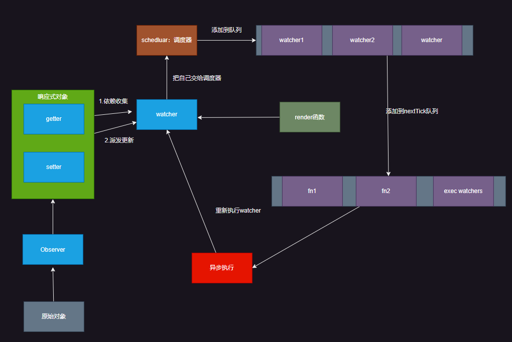

#  vue面试题

## 01.什么是Vue的响应式？

`vue数据响应式设计的初衷是为了实现数据和函数的联动`，当数据发生变化后，该数据的联动函数将会自动运行。

具体在vue的开发中，数据和组件的render函数关联在一起，从而实现了数据变化自动运行render，在感官上就看到了组件的重新渲染。

除了vue自动关联的render函数，其他还有很多适用到vue响应式的场景，比如computed、watch等等，不能仅吧vue的数据响应式想象成和render的关联 


## 02.Vue2和Vue3响应式的区别？
Vue2和Vue3双向数据绑定的区别，可以理解为Proxy和Object.defineProperty的区别，针对于这两个技术的区别，在js的面试题中提到过了

Proxy拦截对象的所有基本操作，而Object.defineProperty只是众多基本操作中其中一个

既然Vue2中无法拦截数组，当这个数组是个响应式数据的时候，如何实现的响应式?
`vue2中使用的Object.defineProperty无法监听到数组的变化，从而vue2直接改写了数组原型上的方法，其实看着是调用的`push`、`shift`、`unshift`等方法，其实是调用了改写过后的数组方法`
vue3就不需要了，vue3可以拦截整个数组

## 03. 阐述响应式的流程


vue2：

首先会把我们的数据先变成一个getter和setter，这是通过Object.defineProperty去做的，遍历对象的每一个属性，变成一个getter和setter，那么这样子之后，读取属性的时候就会调用getter函数，修改属性的时候，就回去调用setter函数，这就是一个响应式数据。那么他是如何去把响应式数据和render函数进行挂钩的呢？当运行render函数的时候，里面会用到一些数据，出去触发getter函数，在getter函数内部会去记录当前有一个函数render，他用到了我的这个属性（依赖收集），进行依赖收集的这个东西是watcher（利用了发布订阅模式），它会观察，将来有一天对这个收集过的响应式数据进行修改的时候，这个时候， 他就会去运行setter函数，然后会去通知watcher（这个步骤叫做notify：派发更新），这时候watcher会发现以前是运行render函数收集的依赖，那么他就会重新去触发render函数的执行，render函数重新执行，就又会生成虚拟dom树

> render函数在用到响应式数据的时候，他会进行收集依赖，当我们数据发生变化的时候，他会通知watcher，watcher会重新运行这个render函数


**响应式数据的最终目标：是当对象本身或者对象属性发生变化时，将会运行一些函数，最常见的就是render函数，在具体是线上，vue用到了几个核心部件：**

1. Observer
2. Dep
3. Watcher
4. Schedule

### 1. Observer

Observer要实现的目标很简单，就是把一个普通的js对象转化成响应式的对象

为了实现这一点，Observer会把对象的每一个属性通过Object.defineproperty转化成带有getter和setter的属性，这样一来，当访问和设置属性时，vue就有机会做一些别的事情


Observer是vue内部的构造器，我们可以通过vue提供的静态方法Vue.observable(object)间接使用该功能。

在组件生命周期中，这件事发生在beforecreate之后，create之前。

具体实现上，他会用递归遍历对象的所有属性，以完成深度的属性转换。

由于遍历只能遍历到对象的当前属性，因此无法监控到将来动态增加或者删除的属性，因此vue提供了$set和$delete两个实例方法，让开发者通过这两个实例方法对已有响应式的对象添加或者删除属性。

对于数组，vue会更改它的隐式原型，之所以要这样做，是因为vue需要监听那些可能改变数组内容的方法


总之，Observer的目标，就是要让一个对象，他属性的读取，赋值，内部数组的变化，都要能够被vue感知到。


### 2. Dep

在Observer中有两个问题没有解决，就是读取属性时要做什么事，而属性变化时候，要做什么事，这个问题要靠dep来解决，Dep的含义是Dependency，表示依赖的意思。

Vue会为响应式对象中的每个属性、对象本身、数组本身创建一个dep实例，每个dep实例都有能力去做以下两件事：

- 记录依赖：是谁在用我
- 派发更新：我变了，我要通知到那些用到我的人

当读取响应式数据的某个属性的时候，他会进行依赖收集，有人用到了我

当改变某个属性的时候，他会派发更新：那些用到我的人，听好了，我变了， 你也要去做相应的事，改变数据


### 3. Watcher

这里又出现一个问题，在getter中进行依赖收集的时候，他是怎么知道是谁在调用我？


要解决这个问题，需要依赖另一个东西：watcher

当某个函数执行的过程中，用到了响应式数据，响应式数据就是无法知道是哪个函数在用自己的。

因此，vue通过一种巧妙的办法来解决这个问题

我们不要直接更新函数，而是把函数交给一个叫做watcher的东西来执行，watcher就是一个对象，每个这样的函数执行时候，都会创建一个watcher，通过watcher去执行。

watcher会设置一个全局变量，让全局变量记录当前负责执行的watcher等于自己，然后再去执行函数，在函数的执行过程中，如果发生了依赖记录(dep.depend())， 那么dep就会把这个全局变量记录下来，表示：有一个watcher用到了我这个属性

````js
// watch 内部
currentWatcher = this；// 表示当前是这个watcher用到了我，接下来使用dep.depend()进行依赖收集的时候看，就知道是谁在调用这个响应式数据了
执行render函数中，使用obj.a 的时候，会在getter内部去调用dep.depend()完成依赖收集
````


当dep进行派发更新的时候，他会通知之前记录的所有watcher：我变了


每一个vue组件实例，都至少对应一个watcher，该watcher中对应了该组件的render函数。

watcher首先会把render函数进行一次依赖收集，于是那些在render该函数中用到的响应式数据都会记录这个watcher


当数据发生变化时，dep就会通知该watcher，而watcher将重新运行render函数，从而让界面重新渲染同时重新记录当前的依赖。


### 4. Schedule(调度器)

现在就剩下最后一个问题，就是Dep通知到watcher之后，如果watcher执行重运行对应的函数，就有可能导致该函数频繁运行，从而导致效率低下


试想：如果交给一个watcher的函数，它里面用到属性a、b、c、d，那么a、b、c、d属性都会记录依赖，于是下面的代码就会触发四次更新：

````js
state.a = 'new data'
state.b = 'new data'
state.c = 'new data'
state.d = 'new data'
````

这样显然是不合适的，因此watcher会受到派发更新的通知后，实际上并不会直接运行对应的函数，而是把自己交给一个叫做调度器的东西

调度器维护一个执行队列，该队列每一个watcher只会存在一次，队列中的watcher不是立即执行，他会通过一个nextTick的工具方法，把这些需要执行的watcher放到事件循环的微队列中，nexttick的具体方法是通过promise完成的

> nextTick通过this.$nextTick暴露给开发者
>
> nextTick的具体处理方式：https://v2.cn.vuejs.org/v2/guide/reactivity.html#%E5%BC%82%E6%AD%A5%E6%9B%B4%E6%96%B0%E9%98%9F%E5%88%97


也就是说，当响应式数据发生变化时，render函数的执行是异步的，并且在微队列中


### 5.  总体流程



 


> 首先原始对象，会交给Observer，会变成一个响应式对象，会有getter和setter，突然在某个时刻，render函数要执行，他并不是立即执行，它是交给watcher来执行，watcher会创建一个全局变量，再执行render函数，在执行的过程中，会用到这个响应式对象中的属性，于是响应式对象的属性，会被收集进来（记录这个属性，用到了这个watcher，另外一个属性也用到了watcher，还有一些对象也用到了这个watcher）。当响应式数据发生改变的时候，会做派发更新，之前已经记录到了这个数据有一个watcher用到了我，通知这个watcher做出一些相应的操作（比如重新执行原来的函数啊），watcher不是立即执行这个函数，不然的话，很有可能会重复执行很多遍，他是把自己交给一个调度器，这个调度器的作用就是把这个watcher添加到队列，同时会把队列的执行过程交给nextTick，进行异步执行，每当数据发生变化的时候，会重复这个执行过程


## 04. 谈谈对虚拟dom的理解

### 1.什么是虚拟dom？
虚拟dom本质上就是一个普通的js对象，用于描述视图的界面结构。
在vue中，每个组件都有一个render函数，每个render函数都会返回一个虚拟dom，这也就意味着每个组件都对应着一颗虚拟dom树

### 2.为什么需要虚拟dom？
虚拟dom的目的从来都不是为了提升效率，如果说是为了提升效率，那么React Fiber(为了提高虚拟dom的效率)？那么svelte（全篇都没有虚拟dom，都是在操作真实的dom）？
那为什么还要需要虚拟dom呢？

- 框架设计：
> 对于vue、react这种框架来说，用他们的那一套设计方式，就避免不了使用虚拟dom，或者说这是他们比较简单的一种方式（当数据发生改变的时候，理想状态是知晓哪个数据发生了变化，找到与之关联的节点，只需要修改这一个节点就好了，理论上是可以做到的，但实际上特别的负责，特别的困难，因为vue和react都是组件开发，他不知道哪个节点发生了改变，他知道的是哪个组件发生了改变（数据发生变化，该组件的render函数重新执行），然后没办法了，在render函数必须要全量渲染，如果全部渲染成真实的dom，那这个效率是非常夸张的，与其操作真实的dom，不如选个折中的办法，也就有了虚拟dom的诞生（操作js的效率要比操作真实dom要好很多），vue还是比较好的，react再进行全量渲染的时候更夸张，他从根组件开始全量渲染）`也就是说网上说的虚拟dom能提高效率也是在render函数中进行全量渲染的前提下进行的`
- 跨平台：
> 只有浏览器中才有真实dom，想一些原生安卓或者是桌面端，他连dom的概念都没有，为什么vue框架和react框架可以实现一套代码，多端运行，其实就是因为它的虚拟dom只是一个普通的js对象，在别的平台下，其实没有真实dom，但是有虚拟dom，可以照样那些真实组件进行对应，也可以很轻松的实现跨平台

### 3. 虚拟dom是如何转化成真实dom的？
在一个组件实例首次被渲染时候，他会生成虚拟dom树，然后根据虚拟dom树创建真实dom，并把真实dom挂在到页面中合适的位置，此时，每个虚拟dom便会对应一个真实的dom。

如果一个组件收到响应式数据变化的影响，需要重新渲染时，他仍然会调用render函数，创建一个新得虚拟dom树，用新树和旧树对比，通过对比，vue会找到最新更新量，然后只更新必要得虚拟dom节点，这些更新过得虚拟节点，会去修改他们对应得真实dom

这样依赖，就保证了对真实dom达到最小得改动过。


### 4. 模板和虚拟dom得关系
vue框架中有一个compile模块，它主要负责将模板转化成render函数，而render函数调用后将会得到虚拟dom
编译得过程分为两步：
1. 将模板字符串转换成AST（抽象语法树：用一种js树形结构，来描述原始代码）
2. 将AST转化成render函数

如果使用传统的引入方式或者vue-cli的配置中开启了`runtimeCompile:true`. 则编译时间发生在组件第一次加载时，这也称为运行时编译。
如果是在vue-cli的默认配置下，编译发生在打包时，这称之为模板预编译

编译是一个及其耗费性能的操作，预编译可以有效的提高运行时的性能，而且，由于运行的时候已不需要编译，vue-cli在打包时会排除掉vue的compile模块，以减少打包体积

模板的存在，仅仅是为了让开发人员更加方便的书写界面代码
`vue最中运行的时候，需要的是render函数，而不是模板，因此模板中的各种语法，在虚拟dom中是不存在的，他们都会变成虚拟dom的配置`

模板的本质： 是渲染函数的语法糖，用于描述整个渲染的过程，他最终会产生表达界面结构的虚拟节点


## 05. 阐述Vue中的diff算法


> 当组件创建和更新时，vue均会执行内部的update函数，该函数在内部调用render函数生成虚拟dom，组件会指向新树，然后vue将新旧两棵树进行对比，找到差异点，最终更新到真实的dom
>
> 
>
> 对比差异的过程就是diff，vue在内部通过一个叫patch的函数完成该过程
>
> 在对比时，vue采用深度优先、逐层比较的方式进行比对。
>
> 在判断两个节点是否相同时，vue是通过虚拟节点的key和tag进行判断的
>
> 具体来说，首先对根节点进行对比，如果相同则将旧节点关联的dom引用到新节点上，然后根据需要更新属性到dom，然后再比对其子节点数组；如果不相同则按照新节点的信息递归创建出所有的真是dom，同时挂载到对应的虚拟节点上，然后移除所有旧的dom。
>
> 在对比其子节点数组时，vue对每一个子节点数组使用了两个指针，分别指向头尾，然后不断的向中间靠拢来进行对比，这样做的目的是尽量复用真是dom，尽量少的销毁和创建真实dom。如果发现相同，则进入和根节点一样的对比流程，如果发现不同，则移动真实dom到合适的位置。
>
> 这样一直递归的遍历下去，直到整棵树完成对比；


### 1. diff的时机

当组件创建时、以及依赖的属性或数据发生变化时，会运行一个函数（不是render函数），该函数会做两件事

- 运行_render生成一颗新的虚拟dom树（vnode tree）
- 运行_update传入虚拟dom树的根节点，对新旧两棵树进行对比，最终完成对真实dom的更新

核心代码如下：

````js
// vue的构造函数
function Vue() {
	// ... 其他代码
    var updateComponent = () => {
        this._update(this._render())
    };
    new Watcher(updateComponent);
    // ... 其他代码
}
````

diff就发生在_update函数的运行过程中

### 2. _update函数在干什么

_update函数会接受一个vnode参数，这就是新生成的虚拟dom树

同时，`_update`函数通过当前组件的`_vnode`属性，拿到旧的虚拟dom树

`_update`函数首先会给组件_`vnode`属性重新赋值，让它指向新树


然后会判断旧树是否存在：

- 不存在：说明这是第一个加载组件，于是通过内部的patch函数，直接遍历树，为每个节点生成真实的DOM，挂载到每个节点的elm属性上


- 存在： 说明之前已经渲染过该组件，于是通过内部的patch函数，对比两颗新旧树，以达到以下两个目标：
     - 完成对所有真实dom的最小化处理
     - 让新树的节点对应合适的真实dom


### 3. patch函数的对比流程

术语解释：

【相同】：是指两个节点的标签类型、key值均相同，但input元素还要看type属性

【新建元素】：是指根据一个虚拟节点提供的信息，创建一个真实dom，同时挂在到虚拟节点的elm属性上

【销毁元素】：是指_vnode.elm.remove()

【更新】： 是指对两个虚拟节点进行对比更新，他仅仅发生在两个虚拟节点【相同】的情况下

【对比子节点】：是指对两个虚拟节点的子节点进行对比


详细流程：

1. 根节点比较

​	如果两个节点【相同】，进入【更新】流程

- 将旧节点的真实dom复制到新节点，newVnode.elm = oldValue.elm
- 对比新旧节点的属性，有变化更新到真实Dom中
- 当前两个节点处理完毕，开始【对比子节点】

​	如果不相同

- 遍历新dom节点【新建元素】
- 旧节点【销毁元素】

2. 子节点比较

​	在【对比子节点】时候，vue一切的出发点都是为了

- 尽量啥也不动
- 不行的话，尽量仅改动元素属性
- 再不行的话，尽量移动元素，而不是删除和创建元素
- 再不行的话，删除和创建元素


## 06. 依赖收集

> 在vue2中，每个响应式数据都会被添加一个dep属性，响应式数据会收集其所依赖的watcher，当数据发生变化时，会通知相应的watcher进行更新，例如在初始化的时候，默认会调用渲染函数，触发依赖收集方法：`dep.depend()`, 当数据发生变化时，会调用`dep.notify()`，触发对应的watcher进行更新。vue3的设计思想和vue2保持一致。在vue3中，依赖收集通过Map结构将属性和effect建立映射关系，例如在初始化时，默认会调用渲染函数，触发属性依赖收集，这个通过`track()`方法实现，，当数据发生变化时，会找到对应effect，通过trigger()将对应的effect列表依次执行


## 07. nexttick

> 组件的更新是异步的，就是通过nextTick完成的


原理：

> nextTick其实是做的一个任务降级，他的目的是将其包装成任务，放到消息队列的末尾
>
> 先判断当前浏览器是否支持Promise，如果支持Promise的话，直接放到then方法中
>
> 如果不支持Promise，会再判断是否支持MutationObserver
>
> 再不支持的话，回去判断是否支持setImmediate
>
> 如果还不支持，就会放到setTimeout里面


## 08. 简述以下MVVM

Model-View-ViewModel


### 1. MVVM机制


MVVM是一种模式(视图模型双向绑定)，以数据为核心，数据驱动视图的模式，让我们把更多的关注点放在数据上，并不是直接操作dom

MVVM出现以后，能在一定程度上减轻开发人员的心智负担，不需要频繁的获取DOM

M：数据，他是一切的核心

V： 视图，界面上展现的结果

VM：数据流向视图，视图流向数据的桥梁，数据发生变化，视图自动发生改变，视图发生改变，一定也会导致数据发生变化


在VM中会做两件事：DOM监听和数据绑定

- DOM监听：当DOM中发生一些事件时，导致页面上的发生改变的时候，会自动应用到数据中
- 数据绑定：将M中的数据变化实时反应到视图中


### 2. 如何实现MVVM


从两个方面来说：

- M->V（数据的响应式）

- V->M（DOM监听，比如input事件呐）


#### 数据代理

#### 数据劫持


## 09. 生命周期

一个组件的生命周期是从组件被开始创建到销毁一系列的过程


|     vue2      | 描述                                                         |        vue3        | 描述                                                         |
| :-----------: | ------------------------------------------------------------ | :----------------: | ------------------------------------------------------------ |
| beforeCreate  | 在实例初始化之后，数据观测 (data observation) 和事件配置 (event/watcher setup) 之前调用。 |       setup        | 开始创建组件之前，在 beforeCreate 和 created 之前执行，创建的是 data 和 method |
|    created    | 在实例创建完成后被调用，此时实例已完成数据观测，但尚未挂载到 DOM 上 |       setup        |                                                              |
|  beforeMount  | 在挂载开始之前被调用，相关的 render 函数首次被调用           |   onBeforeMount    |                                                              |
|    mounted    | 实例被挂载后调用，此时组件已经在 DOM 中渲染完成。            |     onMounted      |                                                              |
| beforeUpdate  | 数据更新时调用，发生在虚拟 DOM 重新渲染和打补丁之前。        |   onBeforeUpdate   |                                                              |
|    updated    | 组件更新完成后调用，此时虚拟 DOM 已重新渲染并应用补丁。      |     onUpdated      |                                                              |
| beforeDestroy | 实例销毁之前调用。在这一步，实例仍然完全可用。               |  onBeforeUnmount   |                                                              |
|   destroyed   | 实例销毁后调用，此时所有的事件监听器被移除，所有的子实例也被销毁 |    onUnmounted     |                                                              |
|   activated   | 被 keep-alive 缓存的组件激活时调用。                         |    onActivated     |                                                              |
|  deactivated  | 被 keep-alive 缓存的组件失活时调用                           |   onDeactivated    |                                                              |
| errorCaptured | 在捕获一个来自后代组件的错误时被调用                         |  onErrorCaptured   |                                                              |
|               |                                                              |  onRenderTracked   | 仅发生在DEV模式下                                            |
|               |                                                              | onRenderTrigglered | 仅发生在DEV模式下                                            |
|               |                                                              |  onServerPrefetch  | 仅发生在SSR模式下                                            |

vue2和vue3的区别： 前两个生命周期变成了setup


onRenderTracked： 仅会在开发模式下触发(调试钩子)：状态追踪， 在组件进行渲染过程中追踪到响应式数据发生的变化时，调用

onRenderTrigglered:  仅会在开发模式下触发（调试钩子）：状态触发， 响应式数据发生了变化引起了组件渲染，此时调用。

onServerPrefetch:  仅在SSR下会触发的生命周期钩子函数： 用于服务器提前获取数据


## 10. 组件间的传递

vue2和vue3稍有点不同

### 1. 父传子：props

````vue
<script>
  // 父组件 vue2 
export default {
    data:()=>({
        msg: '123'
    })
}
</script>
<template>
	<div>
        <child :msg="msg"></child>
    </div>
</template>
<style scoped>

</style>
````

````vue

<script>
// 子组件
export default {
    data:()=>({
        msg: '123'
    }),
    props: {
        msg: {
            type: string,
            default: 'abc',
            required: true
        }
    }
}
</script>
<template>
	<div>
       {{msg}}
    </div>
</template>
<style scoped>

</style>
````

vue3

````vue
<script setup>
import child from './child.vue'
import {ref} from 'vue'
const msg = ref<string>("msg")
</script>
<template>
	<div>
        <child :msg="msg"></child>
    </div>
</template>
<style scoped>

</style>
````

````vue
<script>
import {withDefault} from 'vue'

    
const props = withDefault(defineProps<{
    msg: string
}>(), {msg: '123'})
</script>
<template>
	<div>
       {{props.msg}}
    </div>
</template>
<style scoped>

</style>

````

### 2. 子传父

vue2

````vue
<script>
  // 父组件 vue2 
export default {
    data:()=>({
        msg: '123'
    }),
    methods: {
        received(value) {
            this.msg = value
        }
    }
}
</script>
<template>
	<div>
        <child :msg="msg" @changeMsg="received"></child>
    </div>
</template>
<style scoped>

</style>
````

````vue

<script>
// 子组件
export default {
    data:()=>({
        obj: '123'
    }),
    props: {
        msg: {
            type: string,
            default: 'abc',
            required: true
        }
    },
    methods: {
        changeMsg() {
            this.$emit("changeMsg", this.msg)
        }
    }
}
</script>
<template>
	<div>
       {{msg}}
        <button @click="changeMsg">修改obj</button>
    </div>
</template>
<style scoped>

</style>
````

vue3


````vue
<script setup>
import child from './child.vue'
import {ref} from 'vue'
const msg = ref<string>("msg")
</script>
<template>
	<div>
        <child :msg="msg"></child>
    </div>
</template>
<style scoped>

</style>
````

````vue
<script>
import {withDefault} from 'vue'

    
const props = withDefault(defineProps<{
    msg: string
}>(), {msg: '123'})
</script>
<template>
	<div>
       {{props.msg}}
    </div>
</template>
<style scoped>

</style>

````

### 3. 兄弟传值

vue2： 事件总线(eventBus)，同用同一个vue实例，借助这个上面的$emit和$on进行监听和接收

但是要在组件销毁的时候，移除对事件总线的监听（event.$off(callback,value)）

vue3中移除了事件总线，可以使用`mitt`第三方库：https://github.com/developit/mitt


### 4. 透传

provide/inject


## 11. Vue路由实现

从以下方面进行解读：

- 解释几种路由模式的实现原理
- 说一下 **router**和**route**的区别
- **VueRouter** 有哪几种导航守卫？
- 解释一下 **vueRouter**的完整的导航解析流程是什么

### 1. hash模式和history模式的实现原理

路由模式解决了两个问题：

- 路由从哪里获取路径
- 路由如何改变访问路径

vue-router提供了三种路由模式

1. hash：默认值，路由从浏览器地址栏中的hash部分获取路径，改变路径也是改变的hash部分，该模式兼容性最好

2. history：路由从浏览器地址栏的localtion.pathname中获取路径，改变路径使用的是H5的history API，该模式可以让地址栏更加友好，但是要保证浏览器支持history API

3. abstract： 路由从内存中获取路径，改变路径也只是改变内存中的值，这种模式通常应用到非浏览器环境中。


history刷新导致404的问题原因：

- 使用history API并不会导致刷新页面，但是当按下回车键或者手动刷新的时候，其实会向服务器发送真实的请求，但是后端并没有配置该地址的返回内容，会导致404

hosh不会导致页面404的原因：

- host的URL组成有一部分是hash，从锚点以后的hash部分，并不会出现在真实的网络请求中


实现原理的不同：

> hash模式是从地址栏中的hash部分获取地址,   通过localtion.hash进行修改并且通过window.hashchange事件可以监听到URL的变化．
>
> 而histroy是通过调用H5的history API来实现的,通过history.pushState进行页面的跳转,  调用 `history.pushState()` 或者 `history.replaceState()` 不会触发 `popstate` 事件。`popstate` 事件只会在浏览器某些行为下触发，比如点击后退按钮（或者在 JavaScript 中调用 `history.back()` 方法）。即，在同一文档的两个历史记录条目之间导航会触发该事件。通过使用浏览器的历史记录栈实现的


### 2. router和route的区别

> route 对象表示当前的路由信息，包含了当前 URL 解析得到的信息。包含当前的路径，参数，query **对象**,比如在路由守卫中的to，from, 中的路由信息就是route
>
> 
>
> 而router是路由实例,可以通过路由实例实现路由的跳转等其他功能: push,replace,go


### 3. vuerouter共有哪几种导航守卫

全局守卫: 全局前置守卫(beforeEach), 全局解析守卫(beforeResolve), 全局后置守卫(afterEach)

组件内守卫: beforeRouterEnter, beforeRouterUpdate, beforeRouterLeave

路由独享守卫: beforeEnter


### 4. vueRouter完整的导航解析流程

> 一次完整的导航解析流程如下:  
>
> 1. 导航被触发
> 2. 在失活内的组件里调用离开守卫beforeRouterLeave
> 3. 调用全局的路由守卫
> 4. 在重用的组件内调用beforeRouterUpdate
> 5. 在路由配置中调用beforeEnter
> 6. 解析异步路由守卫
> 7. 在被激活的路由守卫中调用beforeRouterEnter
> 8. 调用全局的解析守卫beforeResolve
> 9. 导航被确认
> 10. 调用全局的afterEnter
> 11. 导致DOM更新
> 12. 用创建好的实例调用beforeRouterEnter守卫中传给next回调函数


## 12. @ Computed实现原理


　


## 13. Watch和Computed，method的区别，以及各自应用场景是什么？

watch和computed都是基于Watcher来实现的

原理：

> computed属性是具有缓存的，依赖的值不发生变化，函数就不会执行，watch则是监听值的变化，当值发生变化时调用对应的回调函数
>
> computed不会立即执行，内部会通过defineProperty进行定义，并且通过dirty属性来检测依赖的数据是否发生变化，
>
> watch则是立即执行，将老值保存在watcher上，当数据更新时，重新计算新值，将新值和老值传递到回调函数中


应用场景：

> computed的使用场景是依赖已有的属性来组合/运算生成一个新的属性，当依赖的数据发生变化时，计算属性得到的值也会发生变化，通常是多个数据对应一个数据
>
> watch在项目中的使用一般是监听某个属性发生了变化，比如监听到某个值发生了变化，要请求一次网络，这种场景就比较适合watch


## 15. Keep-alive


在vue中keep-alive是一个内置组件，和transition组件相似，他是一个抽象组件，自身不会渲染成一个dom元素，也不会出现到父组件链中。

可以将其包裹的动态组件进行缓存，将其状态保存在内存中，避免了组件之间的切换导致组件频繁的创建和销毁造成的性能消耗。

keep-alive提供了两个生命函数钩子用于控制缓存的行为：activated和deactivated

- activated当包含的组件被激活时调用，即切换到当前组件时被调用
- deactivated当缓存组件被销毁的时候调用，即被切换到其他组件时调用

keep-alive还提供了一些属性：include、exclude、max

- include： 值为字符串或者正则表达式，当满足匹配结果的组件才会被应用
- exclude： 名称匹配的组件不会被缓存
- max： 最大缓存数量，当大于这个数量的时候，后续的组件不会被缓存


keep-alive实现原理：

> 具体来说，keep-alive会创建一个名为cache的缓存对象，用来存储被缓存的组件实例。
>
> 当一个被keep-alive包裹的组件切换出去时，其实例会被缓存到cache中。切换回来时，如果之前被缓存的组件实例存在，则会直接从缓存中取出实例，并重新挂载到DOM上。这样就能保留组件的状态，并且不会重新执行created、mounted等生命周期钩子函数。


应用场景：

> 前进后退页面缓存
>
> tab切换
>
> 路由切换缓存

 


## 16. Vue3与Vue2的区别

> vue2采用选项式API， vue3采用组合式API，vue3向下兼容vue2，vue3可以更好的抽离公用组件，自定义hook


> fragment： vue3支持多个根节点，而vue2只支持根节点


> 提供了很多有用的内部组件：suspense（异步组件）， teleport（传送组件： 可以将该组件下的内容传送到该组件外的位置，比如弹出框）
>
> 

> 打包体积上的优化：优化了tree-shaking，在vue3中，会向外暴露出很多工具函数，在进行打包的时候，vue会把没有用到的API不参与打包


> 更好的ts支持：因为vue3中也暴露了很多类型工具，在这vue3源码就是通过ts编写的


> 生命周期的区别： vue3相对vue2中新添加了三个生命周期函数，同时使用setup生命周期钩子替代了beforeCreate和created，同时针对于开发环境调试提供了两个生命周期函数：`onRenderTracked`和`onRenderTrigglered`，针对于SSR还提供了一个新的生命周期钩子函数：`onServerPrefetch`


> 响应式原理


> diff算法区别


> 生命周期区别


> 虚拟dom区别


> 事件缓存区别


### 1. vue3是如何实现多根节点的

vue2中只能有一个根标签，但是在vue3中根组件已经可以有多个根节点了


在vue2中只所以这么做是因为vdom是一颗单根树形结构，patch方法在遍历的时候从根节点开始遍历，它要求只有一个根节点，组件也会转换为一个vdom,自然满足这个要求


vue3中之所以可以有多个节点，是因为引入了Fragment的概念，这是一个抽象的节点，如果发现组件有多个根，就创建一个Fragment节点，把多个根节点作为它的children,将来patch的时候，如果发现是一个Fragement节点，则直接遍历children创建或更新。

 

### 2. vue3如果实现效率提升？

> 客户端渲染效率比vue2提升了1.3-2倍
>
> SSR渲染效率上比vue2提升了2-3倍
>
> 面试题：vue3效率提升主要体现在那些方面？

#### 1. 静态提升

vue3会对模板中的静态节点和静态属性进行提升（编译期间）

静态：不会发生变化的

````js
// 静态节点提升


// vue2
function render() {
    createVnode("h1",null,"hello world")
}
// vue3 静态提升
const hosited = createVnode("h1",null,"hello world")
function render() {
    // 直接调用hosited
}


// 静态属性提升
<div class="user">{{ user.msg }}</div>
const hosited = {class: 'user'}
function  render() {
    createVnode("h1",hosited,user.msg)
}
````


#### 2. 预字符串化

在vue2中，对于模板中写的节点，不分静态节点和动态节点，每次数据发生改变的话，会重新执行render函数，生成虚拟dom，虚拟dom中包含了很多静态节点，每次都要来一遍

vue3中针对静态节点做了预字符串化，也就是他会把哪些静态节点全都变成字符串，也少了虚拟dom转化为真实dom的操作复杂度。

当vue的编译器遇到大量的静态内容，会将其直接编译成一个普通字符串节点。


#### 3. 缓存事件处理函数

````vue
<button @click="count++">
    
</button>

<script setup>
// vue2
    render(ctx) {
        return createVNode("button", {
            onclick: function($event) {
                ctx.count++
            }
        })
    }
    //vue3
    render(ctx,_cache){
        return createVNode("button", {
            onClick: cache || (cache[0] = ($event) => (ctx.count++))
        })
    }
</script>
````


#### 4. Block Tree


#### 5. PatchFlag

## 17.  ref和relative


## 18. Watch和WatchEffect


## 19.  Provide和inject


## 20. toRefs和toRef


## 21. shallowReactive 与 shallowRef


## 22. readonly 与 shallowReadonly


## 23. toRaw与markRaw转换为普通数据和标记属性非响应式


## 24. customRef 自定义ref使用


## 25. 响应式数据的判断

isRef、isReactive、isReadonly、isProxy


## 26. vue3中使用插槽


## 27. vue路由守卫

onBeforeRouteLeave，onBeforeRouteUpdate


------


## 28. 自定义Hooks


## 29. @ setup原理


## 30. 组合式API的好处


## 31. pinia和vuex的区别


## 32. vue3.3新增内容


## 33. SSR

SSR是服务端渲染

服务器端渲染是一种将vue或者react应用程序渲染为html字符串，并在服务端发送到客户端的技术

SSR的好处在于更好的首次加载性能以及SEO搜索优化，当使用SSR的时候，服务端会接收到客户端的请求，在服务器上启动一个vue应用程序并生成一个HTML字符串，返回给客户端，客户端在收到这个字符串的时候，会当成静态HTML进行显示。

SSR带来的优势主要减少了客户端的渲染时间和首次加载时间，因为服务端渲染，会在服务器上进行大部分的渲染工作客户端只需要介绍一个html字符串就好

然而，ＳＳＲ也存在一些限制，使用ＳＳＲ，服务器需要更多的服务端资源，由于ＳＳＲ的复杂性，开发和调试可能会更加复杂，还有一些Ｖｕｅ的特定注意事项，总的来说，服务器端渲染是一个强大的工具，可以提供更好的性能和ＳＥＯ搜索引擎的优化。再合适的场景下，ＳＳＲ会为我们提供更好的用户体验和网页性能。


## 34. vue3中的tree-shaking


## 35. 介绍一下Vue3中的内置组件


## 36. v-for和v-if的优先级


## 37.v-for为什么要加key


## 38. vue3为什么比vue2快


## 39. @ 指令的实现原理


## 40.  单向数据流的原因


## 41. @ v-model的实现原理


## 42. 启动程序的时候，vue单文件初始化的流程


## 43.  说一下什么是单文件组件，以及单(多)组件的区别


## 44. vue中的三种Effect，以及作用是什么


## 45. hook是什么


## 46. @ 什么是异步组件，以及实现原理


## 47. 模板的编译流程


## 48. @ 插件是什么，以及实现原理


