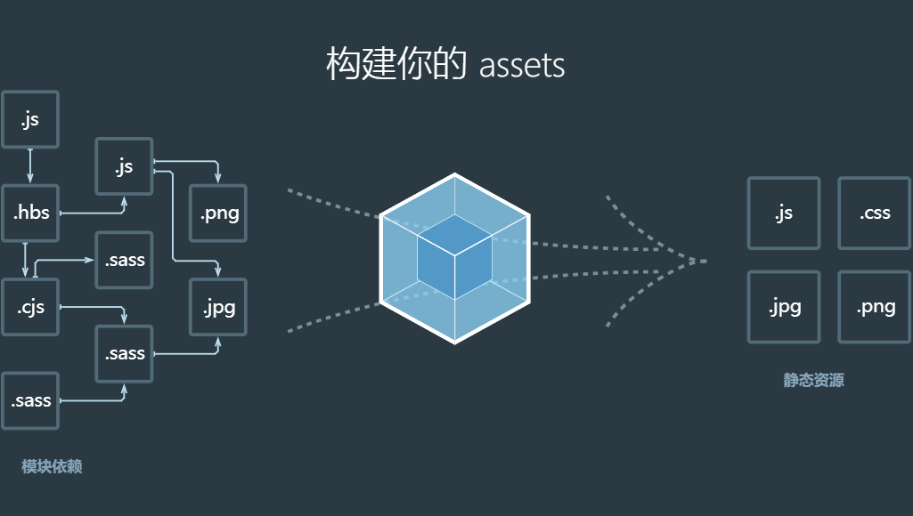
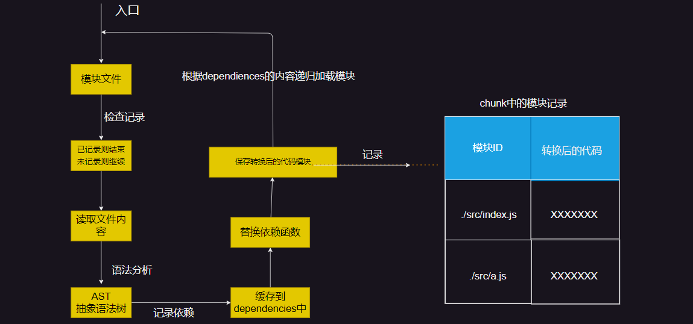
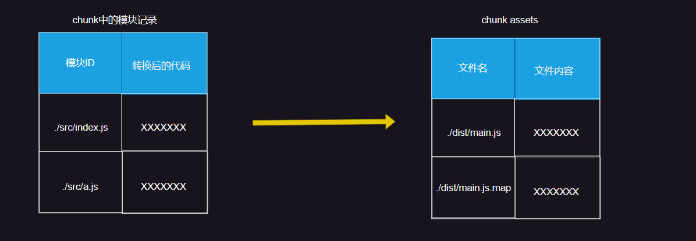
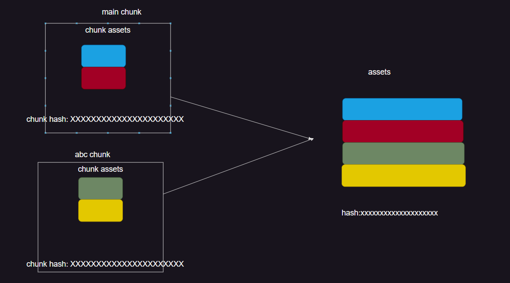
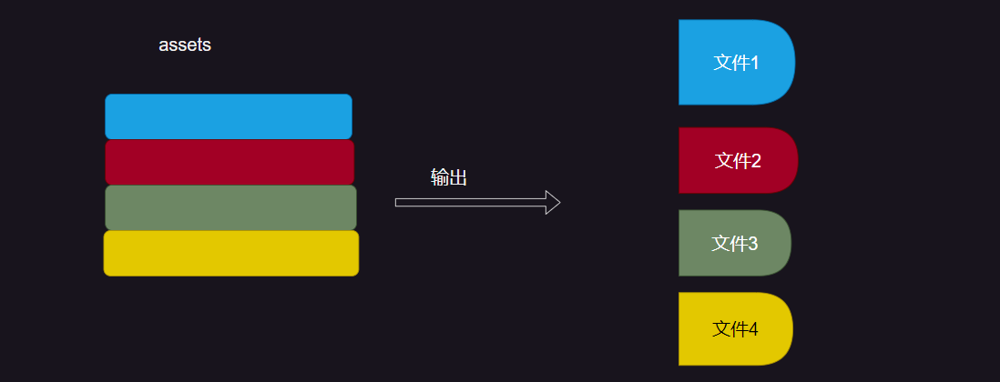
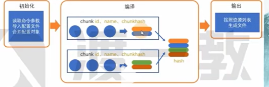

# webpack面试题

## 1.  webpack的构建流程

webpack就是将源代码通过编译（构建、打包）生成最终代码




整个过程大致分为三步：

- 初始化
- 编译
- 输出


### 1. 初始化

此阶段，webpack会将CLI参数、配置文件、默认配置进行融合，形成一个最终的配置对象

对配置的处理是依托一个第三方库yargs完成的

此阶段相对来说比较简单，主要是为接下来的编译阶段做好准备

目前，可以简单的理解为，初始化节点主要用于产生一个最终的配置


### 2. 编译

#### 1. 创建chunk

chunk是webpack在内部构建过程中的一个概念，译为块，他表示通过某个入口文件找到的所有依赖的统称。

根据入口文件默认（默认为./src/index.js）创建一个chunk


chunk是由名字的

- name： 默认是name
- id： 唯一编号，在开发模式下与name相同，在生产模式下是一个数字，由0开始

#### 2. 构建所有依赖模块




首先会在当前chunk中从入口开始检索，会先判断当前依赖是否记录，如果没有记录开始读取文件内容，将文件的内容转化为AST（目的是生成树形结构，然后遍历树形结构，找到所有的依赖）然后缓存到dependiences中（是一个数组，数组中的每一项内容为相对于根目录的相对地址`./src/index.js`），将这个require替换为_webpack_require()，然后进行保存，模块ID对应的转换后的代码

````js
require('./a.js')
console.log('abc')


// 转化后的代码模块
_webpack_require('./src/a.js')
````

只是将代码转换为这种格式，不调用函数

如果加载模块的时候，发现模块又引入了其他的模块，那么他会在加载完这个模块之后，再去加载依赖的模块，如果是依赖的第三方模块，那么他会从node_modules中加载，如此递归下去，知道全部加载完，全部转换，每转换一个都会填充到这个列表里面，

总之，通过递归的方式，将整个项目中所有的模块都加载，构建所有的依赖模块，这一步骤也是最复杂的

#### 3. 产生chunk assets

在第二步完成之后，chunk会生成一个模块列表，列表中包含了模块id和模块转化后的代码

接下来，webpack会根据配置为chunk生成一个资源列表，即chunk assets；资源列表可以理解为是生成到最终文件的文件名和文件内容




> chunk hash是根据生成的文件列表中的所有的内容（将一个chunk里面的所有的内容联合起来生成一个hash）
>
> hash：一个算法，具体有很多种类，特点是能将一个任意长度的字符串转化为一个固定长度的字符串，而且可以保证只要原始内容没有发生变化，产生的hash字符串就不变

#### 4. 合并 chunk assets

会将多个chunk的assets合并到一起，并产生一个总的hash




### 3. 输出
此步骤非常简单，webpack将利用nodejs模块中的fs模块（文件处理模块），根据编译生成的总的assets，生成相应的文件





### 4. 总过程




当从命令行敲下webpack打包命令的时候，先会进行初始化，将cli参数，配置文件，默认配置进行融合，形成一个最终的配置对象

把生成的配置对象交给编译器，他可能会有一个chunk，有可能会有多个chunk，至少会有一个，在每个chunk里面，他要构建好自己的模块，他把这个chunk里面所有相关的模块找到，找到之后会生成一个资源列表（表示这个chunk最终会对应哪些资源）每个chunk会有自己的名字、id和hash，hash是通过这个资源列表算出来的。

最后把每一个chunk生成的资源合并成一个完整的资源，并且生成一个完整的hash，最终根据这个完整的资源列表输出到文件，

（从入口文件开始查找，然后判断该模块是否已经记录，然后读取文件内容，将文件内容生成ast，通过递归AST，转化原有代码的格式，然后将代码格式和chunk名称对应起来进行存储，得到一个模块列表）


> webpack的运行流程是一个串行的流程、也就是从启动到结束会经历一些流程
>
> 首先第一个就是进行`初始化`: 将cli参数、配置文件中的配置、默认配置进行融合，生成最终的一个配置对象
>
> 第二步：`开始编译`，用上一步得到的配置对象，加载我们所有配置的插件，执行对象的run方法
>
> 第三步才是`确定入口`，根据配置中的entry，找到所有的一个入口文件
>
> 第四步：`编译模块`， 从入口文件开始触发，调用所有的loader，对模块进行一个编译，再找出该模块所依赖的所有模块，递归这个步骤，直到所有的入口文件都经过了这个步骤，得到被编译的一个最终内容，还有他们之间的依赖关系
>
> 第五步：`输出资源`


在以上的过程中，webpack就会在特定的时间点广播出特定的事件，插件会在监听到一些事件之后


### 5. 专业术语


- module：模块、分割的代码单元、webpack中的模块可以是任意内容的文件，不仅限于js。

- chunk：webpack内部构建模块的一个块，一个chunk中可以包含很多块，这些模块是从入口文件中进行以来分析得来的。

- bundle：chunk构建好模块之后生成的chunk的资源列表，列表中的每一项就是一个bundle，可以认为bundle就是最终生成的文件。

- hash：最终的资源清单上所有内容联合生成的hash值

- chunkhash：chunk生成的资源清单内容联合生成的hash值

- chunkname：chunk的名称，如果没有配置的话，就是用main

- id： 通常指的是chunk的唯一编号，如果在开发环境下构建，和chunkname相同，如果是在生产模式下的构建，则使用一个从0开始的数字进行编号


## 2. loader和plugin的区别


- loader 是文件加载器，能够加载资源文件，并对这些文件进行一些处理，诸如编译、压缩等，最终一起打包到指定的文件中
- plugin 赋予了 webpack 各种灵活的功能，例如打包优化、资源管理、环境变量注入等，目的是解决 loader 无法实现的其他事


从整个运行时机上来看，如下图所示：


可以看到，两者在运行时机上的区别：

- loader 运行在打包文件之前
- plugins 在整个编译周期都起作用

在`Webpack` 运行的生命周期中会广播出许多事件，`Plugin` 可以监听这些事件，在合适的时机通过`Webpack`提供的 `API`改变输出结果

对于`loader`，实质是一个转换器，将A文件进行编译形成B文件，操作的是文件，比如将`A.scss`或`A.less`转变为`B.css`，单纯的文件转换过程


###  1. 编写loader


在编写 `loader` 前，我们首先需要了解 `loader` 的本质

其本质为函数，函数中的 `this` 作为上下文会被 `webpack` 填充，因此我们不能将 `loader`设为一个箭头函数

函数接受一个参数，为 `webpack` 传递给 `loader` 的文件源内容

函数中 `this` 是由 `webpack` 提供的对象，能够获取当前 `loader` 所需要的各种信息

函数中有异步操作或同步操作，异步操作通过 `this.callback` 返回，返回值要求为 `string` 或者 `Buffer`

代码如下所示：

```js
解释// 导出一个函数，source为webpack传递给loader的文件源内容
module.exports = function(source) {
    const content = doSomeThing2JsString(source);
    
    // 如果 loader 配置了 options 对象，那么this.query将指向 options
    const options = this.query;
    
    // 可以用作解析其他模块路径的上下文
    console.log('this.context');
    
    /*
     * this.callback 参数：
     * error：Error | null，当 loader 出错时向外抛出一个 error
     * content：String | Buffer，经过 loader 编译后需要导出的内容
     * sourceMap：为方便调试生成的编译后内容的 source map
     * ast：本次编译生成的 AST 静态语法树，之后执行的 loader 可以直接使用这个 AST，进而省去重复生成 AST 的过程
     */
    this.callback(null, content); // 异步
    return content; // 同步
}
```

一般在编写`loader`的过程中，保持功能单一，避免做多种功能

如`less`文件转换成 `css`文件也不是一步到位，而是 `less-loader`、`css-loader`、`style-loader`几个 `loader`的链式调用才能完成转换

### 2. 编写plugin

由于`webpack`基于发布订阅模式，在运行的生命周期中会广播出许多事件，插件通过监听这些事件，就可以在特定的阶段执行自己的插件任务

在之前也了解过，`webpack`编译会创建两个核心对象：

- compiler：包含了 webpack 环境的所有的配置信息，包括 options，loader 和 plugin，和 webpack 整个生命周期相关的钩子
- compilation：作为 plugin 内置事件回调函数的参数，包含了当前的模块资源、编译生成资源、变化的文件以及被跟踪依赖的状态信息。当检测到一个文件变化，一次新的 Compilation 将被创建

如果自己要实现`plugin`，也需要遵循一定的规范：

- 插件必须是一个函数或者是一个包含 `apply` 方法的对象，这样才能访问`compiler`实例
- 传给每个插件的 `compiler` 和 `compilation` 对象都是同一个引用，因此不建议修改
- 异步的事件需要在插件处理完任务时调用回调函数通知 `Webpack` 进入下一个流程，不然会卡住

实现`plugin`的模板如下：

```js
解释class MyPlugin {
    // Webpack 会调用 MyPlugin 实例的 apply 方法给插件实例传入 compiler 对象
  apply (compiler) {
    // 找到合适的事件钩子，实现自己的插件功能
    compiler.hooks.emit.tap('MyPlugin', compilation => {
        // compilation: 当前打包构建流程的上下文
        console.log(compilation);
        
        // do something...
    })
  }
}
```

在 `emit` 事件发生时，代表源文件的转换和组装已经完成，可以读取到最终将输出的资源、代码块、模块及其依赖，并且可以修改输出资源的内容


## 3. webpack的热更新原理

`HMR`全称 `Hot Module Replacement`，可以理解为模块热替换，指在应用程序运行过程中，替换、添加、删除模块，而无需重新刷新整个应用

例如，我们在应用运行过程中修改了某个模块，通过自动刷新会导致整个应用的整体刷新，那页面中的状态信息都会丢失

如果使用的是 `HMR`，就可以实现只将修改的模块实时替换至应用中，不必完全刷新整个应用

在`webpack`中配置开启热模块也非常的简单，如下代码：

```js
const webpack = require('webpack')
module.exports = {
  // ...
  devServer: {
    // 开启 HMR 特性
    hot: true
    // hotOnly: true
  }
}
```

实现原理：


## 4. 如何提高webpack的打包速度


## 5. webpack中常用的loader


## 6. webpack中哪些常用的plugin


## 7. webpack哪些可以提高效率的插件


## 8.  source map是什么，生产环境怎么用


## 9. 文件指纹是什么？


## 10. tree shaking原理


## 11.  babel原理


## 14. webpack的五大核心是什么