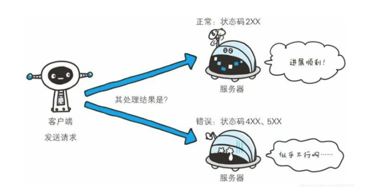

# 浏览器原理

## 1. 浏览器是如何渲染页面的？

当浏览器的网络线程接收到HTML文档后，会产生一个渲染任务，并将其传递给渲染主线程的消息队列。
在事件循环机制的作用下，渲染主线程取出消息队列的渲染任务，开始渲染流程。

整个渲染流程分为多个阶段：分别是：HTML解析、样式计算、布局、分层、绘制、分块、光栅化、画

整个阶段都有明确的输入输出，上一个阶段的输出会作为下一个阶段的输入
这样，整个渲染流程就形成了一套组织严密的生产流水线

### 1. 渲染的第一步是解析HTML

解析过程中遇到CSS解析CSS，遇到JS执行JS，为了提高解析效率，当浏览器开始解析之前，会启动一个预解析的线程，率先下载HTML中的外部css文件和外部的JS文件

如果主线程解析到`link`位置，此时外部的css还没有下载解析好，主线程不会等待，继续解析后续的HTML，这是因为下载和解析css的工作是在预解析线程中进行的。这就是CSS不会阻塞HTML解析的根本原因

如果主线程解析到`script`位置，会停止解析HTML，转而等待JS文件下载好，并将全局代码解析完成后，才会去继续解析HTML，这是因为JS代码的执行可能会修改当前的DOM树，所以DOM的生成
必须暂停，这就是JS会阻塞HTML解析的根本原因。

第一步完成后，会得到DOM树和CSSOM树，浏览器的默认样式，内部样式，外部样式，行内样式均会包含在CSSOM树中

### 2. 渲染的下一个是**样式计算**
主线程会遍历得到的DOM树，依次为树中的每个节点计算出它的终极样式，称之为 Computed Style

在这一过程中，很多预设值都会变成绝对值，比如`red`会变成`rgb(255,0,0)`; 相对单位会变成绝对单位，比如`em`会变成`px`

在这一步完成后，会得到一颗带有样式的DOM树

### 3. 接下来是布局
布局阶段会依次遍历DOM树中的每一个节点，计算每个节点的几何信息，例如节点的宽高、相对包含块的位置。

大部分的时候，DOM树和布局树并非一一对应。

比如： `display: none`的节点没有几何信息，因此不会生成布局树； 又比如使用了伪元素，虽然DOM树中不存在这些伪元素节点，但他们拥有几何信息，所以会生成到布局树中。还有匿名行盒、匿名块盒等都会引起DOM树和布局树无法一一对应

在布局树生成的过程中，匿名行盒和匿名块盒产生的原因因为一下规则：
- 文本节点必须用行元素包裹（如果没有行盒，在生成布局树的时候会生成一个匿名块盒）
- 行盒和块盒不能相邻（如果HTML中写的是相邻的，在生成布局树的时候会生成一个匿名块盒）

### 4. 下一步是分层
主线程会使用一套复杂的策略对整个布局树进行分层

分层的好处在于，将来某一个层改变后，仅会对该层进行后续处理，从而提升效率。

滚动条、堆叠上下文、transform、opacity等样式，都会或多或少的影响分层结果，也可以通过使用`will-change`属性更大程度的影响分层结果。

### 5. 下一步是绘制

主线程会为每一层单独产生绘制指令集，用来描述这一层的内容该如何画出来。

### 6.  分块

完成绘制后，主线程将每层绘制的绘制信息提交给合成线程，剩余的工作都将在合成线程完成。

合成线程首先会对每个图层进行分块，将其划分成更多的小区域。

他会从`线程池`中拿`多个线程来进行分块工作`

### 7.  光栅化

分块完成后，进入`光栅化`阶段

合成线程会将块信息交给GPU进程，以极高的速度完成光栅化。

GPU进行会开启多个线程来完成光栅化，并且优先处理靠近视口区域的块。

光栅化的结果，就是一块一块的位图。

### 8.  画

最后一个阶段就是画了

合成线程拿到每个层，每个块的位图，生成一个个[指引（quad）]信息。

指引会标识出每个位图应该画到屏幕的哪个位置，以及考虑到旋转，缩放，等变形。

变形发生在和合成线程、与渲染主线程无关、这就是`transform`效率高的本质原因。

合成线程会把【quad】提交给GPU进程，由GPU进程进行系统调用，提交给GPU 硬件，完成最终的屏幕成像。

## 2. 什么是reflow

reflow的本质就是重新计算layout树

当进行了会影响布局树的操作后，需要重新计算布局树，会引发reflow

为了避免连续多次的操作导致布局树的反复计算，浏览器会合并这些操作，当JS代码全部完成之后，在进行统一的计算，所以，改动属性造成的reflow是异步完成 。

也同样因为如此，当JS获取布局属性的时候，就可能导致无法获取到最新的布局信息。

浏览器在反复权衡下，最终决定获取属性立即reflow

## 3. 什么是rapaint

repaint的本质就是重新根据分层信息计算了绘制指令。

当改动了可见样式之后，就需要重新计算，会引发repaint

由于元素的布局信息也属于可见样式，所以reflow一定会引发rapint

## 4. 为什么transform效率高

因为transform既不会影响布局，也不会影响绘制指令，他影响的只是渲染流程的最后一个【darw】阶段。

由于 draw 阶段发生在合成线程，所以transform的变化几乎不会影响到渲染主线程。反之，渲染主线程无论如何忙碌，也不

会影响到transform的变化。

## 5. 浏览器缓存 
和浏览器缓存相关的字段，也就这么几个:
> expires 、 cache-control、esta/if-none-match、 last-modified/if-modified-since

浏览器缓存会被分为强缓存(expires 、 cache-control)、协商缓存(esta/if-none-match、 last-modified/if-modified-since)
浏览器缓存机制：
> 浏览器会先检查强缓存，然后再检查协商缓存，如果本地缓存的资源经过强缓存检查过后是有效的，那么浏览器就会直接返回缓存的内容，浏览器甚至都不会把这个对资源的请求不会发出去

> 而且浏览器如果（再浏览器地址栏）直接请求本地缓存过的资源或者`cache-control字段中包含no-cache`,那么浏览器向这个资源地址发生请求的时候，如果这个资源没有发生任何变动，服务端通常会返回一个304，并且返回体中不携带任何信息，浏览器在接收到这个服务端响应的时候，会使用本地缓存中的资源，这就是协商缓存

字段分析：
1. expires： 这是一个比较过时的HTTP响应头，他设置的是过期的绝对时间，和系统时间进行对比（缺点，系统时间可以人为设置）
2. cache-control: 这是浏览器缓存中最核心的头部信息
      - public: 浏览器和中间代理都能进行缓存
      - private： 只有浏览器可以进行缓存，是默认值
      - no-cache：不是不缓存，只是会根据服务端的响应来做相应的缓存资源选择
      - no-store：不使用缓存
      - max-age： 用来设定缓存的时长，单位是秒s
      - s-maxage：也是用来设置缓存的时长，只不过他是告诉代理服务器的，和浏览器没关系，注意：如果cache-control和expires都设置了缓存过期时间，那么expires会失效，以cache-control为准
      - max-stale
      - min-fresh
      - must-revalidate
      - no-transform

## 6. 常见的响应状态码
HTTP状态码负责表示客户端HTTP请求的返回结果、标记服务器的处理是否正常、通知出现的错误工作等。借助状态码，用户可以知道服务器端是正常处理了请求，还是出现了错误。

数字中的第一位指定了响应类别，后两位无分类。相应类别由以下五种：

| 状态码 | 类别             | 描述                   |
| ------ | ---------------- | ---------------------- |
| 1xx    | 信息状态码       | 请求正在处理           |
| 2xx    | 成功状态码       | 请求成功处理           |
| 3xx    | 重定向状态码     | 需要附加操作已完成请求 |
| 4xx    | 客户端错误状态码 | 服务器无法处理请求     |
| 5xx    | 服务端错误状态码 | 服务器处理请求错误     |

HTTP的状态码总数达60余种，但是常用的大概只有14种。

- 14种常用的HTTP状态码列表

| 状态码 | 状态码英文名   称     |                           中文描述                           |
| ------ | --------------------- | :----------------------------------------------------------: |
| 200    | OK                    |              `请求成功`。一般用于GET与POST请求               |
| 204    | No Content            | 无内容。`服务器成功处理，但未返回内容`。在未更新网页的情况下，可确保浏览器继续显示当前文档 |
| 206    | Partial Content       | `是对资源某一部分的请求`，服务器成功处理了部分GET请求，响应报文中包含由Content-Range指定范围的实体内容。 |
|        |                       |                                                              |
| 301    | Moved Permanently     | `永久性重定向`。请求的资源已被永久的移动到新URI，返回信息会包括新的URI，浏览器会自动定向到新URI。今后任何新的请求都应使用新的URI代替 |
| 302    | Found                 | `临时性重定向`。与301类似。但资源只是临时被移动。客户端应继续使用原有URI |
| 303    | See Other             |          `查看其它地址`。与302类似。使用GET请求查看          |
| 304    | Not Modified          | 未修改。所请求的资源未修改，服务器返回此状态码时，不会返回任何资源。客户端通常会缓存访问过的资源，通过提供一个头信息指出客户端希望只返回在指定日期之后修改的资源 |
| 307    | Temporary Redirect    | `临时重定向`。与302类似。使用GET请求重定向，会按照浏览器标准，不会从POST变成GET。 |
|        |                       |                                                              |
| 400    | Bad Request           | `客户端请求报文中存在语法错误，服务器无法理解`。浏览器会像200 OK一样对待该状态吗 |
| 401    | Unauthorized          | `请求要求用户的身份认证`，通过HTTP认证（BASIC认证，DIGEST认证）的认证信息，若之前已进行过一次请求，则表示用户认证失败 |
| 402    | Payment Required      |                        保留，将来使用                        |
| 403    | Forbidden             |       `服务器理解请求客户端的请求，但是拒绝执行此请求`       |
| 404    | Not Found             | 服务器无法根据客户端的请求找到资源（网页）。通过此代码，网站设计人员可设置"您所请求的资源无法找到"的个性页面。也可以在服务器拒绝请求且不想说明理由时使用 |
|        |                       |                                                              |
| 500    | Internal Server Error | `服务器内部错误，无法完成请求`，也可能是web应用存在bug或某些临时故障 |
| 501    | Not Implemented       |             服务器不支持请求的功能，无法完成请求             |
| 503    | Service Unavailable   | `由于超载或系统维护，服务器暂时的无法处理客户端的请求`。延时的长度可包含在服务器的Retry-After头信息中 |