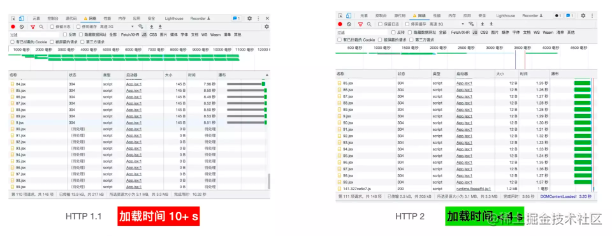
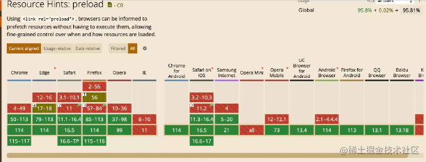
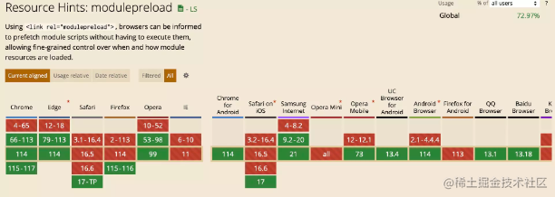
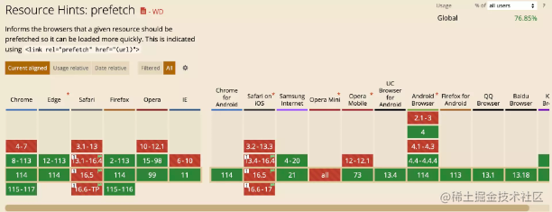
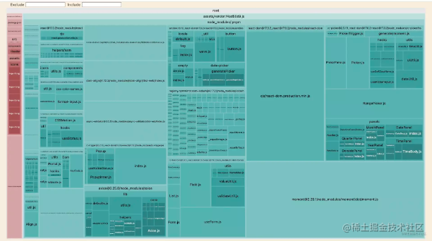

# Vite性能优化
性能优化不管是前端工程化中老生常谈的话题，不管是在实际项目中开发，还是作为找工作时的亮点，随着项目的体积越来越大，稍不注意就会产生明显的性能问题。在不同情景中，对于项目性能的关注点是不一样的。在项目开发阶段，我们只需要注重开发体验，注重项目构建性能；而在生产环境中，我们一般看重线上的实际运行时的性能。

对于开发阶段的构建性能问题，Vite内部已经做了很多相当多的优化，实现了`项目秒启动`和`零毫秒级热更新`。
本文主要针对线上环境的`项目加载性能优化`，与页面的 FCP(First Contentful Paint)、TTI 等指标。

对于Vite项目的加载性能优化，常见的优化手段重点关注下面三个方面：

- 网络优化。包括 HTTP2、DNS 预解析、Preload、Prefetch等手段。
- 资源优化。包括构建产物分析、资源压缩、产物拆包、按需加载等优化方式。
- 预渲染优化，本文主要介绍服务端渲染(SSR)和静态站点生成(SSG)两种手段。

不过，无论是以上哪一类优化方式，都离不开构建工具的支持，也就是说，在这些性能优化的场景中，我们将高频地使用到 Vite，对 Vite 本身的构建能力进行深度地应用或者定制。

## 网络优化
### http2
传统的Http1.存在队头阻塞的问题，同一个管道同一时刻只能处理一个请求，也就是说如果当前的请求没有处理完，其他的请求都处于阻塞状态，另外浏览器对于同一域名下的并发请求数量都有限制，比如说Chrome最多之允许六个并发请求，也就是说请求数量超过六个时候，其他的请求，都要排队，等待发送。

因此，在HTTP1.1中队头阻塞和并发请求数量限制很容易成为网络层的瓶颈。而HTTP2的诞生就是为了解决这些问题，主要体现在
下面能力上：

- 多路复用：`将数据分为多个二进制帧，多个请求和响应的数据帧在同一个 TCP 通道进行传输，解决了之前的队头阻塞问题。`而与此同时，`在 HTTP2 协议下，浏览器不再有同域名的并发请求数量限制，因此请求排队问题也得到了解决`。
- server push: 即服务器推送能力，可以让某些资源能够提前到达浏览器，比如对于一个 html 的请求，通过 HTTP 2 我们可以同时将相应的 js 和 css 资源推送到浏览器，省去了后续请求的开销。

在 Vite 中，我们可以通过vite-plugin-mkcert在本地 Dev Server 上开启 HTTP2，使用前需要先安装这个插件：
````shell
$ npm i vite-plugin-mkcert -D
````
然后再vite中进行这样配置
````js
// vite.config.ts
import { defineConfig } from "vite";
import react from "@vitejs/plugin-react";
import mkcert from "vite-plugin-mkcert";


export default defineConfig({
  plugins: [react(), mkcert()],
  server: {
    // https 选项需要开启
    https: true,
  },
});

````
插件的原理也比较简单，由于 HTTP2 依赖 TLS 握手，插件会帮你自动生成 TLS 证书，然后支持通过 HTTPS 的方式启动，
而 Vite 会自动把 HTTPS 服务升级为 HTTP2。

使用上 HTTP2 之后，在某些情况下大量并行请求的问题会得到明显的改善，这里有一个多请求的示例项目，下载完成之后再执行如下的命令：
````shell 
$ npm run generate 
````
即可生成 100 个 jsx 文件，我们在弱网环境下测试，这样对比的效果更加明显，实际情况如下：


可以看到，以页面首屏绘制的时间(FCP)来看，在开启了 HTTP2 之后，页面性能可以优化 60% 以上。而反观 HTTP 1.1 下的表现，不难发现大部分的时间开销用用在了请求排队上面，在并发请求很多的情况下性能直线下降。


因此，对于线上的项目来说，HTTP2 对性能的提升非常可观，几乎成为了一个必选项。


而刚刚演示用到的 `vite-plugin-mkcert插件仅用于开发阶段`，在生产环境中我们会对线上的服务器进行配置，从而开启 HTTP2 的能力，如果是用的Nginx，可以参考[Nginx 的 HTTP2 配置](http://nginx.org/en/docs/http/ngx_http_v2_module.html)。

### DNS预解析
浏览器在向跨域的服务器发送请求时，首先会进行 DNS 解析，将服务器域名解析为对应的 IP 地址。我们通过 dns-prefetch 技术将这一过程提前，降低 DNS 解析的延迟时间，具体使用方式如下:
````html
<!-- href 为需要预解析的域名 -->
<link rel="dns-prefetch" href="https://fonts.googleapis.com/"> 
````

一般情况下 dns-prefetch会与preconnect 搭配使用，


前者用来解析 DNS，而后者用来会建立与服务器的连接，建立 TCP 通道及进行 TLS 握手，进一步降低请求延迟。


使用方式如下所示:
````html
<link rel="preconnect" href="https://fonts.gstatic.com/" crossorigin>
<link rel="dns-prefetch" href="https://fonts.gstatic.com/">

````
值得注意的是，对于 preconnect 的 link 标签一般需要加上 crorssorigin(跨域标识)，否则对于一些字体资源 preconnect 会失效。

### preload/prefetch
对于一些比较重要的资源，我们可以通过 Preload 方式进行预加载，即在资源使用之前就进行加载，而不是在用到的时候才进行加载，这样可以使资源更早地到达浏览器。具体使用方式如下:

````html
<link rel="preload" href="style.css" as="style">
<link rel="preload" href="main.js" as="script">
````

其中我们一般会声明 href 和 as 属性，分别表示资源地址和资源类型。Preload的浏览器兼容性也比较好，目前 90% 以上的浏览器已经支持。



与普通 script 标签不同的是，对于原生 ESM 模块，浏览器提供了modulepreload来进行预加载:
````html
<link rel="modulepreload" href="/src/app.js" />

````
modulepreload的兼容性如下:

仅有 70% 左右的浏览器支持这个特性，不过在 Vite 中我们可以通过配置一键开启 modulepreload 的 Polyfill，从而在使所有支持原生 ESM 的浏览器(占比 90% 以上)都能使用该特性，配置方式如下：
````js
// vite.config.ts
export default {
  build: {
    polyfillModulePreload: true
  }
}
````
除了 Preload，Prefetch 也是一个比较常用的优化方式，它相当于告诉浏览器空闲的时候去预加载其它页面的资源，比如对于 A 页面中插入了这样的 link 标签：
````html
<link rel="prefetch" href="https://B.com/index.js" as="script">
````
这样浏览器会在 A 页面加载完毕之后去加载B这个域名下的资源，如果用户跳转到了B页面中，浏览器会直接使用预加载好的资源，从而提升 B 页面的加载速度。而相比 Preload， Prefetch 的浏览器兼容性不太乐观，具体数据如下图所示。




## 资源优化
### 产物分析报告
为了能可视化地感知到产物的体积情况，推荐大家用rollup-plugin-visualizer来进行产物分析。安装好之后，就可以直接使用了，使用方式如下:
````js
// 注: 首先需要安装 rollup-plugin-visualizer 依赖
import { defineConfig } from "vite";
import vue from "@vitejs/plugin-vue";
import { visualizer } from "rollup-plugin-visualizer";

// https://vitejs.dev/config/
export default defineConfig({
  plugins: [
    vue(),
    visualizer({
      // 打包完成后自动打开浏览器，显示产物体积报告
      open: true,
    }),
  ],
});
````
当你执行npm run build命令之后，浏览器会自动打开产物分析页面，如下图。



从中你可以很方便地观察到产物体积的分布情况，提高排查问题的效率，比如定位到体积某些过大的包，然后针对性地进行优化。

### 资源压缩
在生产环境中，为了极致的代码体积，我们一般会通过构建工具来对产物进行压缩。具体来说，有这样几类资源可以被压缩处理: JavaScript 代码、CSS 代码和图片文件。
#### 1. javascript压缩
在 Vite 生产环境构建的过程中，JavaScript 产物代码会自动进行压缩，相关的配置参数如下：
````js
// vite.config.ts
export default {
  build: {
    // 类型: boolean | 'esbuild' | 'terser'
    // 默认为 `esbuild`
    minify: 'esbuild',
    // 产物目标环境
    target: 'modules',
    // 如果 minify 为 terser，可以通过下面的参数配置具体行为
    // https://terser.org/docs/api-reference#minify-options
    terserOptions: {}
  }
}
````
值得注意的是target参数，也就是压缩产物的目标环境。Vite 默认的参数是modules，即如下的 browserlist：
`['es2019', 'edge88', 'firefox78', 'chrome87', 'safari13.1']`
可能你会有疑问，既然是压缩代码，为什么还跟目标环境有关系呢？其实，对于 JS 代码压缩的理解仅仅停留在去除空行、混淆变量名的层面是不够的，为了达到极致的压缩效果，压缩器一般会根据浏览器的目标，会对代码进行语法层面的转换，比如下面这个例子:
````js
// 业务代码中
info == null ? undefined : info.name
````
如果你将 target 配置为exnext，也就是最新的 JS 语法，会发现压缩后的代码变成了下面这样：
````js
info?.name
````


这就是压缩工具在背后所做的事情，将某些语句识别之后转换成更高级的语法，从而达到更优的代码体积。因此，设置合适的 target 就显得特别重要了，一旦目标环境的设置不能覆盖所有的用户群体，那么极有可能在某些低端浏览器中出现语法不兼容问题，从而发生线上事故。

#### 2. css压缩
对于 CSS 代码的压缩，Vite 中的相关配置如下：
````js
// vite.config.ts
export default {
  build: {
    // 设置 CSS 的目标环境
    cssTarget: ''
  }
}
````

默认情况下 Vite 会使用 Esbuild 对 CSS 代码进行压缩，一般不需要我们对 cssTarget 进行配置。不过在需要兼容安卓端微信的WebView 时，我们需要将 build.cssTarget 设置为 chrome61，以防止 vite 将 rgba() 颜色转化为 #RGBA 十六进制符号的形式，出现样式问题。

#### 3. 图片压缩
图片资源是一般是产物体积的大头，如果能有效地压缩图片体积，那么对项目体积来说会得到不小的优化，而在 Vite 中我们一般使用 `vite-plugin-imagemin`来进行图片压缩。

#### 4. 产物拆包
一般来说，如果不对产物进行代码分割(或者拆包)，全部打包到一个 chunk 中，会产生如下的问题：

- 首屏加载的代码体积过大，即使是当前页面不需要的代码也会进行加载。
- 线上缓存复用率极低，改动一行代码即可导致整个 bundle 产物缓存失效。

而 Vite 中内置如下的代码拆包能力：
- CSS 代码分割，即实现一个 chunk 对应一个 css 文件。
- 默认有一套拆包策略，将应用的代码和第三方库的代码分别打包成两份产物，并对于动态 import 的模块单独打包成一个 chunk。

当然，我们也可以通过manualChunks参数进行自定义配置。
````js
// vite.config.ts
{
  build {
    rollupOptions: {
      output: {
        // 1. 对象配置
        manualChunks: {
          // 将 React 相关库打包成单独的 chunk 中
          'react-vendor': ['react', 'react-dom'],
          // 将 Lodash 库的代码单独打包
          'lodash': ['lodash-es'],
          // 将组件库的代码打包
          'library': ['antd'],
        },
        // 2. 函数配置
          if (id.includes('antd') || id.includes('@arco-design/web-react')) {
            return 'library';
          }
          if (id.includes('lodash')) {
            return 'lodash';
          }
          if (id.includes('react')) {
            return 'react';
          }
      },
    }
  },
}

````
当然，在函数配置中，我们还需要注意循环引用的问题。

#### 5.按需加载
在一个完整的 Web 应用中，对于某些模块当前页面可能并不需要，如果浏览器在加载当前页面的同时也需要加载这些不必要的模块，那么可能会带来严重的性能问题。一个比较好的方式是对路由组件进行动态引入，比如在 React 应用中使用 @loadable/component 进行组件异步加载。
````js
import React from "react";
import ReactDOM from "react-dom";
import loadable from "@loadable/component";
import { BrowserRouter, Routes, Route } from "react-router-dom";


const Foo = loadable(() => import("./routes/Foo"));
const Bar = loadable(() => import("./routes/Bar"));


ReactDOM.render(
  <React.StrictMode>
    <BrowserRouter>
      <Routes>
        <Route path="/foo" element={<Foo />} />
        <Route path="/bar" element={<Bar />} />
      </Routes>
    </BrowserRouter>
  </React.StrictMode>,
  document.getElementById("root")
);

````
这样在生产环境中，Vite 也会将动态引入的组件单独打包成一个 chunk。当然，对于组件内部的逻辑，我们也可以通过动态 import 的方式来延迟执行，进一步优化首屏的加载性能，如下代码所示:

````js
function App() {
  const computeFunc = async () => {
    // 延迟加载第三方库
    // 需要注意 Tree Shaking 问题
    // 如果直接引入包名，无法做到 Tree-Shaking，因此尽量导入具体的子路径
    const { default: merge } = await import("lodash-es/merge");
    const c = merge({ a: 1 }, { b: 2 });
    console.log(c);
  };
  return (
    <div className="App">
      <p>
        <button type="button" onClick={computeFunc}>
          Click me
        </button>
      </p>
    </div>
  );
}


export default App;
````


## 预渲染优化
预渲染是当今比较主流的优化手段，主要包括`服务端渲染(SSR)`和`静态站点生成(SSG)`这两种技术。

在 SSR 的场景下，服务端生成好完整的 HTML 内容，直接返回给浏览器，浏览器能够根据 HTML 渲染出完整的首屏内容，而不需要依赖 JS 的加载，从而降低浏览器的渲染压力；而另一方面，由于服务端的网络环境更优，可以更快地获取到页面所需的数据，也能节省浏览器请求数据的时间，同时也完成了对SEO的优化。

而 SSG 可以在`构建阶段生成完整的 HTML 内容`，它与 SSR 最大的不同在于 `HTML 的生成在构建阶段完成，而不是在服务器的运行时`。`SSG 同样可以给浏览器完整的 HTML 内容，不依赖于 JS 的加载`，可以有效提高页面加载性能。不过相比 SSR，SSG 的内容往往动态性不够，适合比较静态的站点，比如文档、博客等场景。


## 总结

主要围绕vite项目的性能优化主题，从网络优化，资源优化和预渲染优化三个维度了解一些项目中常用的优化手段； 在网络优化层面，使用Http2、DNS预解析，preload/prefetch/precontented这些优化手段，在资源优化手段，从构建产物的生成，以及分析产物的体积并对不同的文件进行不同的处理，通过拆包处理，资源压缩，按需加载等手段，同时在预渲染优化层面，通过SSR和SSG优化