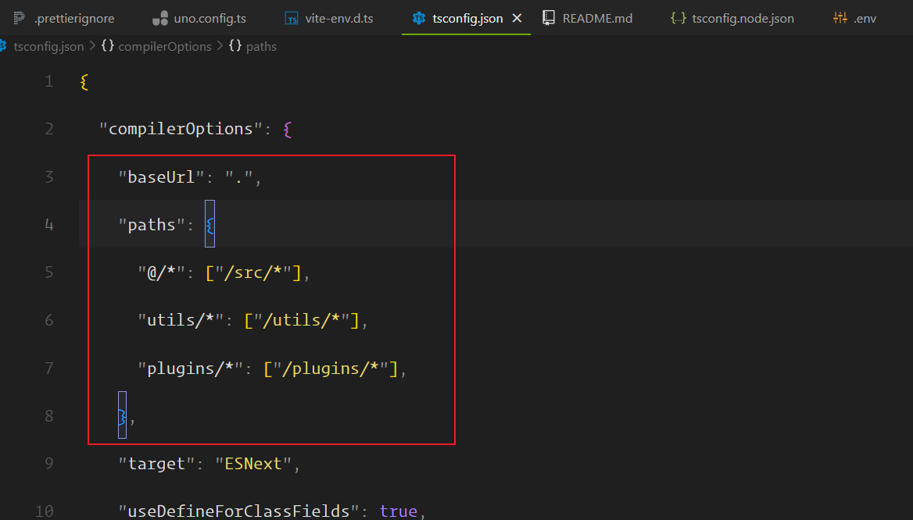
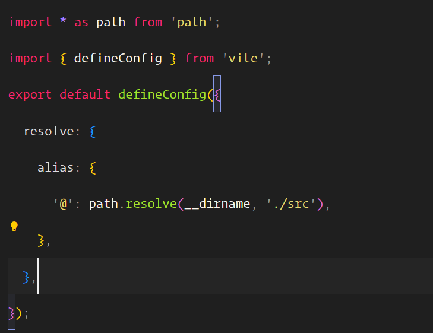
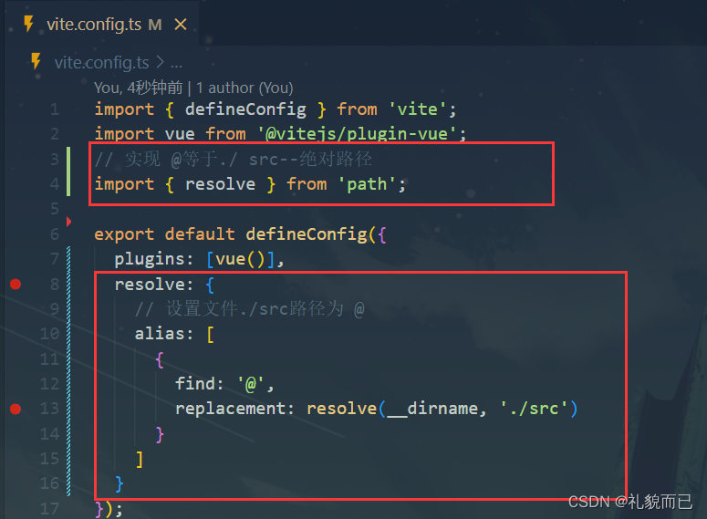

# 配置路径
vite项目中的配置路径的别名，需要添加以下两个地方的配置：`tsconfig.json`和`vite.config.ts`

## 前提
需要安装`@types/node`插件，防止代码爆红
````shell
$ npm install @types/node
````

## tsconfig.json
在该文件中需要在compilerOptions选项中添加以下配置
````js
    "baseUrl": ".",
    "paths": {
      "@/*": ["/src/*"],
    },
````

## vite.config.ts
需要在配置中添加以下的配置
`resolve.alias`有很多书写的方式
类型：`Record<string, string> | Array<{ find: string | RegExp, replacement: string, customResolver?: ResolverFunction | ResolverObject }>`
可以是一个对象

或者是一个 { find, replacement, customResolver } 的数组。


## VSCODE路径插件
下面两个是vscode 的路径自动提示、路径自动补全插件
1. Path Intellisense
2. Path Autocomplete