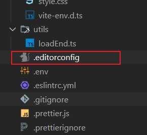

# prettier在项目中配置不生效

在项目中安装了prettier， 也在.prettierrc.js中添加了格式化的配置，但是配置就是没有生效，重启vscode也没用

## 问题剖析
这是因为prettier插件优先使用项目根目录下的`editorconfig`配置文件，所以在vscode中无论怎样配置都没有用

与代码规范相关的配置，总共有四种。除了我们最熟知的 .eslintrc 和 .prettierrc，还有两个鲜少提及：IDE 的 settings.json 和 .editorconfig。通常，配置文件没有生效，就是因为这四种配置互相冲突造成的。

配置文件优先级：`.editorconfig > settings.json (Workspace) > settings.json (User) > .eslintrc 和 .prettierrc`

## 解决问题
1. 进入插件配置界面

2. 取消对editor config 得勾选

3. 这下在项目根目录中创建.prettierrc.js prettier就会被自动检测到了

4. 重启vscode