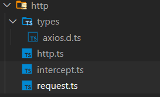

# axios

## 简介
今天使用ts来封装axios

## axios常用的几个类型
在使用TypeScript封装Axios之前我们先来看看Axios几个重要的类型

### AxiosRequestConfig
`AxiosRequestConfig`是我们使用`axios`发送请求传递参数的类型。当然它也是我们请求拦截器里面的参数类型。

````ts
import type {AxiosRequestConfig} from 'axios'
axios(config: AxiosRequestConfig)
```

可以看到，这个config里面的参数还是挺多的。我们常用的有url、method、params、data、headers、baseURL、timeout。

````typescript
export interface AxiosRequestConfig {
  // `url` 是用于请求的服务器 URL
  url?: string;
  
  // `method` 是创建请求时使用的方法
  method?: Method;
  
  // `baseURL` 将自动加在 `url` 前面，除非 `url` 是一个绝对 URL。
  // 它可以通过设置一个 `baseURL` 便于为 axios 实例的方法传递相对 URL
  baseURL?: string;
  
  // `transformRequest` 允许在向服务器发送前，修改请求数据
  // 只能用在 'PUT', 'POST' 和 'PATCH' 这几个请求方法
  // 后面数组中的函数必须返回一个字符串，或 ArrayBuffer，或 Stream
  transformRequest?: AxiosTransformer | AxiosTransformer[];
  
  // `transformResponse` 在传递给 then/catch 前，允许修改响应数据
  transformResponse?: AxiosTransformer | AxiosTransformer[];
  
  // `headers` 是即将被发送的自定义请求头
  headers?: any;
  
  // `params` 是即将与请求一起发送的 URL 参数
  // 必须是一个无格式对象(plain object)或 URLSearchParams 对象
  params?: any;
  
  // `paramsSerializer` 是一个负责 `params` 序列化的函数
  paramsSerializer?: (params: any) => string;
  
  // `data` 是作为请求主体被发送的数据
  // 只适用于这些请求方法 'PUT', 'POST', 和 'PATCH'
  // 在没有设置 `transformRequest` 时，必须是以下类型之一：
  // - string, plain object, ArrayBuffer, ArrayBufferView, URLSearchParams
  // - 浏览器专属：FormData, File, Blob
  // - Node 专属： Stream
  data?: any;
  
  // `timeout` 指定请求超时的毫秒数。默认值是 `0` (永不超时)
  // 如果请求超过 `timeout` 的时间，请求将被中断
  timeout?: number;
  
  // 超时提示消息
  timeoutErrorMessage?: string;
  
  // `withCredentials` 表示跨域请求时是否需要使用凭证
  withCredentials?: boolean;
  
  // `adapter` 允许自定义处理请求，以使测试更轻松
  adapter?: AxiosAdapter;
  
  // `auth` 表示应该使用 HTTP 基础验证，并提供凭据
  auth?: AxiosBasicCredentials;
  
  // `responseType` 表示服务器响应的数据类型，可以是 'arraybuffer', 'blob', 'document', 'json', 'text', 'stream'
  responseType?: ResponseType;
  
  // `xsrfCookieName` 是用作 xsrf token 的值的cookie的名称
  xsrfCookieName?: string;
  
  // `xsrfHeaderName` 是携带 xsrf 令牌值的 http 标头的名称
  xsrfHeaderName?: string;
  
  // `onUploadProgress` 允许为上传处理进度事件
  onUploadProgress?: (progressEvent: any) => void;
  
  // `onDownloadProgress` 允许为下载处理进度事件
  onDownloadProgress?: (progressEvent: any) => void;
  
  // `maxContentLength` 定义允许的响应内容的最大尺寸
  maxContentLength?: number;
  
  // `validateStatus` 定义对于给定的HTTP 响应状态码是 resolve 或 reject  promise 。
  // 如果 `validateStatus` 返回 `true` (或者设置为 `null` 或 `undefined`)，
  // promise 将被 resolve; 否则，promise 将被 rejecte
  validateStatus?: ((status: number) => boolean) | null;
  
  // 请求体最大尺寸
  maxBodyLength?: number;
  
  // `maxRedirects` 定义在 node.js 中 follow 的最大重定向数目
  // 如果设置为0，将不会 follow 任何重定向
  maxRedirects?: number;
  
  // `socketPath` 定义了一个在 node.js 中使用的 UNIX Socket。
  // 只能指定 `socketPath` 或 `proxy`。
  // 如果两者都指定，则使用 `socketPath`。
  socketPath?: string | null;
  
  // `httpAgent` 和 `httpsAgent` 分别在 node.js 中用于定义在执行 http 和 https 时使用的自定义代理。
  httpAgent?: any;
  httpsAgent?: any;
  
  // 'proxy' 定义代理服务器的主机名称和端口
  proxy?: AxiosProxyConfig | false;
  
  // `cancelToken` 指定用于取消请求的 cancel token
  cancelToken?: CancelToken;
  
  // 将其设置为`false`，它将不会解压缩您的响应，而是保留原始的Content-Encoding头。
  // 默认是true
  decompress?: boolean;
  
  // 控制响应数据是否转换
  transitional?: TransitionalOptions
}

````


### AxiosInstance
`AxiosInstance`是我们使用axios实例对象类型。

我们使用`axios.create(config?: AxiosRequestConfig)`创建出来的对象都是AxiosInstance类型

````ts
export interface AxiosInstance {
  (config: AxiosRequestConfig): AxiosPromise;
  (url: string, config?: AxiosRequestConfig): AxiosPromise;
  defaults: AxiosRequestConfig;
  interceptors: {
    request: AxiosInterceptorManager<AxiosRequestConfig>;
    response: AxiosInterceptorManager<AxiosResponse>;
  };
  getUri(config?: AxiosRequestConfig): string;
  request<T = any, R = AxiosResponse<T>> (config: AxiosRequestConfig): Promise<R>;
  
  // 拥有如下便捷方法
  get<T = any, R = AxiosResponse<T>>(url: string, config?: AxiosRequestConfig): Promise<R>;
  delete<T = any, R = AxiosResponse<T>>(url: string, config?: AxiosRequestConfig): Promise<R>;
  head<T = any, R = AxiosResponse<T>>(url: string, config?: AxiosRequestConfig): Promise<R>;
  options<T = any, R = AxiosResponse<T>>(url: string, config?: AxiosRequestConfig): Promise<R>;
  post<T = any, R = AxiosResponse<T>>(url: string, data?: any, config?: AxiosRequestConfig): Promise<R>;
  put<T = any, R = AxiosResponse<T>>(url: string, data?: any, config?: AxiosRequestConfig): Promise<R>;
  patch<T = any, R = AxiosResponse<T>>(url: string, data?: any, config?: AxiosRequestConfig): Promise<R>;
}

````

可以发现，我们可以使用axios.create、axios.all、axios.spread方法，但是AxiosInstance 上并没有create、all、spread等方法，那我们的axios到底是什么类型呢？


### AxiosStatic
````ts
export interface AxiosStatic extends AxiosInstance {
  create(config?: AxiosRequestConfig): AxiosInstance;
  Cancel: CancelStatic;
  CancelToken: CancelTokenStatic;
  isCancel(value: any): boolean;
  
  // 并发请求
  all<T>(values: (T | Promise<T>)[]): Promise<T[]>;
  // 切分并发结果
  spread<T, R>(callback: (...args: T[]) => R): (array: T[]) => R;
  isAxiosError(payload: any): payload is AxiosError;
}

declare const axios: AxiosStatic;

````

可以发现，`axios其实是AxiosStatic类型，并且继承了AxiosInstance类型`。所以是两者的结合。`相较axios.create(config?: AxiosRequestConfig)创建出来的实例对象`，axios功能是更强大的。

### AxiosResponse
`AxiosResponse是非常重要的，我们的axios请求返回值类型都是AxiosResponse类型`。并且我们可以发现`AxiosResponse是一个接口泛型`，这个泛型会应用到后端返回的data上。所以这块我们可以根据后端接口返回定义不同的类型传递进去。
````ts
export interface AxiosResponse<T = any>  {
  // 后端接口数据
  data: T;
  // http状态码
  status: number;
  // 来自服务器响应的 HTTP 状态信息
  statusText: string;
  // 响应头
  headers: any;
  // 请求配置信息
  config: AxiosRequestConfig;
  // 请求
  request?: any;
}

````

### AxiosError
AxiosError这个类型也是我们必须要知道的。`在我们响应拦截器里面的错误就是AxiosError类型`。

````ts
export interface AxiosError<T = any> extends Error {
  config: AxiosRequestConfig;
  code?: string;
  request?: any;
  response?: AxiosResponse<T>;
  isAxiosError: boolean;
  toJSON: () => object;
}
````

## 基础封装

````TS
import type { AxiosInstance } from 'axios';

interface RequestConfig extends AxiosRequestConfig {
	needToken?: boolean;
}

export class Request {
	private instance = {} as AxiosInstance;
	// 构造器函数
	constructor(config: RequestConfig) {
		this.instance = axios.create({ ...baseConfig, ...config });
	}
}
````

在实际项目中有了基本的请求方法还是远远不够的，我们还需要封装拦截器和一些常用方法

## 拦截器封装
拦截器封装只需要在类中对`axios.create()`创建的实例调用`interceptors`下的两个拦截器即可，实例代码如下：
````ts
import type { AxiosInstance, InternalAxiosRequestConfig, AxiosResponse, AxiosError } from 'axios';
import { useLoginStore } from 'src/store/login';
const login = useLoginStore();

export class Intercept {
	constructor(private instance: AxiosInstance) {
		this.instance.interceptors.request.use(
			(config: InternalAxiosRequestConfig) => {
				// 获取token
				const token = login.token;
				if (token) {
					config.headers.Authorization = token;
				}
				return config;
			},
			(err: AxiosError): Promise<Error> => {
				// 请求错误，这里可以用全局提示框进行提示
				return Promise.reject(err);
			},
		);
		this.instance.interceptors.response.use(
			(response: AxiosResponse) => {
				return response.data;
			},
			(error: AxiosError): Promise<Error> => {
        // 添加错误处理，包括不同状态码需要做不同的代码处理
				return Promise.reject(error.response);
			},
		);
	}
}

````

在这里我们分别对请求拦截器和响应拦截器做了处理。

在请求拦截器我们给请求头添加了token。

在响应拦截器，我们返回了整个response对象，当然你也可以只返回后端返回的response.data，这里可以根据个人喜好来处理。其次对http错误进行了全局处理。

## 请求方法封装
在基础封装的时候我们封装了一个request通用方法
其实我们还可以更具体的封装get、post、put、delete方法，让我们使用更方便。

并且，我们前面分析到，`AxiosResponse`其实是一个泛型接口，他可以接受一个泛型并应用到我们的data上。所以我们可以在这里再定义一个后端通用返回的数据类型。

`比如假设我们某个项目后端接口不管请求成功与失败，返回的结构永远是code、message、data的话我们可以定义一个这样的数据类型。`

````ts
type Result<T> = {
  code: number,
  message: string,
  data: T
}
````
然后传递个各个方法
````java
  // 请求方法
	public request(config: RequestConfig): Promise<AxiosResponse> {
		return this.instance.request(config);
	}
	// get请求
	public get<T>(url: string, config: RequestConfig): Promise<AxiosResponse<Result<T>>> {
		return this.instance.get(url, config);
	}
	// post请求
  // 泛型T表示服务器传递的data类型，泛型U表示客户端需要传递给服务端的字段
	public post<T, U>(
		url: string,
		data: U,
		config: RequestConfig,
	): Promise<AxiosResponse<Result<T>>> {
		return this.instance.post(url, data, config);
	}
	// put请求
	public put<T = any, U = any>(
		url: string,
		data: U,
		config: RequestConfig,
	): Promise<AxiosResponse<Result<T>>> {
		return this.instance.put(url, data, config);
	}
	// delete请求
	public delete<T = any>(url: string, config: RequestConfig): Promise<AxiosResponse<Result<T>>> {
		return this.instance.delete(url, config);
	}
````

## 完整代码
目录如下



request.ts

````ts
import axios from 'axios';
import type { RequestConfig, Result } from './types/axios.d';
import type { AxiosInstance, AxiosResponse } from 'axios';
import { Intercept } from './intercept';

/**
 * @description 使用typescript对axios的进行类型封装
 * 泛型T是指服务器端返回的数据的类型
 * 泛型U表示客户端传递数据的值
 */

const baseConfig: RequestConfig = { baseURL: '/', timeout: 6000, needToken: false };

export class Request {
	private instance = {} as AxiosInstance;
	// 构造器函数
	constructor(config: RequestConfig) {
		this.instance = axios.create({ ...baseConfig, ...config });
		new Intercept(this.instance);
	}
	// 请求方法
	public request(config: RequestConfig): Promise<AxiosResponse> {
		return this.instance.request(config);
	}
	// get请求
	public get<T>(url: string, config: RequestConfig): Promise<AxiosResponse<Result<T>>> {
		return this.instance.get(url, config);
	}
	// post请求
	public post<T, U>(
		url: string,
		data: U,
		config: RequestConfig,
	): Promise<AxiosResponse<Result<T>>> {
		return this.instance.post(url, data, config);
	}
	// put请求
	public put<T = any, U = any>(
		url: string,
		data: U,
		config: RequestConfig,
	): Promise<AxiosResponse<Result<T>>> {
		return this.instance.put(url, data, config);
	}
	// delete请求
	public delete<T = any>(url: string, config: RequestConfig): Promise<AxiosResponse<Result<T>>> {
		return this.instance.delete(url, config);
	}
}

````


interceptor.ts


````ts
import type { AxiosInstance, InternalAxiosRequestConfig, AxiosResponse, AxiosError } from 'axios';
import { useLoginStore } from 'src/store/login';
const login = useLoginStore();

export class Intercept {
	constructor(private instance: AxiosInstance) {
		this.instance.interceptors.request.use(
			(config: InternalAxiosRequestConfig) => {
				// 获取token
				const token = login.token;
				if (token) {
					config.headers.Authorization = token;
				}
				return config;
			},
			(err: AxiosError): Promise<Error> => {
				// 请求错误，这里可以用全局提示框进行提示
				return Promise.reject(err);
			},
		);
		this.instance.interceptors.response.use(
			(response: AxiosResponse) => {
				return response.data;
			},
			(error: AxiosError): Promise<Error> => {
				return Promise.reject(error.response);
			},
		);
	}
}

````

http.ts
````ts
import { Request } from './request';

export const http = new Request({});
````

types/axios.d.ts
````ts
import type { AxiosRequestConfig } from 'axios';

export interface RequestConfig extends AxiosRequestConfig {
	needToken?: boolean;
}

export interface Result<T> {
	code: number;
	message: string;
	data: T;
}
````