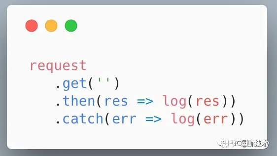

# HTTP请求库配置
随着生态的完善，网络请求库也越来越多，当前主流的http请求库有以下
- axios: 基于Promis的http请求库
- umi-request: 基于Fetch的http请求库
- superagent： 基于Promise的清亮渐进式API

## Axios
> 基于 Promise 的 HTTP 客户端，可用于浏览器和 Node.js
Axios 是一个基于 Promise 的 HTTP 库，可用在 Node.js 和浏览器上发起 HTTP 请求，支持所有现代浏览器，甚至包括 IE8+！

优点：
- 同时支持 Node.js 和浏览器
- 支持 Promise API
- 可以配置或取消请求
- 可以设置响应超时
- 支持防止跨站点请求伪造（XSRF）攻击
- 可以拦截未执行的请求或响应
- 支持显示上传进度
- 广泛用于 React 和 Vue 项目

缺点：
- 用起来比较麻烦

## Superagent
> 改良版 Ajax——与 Node.js HTTP 客户端搭配使用

Superagent 是一个基于 Promise 的轻量级渐进式 AJAX API，非常适合发送 HTTP 请求以及接收服务器响应。 与 Axios 相同，它既适用于 Node，也适用于所有现代浏览器。

用 Superagent 发起 HTTP 请求就像在 request 对象上调用方法一样简单：

优点: 
- 它有一个插件生态，通过构建插件可以实现更多功能
- 可配置
- HTTP 请求发送接口友好
- 可以为请求链式添加方法
- 适用于浏览器和 Node
- 支持显示上传和下载进度
- 支持分块传输编码
- 支持旧风格的回调
- 繁荣的插件生态，支持众多常见功能

缺点: 
- 其 API 不符合任何标准

## Fetch

优点: 
- 灵活易用
- 使用 Promise 避免回调地狱
- 支持所有现代浏览器
- 遵循 request-response 方案
- 语法简单清晰
- 支持 React Native

缺点: 

- 不支持服务器端使用
- 缺乏开发库的亮点功能，比如取消请求
- 没有内置默认值，如请求模式，请求头，请求凭据。

## Flyio
> Fly.js 是一个基于 promise 的，轻量且强大的Javascript http 网络库

优点： 
- 提供统一的 Promise API。
- 浏览器环境下，轻量且非常轻量 。
- 支持多种JavaScript 运行环境
- 支持请求／响应拦截器。
- 自动转换 JSON 数据。
- 支持切换底层 Http Engine，可轻松适配各种运行环境。
- 浏览器端支持全局Ajax拦截 。
- H5页面内嵌到原生 APP 中时，支持将 http 请求转发到 Native。支持直接请求图片。

