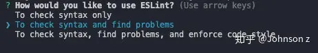

# Eslint
## 介绍
他是在ECMAScript/JavaScript代码中检验代码规范的一种工具。
它的目标是保证代码的一致性和避免错误。在许多方面，它和JSLint，JSHint相似，
除了少数例外：
- ESLint使用Espree解析JavaScript。
- ESLint使用AST去分析代码中的模式。
- ESLint是完全插件化的。每个规则都是一个插件且你可以在运行时添加更多的规则。
## 安装和使用
前提条件：Node.js（^10.12.0，or >=12.0.0）。
````shell
$ npm install eslint --save-dev
# or
$ yarn add eslint --dev
````
 然后创建一个配置文件：
````shell
$ npx eslint --init
​ 之后在任何文件或者目录下运行：

$ npx eslint yourfile.js
````

**Notes**
在运行eslint --init之后会在控制台生成一个交互提示界面，可根据需求手动选择eslint的配置。

在选择完配置之后，会在项目中生成.eslintrc配置文件：

- JS：使用.eslintrc.js文件并导出一个包含配置的对象。
- Yaml：.eslintrc.yaml。
- JSON：.eslintrc.json，并允许此文件使用JS形式的注释。
- 废弃的用法：.eslintrc。
- package.json：在文件中创建eslintConfig属性，并在此属性中进行配置。

**PS:翻阅ESLint源码可以看到，其配置文件的优先级如下：**
````js
const configFilenames = [
".eslintrc.js",
".eslintrc.yaml",
".eslintrc.yml",
".eslintrc.json",
".eslintrc",
"package.json"   
];
````
eslint不仅支持文件配置，还支持代码注释的配置方式，不推荐后者，方式繁琐，且不利于维护。

## 基础配置

在.eslintrc文件中可以看到许多这样的规则:
````json
{
    "rules": {
    "semi": ["error", "always"],
    "quotes": ["error", "double"]
    }
}
````

"semi"和"quotes"是Eslint中规则的名称，第一个值是错误的级别，可以是下面的值之一：

- "off"或0--关闭规则
- "warn"或1---将规则视为一个警告（不会影响退出码），程序不会退出运行
- "error"或2----将规则视为一个错误（退出码为1），同时会退出程序的运行。

同时也可以使用推荐配置：
````json
{
    "extends": "eslint:recommended"
}
````
此时开启的是严格模式，所有在规则页面中被标记为✔的规则将会默认开启。

## Environments环境配置
指定脚本的运行环境。每种环境都有一组特定的预定义的全局变量。默认情况下所有环境变量都是false，且这些环境并不冲突，所以可以同时定义多个，自由选择环境搭配。将环境变量设置为true，开启环境变量，以保证代码检测时不会把这些环境预定义的全局变量识别成未定义的变量而报错。可用的环境包括：
````json
"env": {
    "browser": true, // 浏览器环境中的全局变量
    "node": true, // Node.js全局变量和Node.js作用域。
    "commonjs": true, //CommonJS全局变量和CommonJS作用域（使用Browserify/webpack的浏览器代码）
    "shared-node-browser": true, // Node.js 和 Browser 通用全局变量
    "es6": true,// 启用除modules以外的所有ES6特性（该选项会自动设置 ecmaVersion 解析器选项为 6）
    "worker": true, // Web Workers 全局变量
    "amd": true, // 将require() 和 define() 定义为像 amd 一样的全局变量
    "mocha": true, // 添加所有的 Mocha 测试全局变量
    "jasmine": true, // 添加所有的 Jasmine 版本 1.3 和 2.0 的测试全局变量
    "jest": true, // jest 全局变量
    "phantomjs": true, // PhantomJS 全局变量
    "jquery": true, // jQuery 全局变量
    "mongo": true, // MongoDB 全局变量
}
````
## Globals全局配置
 当访问代码内未定义的全局变量时，no-undef规则将发出警告。如果你想在代码内使用自定义的全局变量，就需要在globals配置中指定。由于可以配置环境的预定义全局变量，所以此配置一般用不上，配置方式如下：
 ````json
 {
    "globals": {
        "var1": "writable", // 允许重写变量
        "var2": "readonly" // 变量为只读，不允许重写
    }
}
 ````
由于历史原因，false和readable等价于readonly。类似地，true和writeable等价于writeable，但是不建议使用旧值。

## parse解析器配置
​ ESLint默认使用Espree作为解析器，你可以在配置文件中指定不同的解析器，只要该解析器符合下列要求：

1. 它必须是一个Node模块，可以从它出现的配置文件中加载。通常，这意味着应该使用npm单独安装解析包。
2. 它必须符合[parser interface](https://link.zhihu.com/?target=https%3A//cn.eslint.org/docs/developer-guide/working-with-plugins%23working-with-custom-parsers)。

​**注意**：即使满足兼容性要求，也不能保证一个外部解析器可以与ESLint正常配合工作，ESLint也不会修复与其他解析器不兼容的bug。

​ 为了使用解析器，你需要在你的.eslintrc文件中指定parser选项。例如：
````js
{
    "parser": "esprima",
    "rules": {
        "semi": "error"
    }
}
````
 以下解析器与ESLint兼容：
- Esprima
- Babel-ESLint - 一个对Babel解析器的包装，使其能够与 ESLint 兼容。注意：该包允许你使用一些实验特性的时候，依然能够用上ESLint语法检查，如果没有用到ESLint不支持的实验特性时不需要安装此包。
- @typescript-eslint/parser - 将 TypeScript 转换成与 estree 兼容的形式，以便在ESLint中使用。

**注意**：在使用自定义解析器时，为了让ESLint在处理非 ECMAScript 5 特性时正常工作，仍然需要配置属性parserOptions。

## ParseOptions解析器选项配置
ESLint允许你指定你想要支持的JS语言选项。默认情况下，ESLint支持ECMAScript 5 语法。你可以覆盖该设置，以启用对ECMAScript 其它版本的支持。

​**注意**：支持ES6语法并不意味着同时支持新的ES6全局变量或类型（比如 Set 等新类 型）。对于ES6语法，使用{ "parserOptions": { "ecmaVersion": 6 } }；对于新的ES6全局变量，使用{ "env":{ "es6": true } }。

- ecmaVersion:3，5（默认），你也可以使用6，7，8，9，10来指定想要使用的ECMAScript版本。同时也可以使用年份命名的版本号，2015（同 6），2016（同 7），或 2017（同 8）或 2018（同 9）或 2019 (同10)。
- sourceType:默认是"script"，也可以使用"module"(如果你的代码是ECMAScript 模块)。
- ecmaFeatures：该配置对象指定你想使用的额外的语言特性:
- globalReturn：允许在全局作用域下使用return语句。
- impliedStrict：启用全局严格校验模式。
- jsx：启用jsx。

示例如下：
````js
"parserOptions": {
    "ecmaVersion": 6,
    "sourceType": "module",
    "ecmaFeatures": {
        "experimentalObjectRestSpread": true,//启用对对象的扩展
        "jsx": true, //启用jsx语法
        "globalReturn":true, //允许return在全局使用
        "impliedStrict":true //启用严格校验模式
    }
}
````

## 插件配置
虽然官方提供了上百种的规则供选择，但还是不够的，因为官方的规则只能检查标准的JavaScript语法，如果你写的是JSX或者Vue单文件组件，ESLint的规则就无法处理了。这时就通过安装ESLint的插件，指定一些特殊的规则进行检查，在.eslintrc配置文件配置插件时，可以使用plugins来存放插件名字的列表，插件的名字可以省略eslint-plugin-前缀。
````shell
$ npm install --save-dev eslint-plugin-vue
````
````json
{
  "plugins": [
    "vue",   // eslint-plugin-vue
  ]
}
````
- eslint-plugin-babel：和babel-eslint一起使用的一款插件。babel-eslint将eslint应用于babel方面做的很好，但是它不能更改内置的规则来支持实验特性。eslint-plugin-babel重新实现了这些有问题的规则，因此不会误报一些错误信息。
eslint-plugin-import：该插件支持对ES6+的import/export语法的校验，并防止一些文件路径拼写错误或者导入名称错误的情况。
- eslint-plugin-prettier：该插件辅助ESLint与Prettier一些协作，并将prettier的解析作为ESLint的一部分，在最后输出给出修改意见，这样当使用prettier格式化代码的时候，依然能够遵循ESLint的规则。如果你禁用掉了所有和代码格式化相关的Eslint规则，该插件可以更好得工作。因此你可以用eslint-config-prettier禁用掉所有的格式化相关的规则(如果其他有效的Eslint规则与prettier在代码如何格式化的问题上不一致的时候，报错是在所难免的了)。
- @typescript-eslint/eslint-plugin：typescript辅助ESLint的插件。此插件为ESLint校验typescript使用，所以需要使用@typescript-eslint/parser作为ESLint的解析器。


## Extends扩展配置
配置ESLint的extends选项可以让我们直接使用别人已经写好的lint规则，方便快捷。一个配置文件可以被基础配置中已启用的规则继承。
​ extend是属性值可以是：

- 指定配置的字符串（配置文件的路径，可共享的配置的名称，eslint:recommended或 eslint:all）
- 字符串数组：每个配置都继承它前面的配置。

ESLint递归地扩展配置，因此基本配置也可以具有extends属性。extends属性中的相对路径和可共享配置名从配置文件中出现的位置进行解析。

 扩展一般支持三种类型：
````json
{
  "extends": [
    "eslint:recommended",
    "plugin:react/recommended",
    "eslint-config-standard",
  ]
}
````

- eslint:开头的是ESLint官方的扩展，一共有两个：eslint:recommended、eslint:all。
  1. 值为"eslint:recommended" 的 extends 属性启用一系列核心规则，这些规则显示常见的问题。
  2. 值为"eslint:all" 的 extends 属性启用所有的核心规则（不推荐）。

- eslint-config-：开头的是可共享的配置包，它输出一个配置对象。使用时可以省略eslint-config-前缀。
eslint-config-airbnb：该包提供了Airbnb的所有ESLint配置，该工具包包含了react相关的ESLint规则配置，所以还需要另外安装eslint-plugin-import, eslint-plugin-react, eslint-plugin-react-hooks, and eslint-plugin-jsx-a11y这几个包。
- eslint-config-airbnb-base：此工具包功能与上一个包一样，区别是不包含react的规则，所以不需要安装与react有关的插件。
- eslint-config-prettier：此工具包将会禁用掉所有非必须或者与prettier冲突的规则，把它放在extends选项的最后。以便它能够覆盖其他配置。
- eslint-plugin-:开头的是插件包。在extends中以plugin:开头。使用的是ESLint的plugins配置中的某些规则，有点相当于plugins配置中某个eslint-plugin插件的子集。
- eslint-plugin-vue：此包是Vue的官方ESLint插件，它使你能够使用ESLint检查vue文件的`<template>`和`<script>`。目前支持的规则配置如下：
````json5
  {   "extends": "plugin:vue/base" } 
  //或者
  {   "extends": "plugin:vue/essential" } 
  // 或者
  {   "extends": "plugin:vue/strongly-recommended" } 
  // 或者
  {   "extends": "plugin:vue/recommended" }
````

## Rules规则配置
rules属性可以做下面的任何事情以扩展(或覆盖)默认的规则：

- 启用额外的规则。
- 改变继承的规则级别而不改变它的选项：
- 基础配置："eqeqeq": ["error", "allow-null"]
- 派生的配置："eqeqeq": "warn"
- 最后生成的配置："eqeqeq": ["warn", "allow-null"]
- 覆盖基础配置中的规则的选项：
- 基础配置："quotes": ["error", "single", "avoid-escape"]
- 派生配置："quotes": ["error", "single"]
- 最后生成的配置："quotes": ["error", "single"]

## Overrides覆盖配置
 可以通过overrides覆盖指定文件的配置，为某些特殊文件单独指定配置规则。比如：
````json
{
  overrides: [
    {
      files: [
        "**/__tests__/*.{j,t}s?(x)",
        "**/tests/unit/**/*.spec.{j,t}s?(x)"
      ],
      env: {
        jest: true
      }
    }
  ]
}
````

## 忽略文件
可以在项目根目录创建一个`.eslintignore`文件去告诉`EsLint`忽略特定的文件和目录。`.eslintignore`文件是一个纯文本文件，其中每一行都是一个glob模式的，表明哪些路径应该忽略检测。当ESLint运行时，在确定哪些文件要检测之前，它会在当前工作目录中查找一个.eslintignore文件，如果找到，当遍历目录时，将会应用这些设置。可用的特性如下：

- 以`#`开头的行会被当做注释。
- 路径是相当于`.eslintignore`的位置或当前目录。
- 忽略模式同`.gitignore`。

除了.eslintignore文件中的模式，ESLint总是忽略/node_modules/*中的文件。

## 常见规则
````js
{
  "rules": {
    "no-alert": 0,//禁止使用alert confirm prompt
    "no-array-constructor": 2,//禁止使用数组构造器
    "no-bitwise": 0,//禁止使用按位运算符
    "no-caller": 1,//禁止使用arguments.caller或arguments.callee
    "no-catch-shadow": 2,//禁止catch子句参数与外部作用域变量同名
    "no-class-assign": 2,//禁止给类赋值
    "no-cond-assign": 2,//禁止在条件表达式中使用赋值语句
    "no-console": 2,//禁止使用console
    "no-const-assign": 2,//禁止修改const声明的变量
    "no-constant-condition": 2,//禁止在条件中使用常量表达式 if(true) if(1)
    "no-continue": 0,//禁止使用continue
    "no-control-regex": 2,//禁止在正则表达式中使用控制字符
    "no-debugger": 2,//禁止使用debugger
    "no-delete-var": 2,//不能对var声明的变量使用delete操作符
    "no-div-regex": 1,//不能使用看起来像除法的正则表达式/=foo/
    "no-dupe-keys": 2,//在创建对象字面量时不允许键重复 {a:1,a:1}
    "no-dupe-args": 2,//函数参数不能重复
    "no-duplicate-case": 2,//switch中的case标签不能重复
    "no-else-return": 2,//如果if语句里面有return,后面不能跟else语句
    "no-empty": 2,//块语句中的内容不能为空
    "no-empty-character-class": 2,//正则表达式中的[]内容不能为空
    "no-empty-label": 2,//禁止使用空label
    "no-eq-null": 2,//禁止对null使用==或!=运算符
    "no-eval": 1,//禁止使用eval
    "no-ex-assign": 2,//禁止给catch语句中的异常参数赋值
    "no-extend-native": 2,//禁止扩展native对象
    "no-extra-bind": 2,//禁止不必要的函数绑定
    "no-extra-boolean-cast": 2,//禁止不必要的bool转换
    "no-extra-parens": 2,//禁止非必要的括号
    "no-extra-semi": 2,//禁止多余的冒号
    "no-fallthrough": 1,//禁止switch穿透
    "no-floating-decimal": 2,//禁止省略浮点数中的0 .5 3.
    "no-func-assign": 2,//禁止重复的函数声明
    "no-implicit-coercion": 1,//禁止隐式转换
    "no-implied-eval": 2,//禁止使用隐式eval
    "no-inline-comments": 0,//禁止行内备注
    "no-inner-declarations": [2, "functions"],//禁止在块语句中使用声明（变量或函数）
    "no-invalid-regexp": 2,//禁止无效的正则表达式
    "no-invalid-this": 2,//禁止无效的this，只能用在构造器，类，对象字面量
    "no-irregular-whitespace": 2,//不能有不规则的空格
    "no-iterator": 2,//禁止使用__iterator__ 属性
    "no-label-var": 2,//label名不能与var声明的变量名相同
    "no-labels": 2,//禁止标签声明
    "no-lone-blocks": 2,//禁止不必要的嵌套块
    "no-lonely-if": 2,//禁止else语句内只有if语句
    "no-loop-func": 1,//禁止在循环中使用函数（如果没有引用外部变量不形成闭包就可以）
    "no-mixed-requires": [0, false],//声明时不能混用声明类型
    "no-mixed-spaces-and-tabs": [2, false],//禁止混用tab和空格
    "linebreak-style": [0, "windows"],//换行风格
    "no-multi-spaces": 1,//不能用多余的空格
    "no-multi-str": 2,//字符串不能用\换行
    "no-multiple-empty-lines": [1, {"max": 2}],//空行最多不能超过2行
    "no-native-reassign": 2,//不能重写native对象
    "no-negated-in-lhs": 2,//in 操作符的左边不能有!
    "no-nested-ternary": 0,//禁止使用嵌套的三目运算
    "no-new": 1,//禁止在使用new构造一个实例后不赋值
    "no-new-func": 1,//禁止使用new Function
    "no-new-object": 2,//禁止使用new Object()
    "no-new-require": 2,//禁止使用new require
    "no-new-wrappers": 2,//禁止使用new创建包装实例，new String new Boolean new Number
    "no-obj-calls": 2,//不能调用内置的全局对象，比如Math() JSON()
    "no-octal": 2,//禁止使用八进制数字
    "no-octal-escape": 2,//禁止使用八进制转义序列
    "no-param-reassign": 2,//禁止给参数重新赋值
    "no-path-concat": 0,//node中不能使用__dirname或__filename做路径拼接
    "no-plusplus": 0,//禁止使用++，--
    "no-process-env": 0,//禁止使用process.env
    "no-process-exit": 0,//禁止使用process.exit()
    "no-proto": 2,//禁止使用__proto__属性
    "no-redeclare": 2,//禁止重复声明变量
    "no-regex-spaces": 2,//禁止在正则表达式字面量中使用多个空格 /foo bar/
    "no-restricted-modules": 0,//如果禁用了指定模块，使用就会报错
    "no-return-assign": 1,//return 语句中不能有赋值表达式
    "no-script-url": 0,//禁止使用javascript:void(0)
    "no-self-compare": 2,//不能比较自身
    "no-sequences": 0,//禁止使用逗号运算符
    "no-shadow": 2,//外部作用域中的变量不能与它所包含的作用域中的变量或参数同名
    "no-shadow-restricted-names": 2,//严格模式中规定的限制标识符不能作为声明时的变量名使用
    "no-spaced-func": 2,//函数调用时 函数名与()之间不能有空格
    "no-sparse-arrays": 2,//禁止稀疏数组， [1,,2]
    "no-sync": 0,//nodejs 禁止同步方法
    "no-ternary": 0,//禁止使用三目运算符
    "no-trailing-spaces": 1,//一行结束后面不要有空格
    "no-this-before-super": 0,//在调用super()之前不能使用this或super
    "no-throw-literal": 2,//禁止抛出字面量错误 throw "error";
    "no-undef": 1,//不能有未定义的变量
    "no-undef-init": 2,//变量初始化时不能直接给它赋值为undefined
    "no-undefined": 2,//不能使用undefined
    "no-unexpected-multiline": 2,//避免多行表达式
    "no-underscore-dangle": 1,//标识符不能以_开头或结尾
    "no-unneeded-ternary": 2,//禁止不必要的嵌套 var isYes = answer === 1 ? true : false;
    "no-unreachable": 2,//不能有无法执行的代码
    "no-unused-expressions": 2,//禁止无用的表达式
    "no-unused-vars": [2, {"vars": "all", "args": "after-used"}],//不能有声明后未被使用的变量或参数
    "no-use-before-define": 2,//未定义前不能使用
    "no-useless-call": 2,//禁止不必要的call和apply
    "no-void": 2,//禁用void操作符
    "no-var": 0,//禁用var，用let和const代替
    "no-warning-comments": [1, { "terms": ["todo", "fixme", "xxx"], "location": "start" }],//不能有警告备注
    "no-with": 2,//禁用with
    "array-bracket-spacing": [2, "never"],//是否允许非空数组里面有多余的空格
    "arrow-parens": 0,//箭头函数用小括号括起来
    "arrow-spacing": 0,//=>的前/后括号
    "accessor-pairs": 0,//在对象中使用getter/setter
    "block-scoped-var": 0,//块语句中使用var
    "brace-style": [1, "1tbs"],//大括号风格
    "callback-return": 1,//避免多次调用回调什么的
    "camelcase": 2,//强制驼峰法命名
    "comma-dangle": [2, "never"],//对象字面量项尾不能有逗号
    "comma-spacing": 0,//逗号前后的空格
    "comma-style": [2, "last"],//逗号风格，换行时在行首还是行尾
    "complexity": [0, 11],//循环复杂度
    "computed-property-spacing": [0, "never"],//是否允许计算后的键名什么的
    "consistent-return": 0,//return 后面是否允许省略
    "consistent-this": [2, "that"],//this别名
    "constructor-super": 0,//非派生类不能调用super，派生类必须调用super
    "curly": [2, "all"],//必须使用 if(){} 中的{}
    "default-case": 2,//switch语句最后必须有default
    "dot-location": 0,//对象访问符的位置，换行的时候在行首还是行尾
    "dot-notation": [0, { "allowKeywords": true }],//避免不必要的方括号
    "eol-last": 0,//文件以单一的换行符结束
    "eqeqeq": 2,//必须使用全等
    "func-names": 0,//函数表达式必须有名字
    "func-style": [0, "declaration"],//函数风格，规定只能使用函数声明/函数表达式
    "generator-star-spacing": 0,//生成器函数*的前后空格
    "guard-for-in": 0,//for in循环要用if语句过滤
    "handle-callback-err": 0,//nodejs 处理错误
    "id-length": 0,//变量名长度
    "indent": [2, 4],//缩进风格
    "init-declarations": 0,//声明时必须赋初值
    "key-spacing": [0, { "beforeColon": false, "afterColon": true }],//对象字面量中冒号的前后空格
    "lines-around-comment": 0,//行前/行后备注
    "max-depth": [0, 4],//嵌套块深度
    "max-len": [0, 80, 4],//字符串最大长度
    "max-nested-callbacks": [0, 2],//回调嵌套深度
    "max-params": [0, 3],//函数最多只能有3个参数
    "max-statements": [0, 10],//函数内最多有几个声明
    "new-cap": 2,//函数名首行大写必须使用new方式调用，首行小写必须用不带new方式调用
    "new-parens": 2,//new时必须加小括号
    "newline-after-var": 2,//变量声明后是否需要空一行
    "object-curly-spacing": [0, "never"],//大括号内是否允许不必要的空格
    "object-shorthand": 0,//强制对象字面量缩写语法
    "one-var": 1,//连续声明
    "operator-assignment": [0, "always"],//赋值运算符 += -=什么的
    "operator-linebreak": [2, "after"],//换行时运算符在行尾还是行首
    "padded-blocks": 0,//块语句内行首行尾是否要空行
    "prefer-const": 0,//首选const
    "prefer-spread": 0,//首选展开运算
    "prefer-reflect": 0,//首选Reflect的方法
    "quotes": [1, "single"],//引号类型 `` "" ''
    "quote-props":[2, "always"],//对象字面量中的属性名是否强制双引号
    "radix": 2,//parseInt必须指定第二个参数
    "id-match": 0,//命名检测
    "require-yield": 0,//生成器函数必须有yield
    "semi": [2, "always"],//语句强制分号结尾
    "semi-spacing": [0, {"before": false, "after": true}],//分号前后空格
    "sort-vars": 0,//变量声明时排序
    "space-after-keywords": [0, "always"],//关键字后面是否要空一格
    "space-before-blocks": [0, "always"],//不以新行开始的块{前面要不要有空格
    "space-before-function-paren": [0, "always"],//函数定义时括号前面要不要有空格
    "space-in-parens": [0, "never"],//小括号里面要不要有空格
    "space-infix-ops": 0,//中缀操作符周围要不要有空格
    "space-return-throw-case": 2,//return throw case后面要不要加空格
    "space-unary-ops": [0, { "words": true, "nonwords": false }],//一元运算符的前/后要不要加空格
    "spaced-comment": 0,//注释风格要不要有空格什么的
    "strict": 2,//使用严格模式
    "use-isnan": 2,//禁止比较时使用NaN，只能用isNaN()
    "valid-jsdoc": 0,//jsdoc规则
    "valid-typeof": 2,//必须使用合法的typeof的值
    "vars-on-top": 2,//var必须放在作用域顶部
    "wrap-iife": [2, "inside"],//立即执行函数表达式的小括号风格
    "wrap-regex": 0,//正则表达式字面量用小括号包起来
  }
}
````

**Notes**
如果需要在运行webpack时运行ESLint，需要在webpack中配置eslint-loader。
````json
{
    test: /\.js$/,
    loader: 'eslint-loader',
    enforce: "pre",
    include: [path.resolve(__dirname, 'src')], // 指定检查的目录
    options: {
        formatter: require('eslint-friendly-formatter') // 指定错误报告的格式规范 需要npm安装
    }
}
````