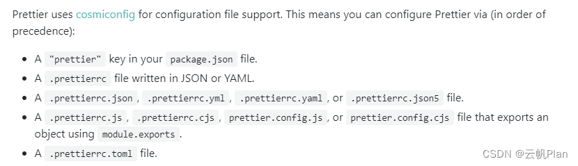

# Prettier
## 介绍
prettier其实就一个代码格式化工具

- JavaScript, including ES2017
- JSX
- Angular
- Vue
- Flow
- TypeScript
- CSS，Less，SCSS
- HTML
- JSON
- GraphQL
- Markdown，including GFM andMDX
- YAML

它会移除原有代码的样式，并输出统一样式的代码。Prettier会重新计算每行代码的长度并重新打印它。Prettier 通过解析你的代码库，强制使用统一的风格的代码，因为它会移除掉原有代码样式（这并不会影响 AST 的代码样式）。它会采用自己的规则来重新输出解析后的 AST，该规则将考虑每行最大长度，当必要的时候，会进行换行。

## 安装和使用
````shell
$ yarn add prettier --dev --exact
$ npm install --save-dev --save-exact prettier
````
 然后创建一个空的配置文件来让编辑器和其他工具知道你正在使用Prettier：
````shell
 echo {}> .prettierrc.json
 ````

接着创建一个.prettierignore文件让编辑器知道哪些文件不需要格式化。以#开头的行会被当做注释。比如：
```` shell
  # Ignore artifacts:
  build
  coverage
  # Ignore all HTML files:
  *.html
````

 最后使用Prettier格式化所有文件:
 ```` shell
 $ npx prettier --write .
  # or
 $ yarn prettier --write .
 ````

## 常用配置
````js
module.exports = { 
  "printWidth": 80, // 每行代码长度（默认80）
  "tabWidth": 2, // 每个tab相当于多少个空格（默认2）
  "useTabs": false, // 是否使用tab进行缩进（默认false）
  "singleQuote": true, // 使用单引号（默认false）
  "semi": true, // 声明结尾使用分号(默认true)
  "trailingComma": "all", // 多行使用拖尾逗号（默认none）
  "bracketSpacing": true, // 对象字面量的大括号间使用空格（默认true）
  "jsxBracketSameLine": false, // 多行JSX中的>放置在最后一行的结尾，而不是另起一行（默认false）
  "arrowParens": "avoid" // 只有一个参数的箭头函数的参数是否带圆括号（默认avoid）
};
````

 ## 好用的工具
 **Pre-commit Hook**
​ 你可以通过pre-commit工具来使用Prettier。执行了git add的文件在提交之前，可以重新格式化这些被保存在暂存区的文件。
````shell
npx mrm lint-staged
````
​执行之后会安装husky和lint-staged，同时自动在你的package.json文件中添加配置。如下：
````js
{
"husky": {
    "hooks": {
      "pre-commit": "lint-staged"
    }
  },
  "lint-staged": {
    "*.js": "eslint --cache --fix"
  }
}
````

**注意** 配置文件是有优先级的，实测：独立的配置文件 (editorconfig)>vscode工作区配置>vscode用户配置
